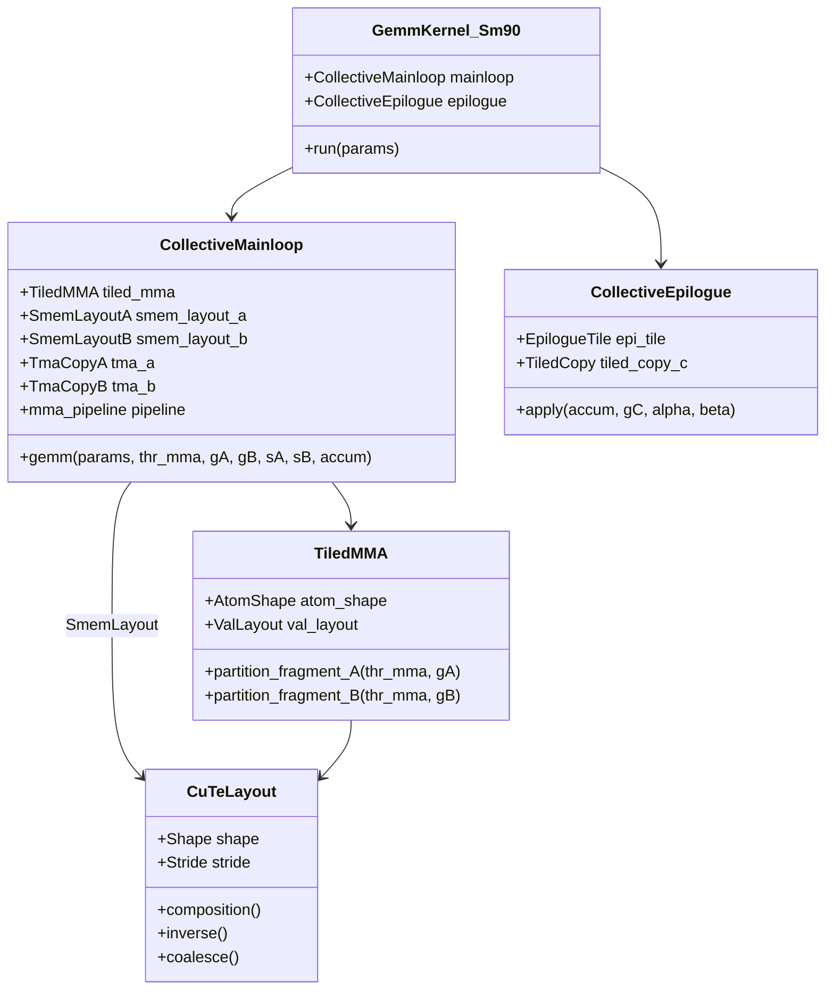
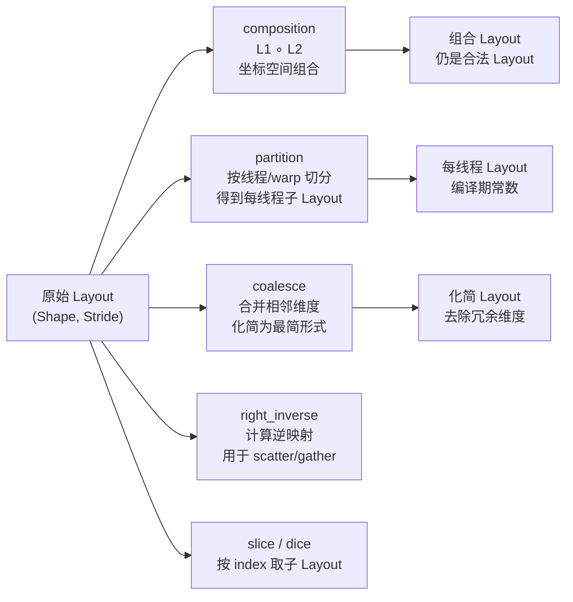
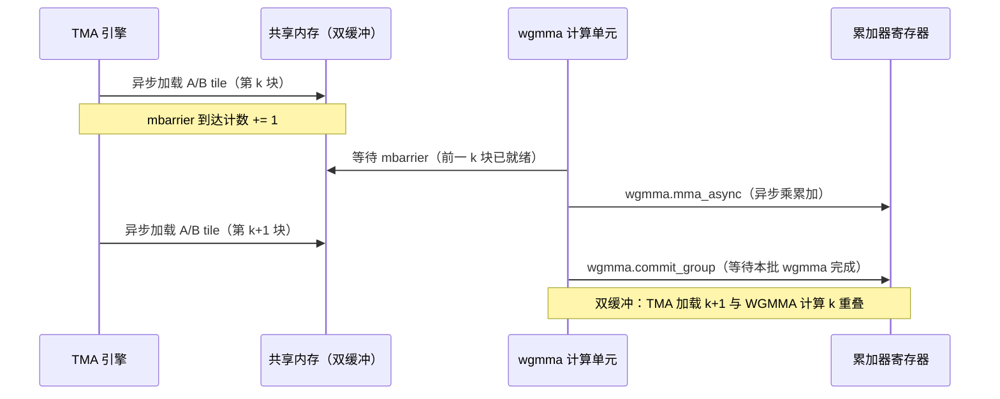

# a02 · CUTLASS 3.x + CuTe — Hopper kernel 工程的事实标准

> **一句话总结:** CUTLASS 3.x 为 Hopper SM90 完全重写，引入 CuTe 布局代数作为底层抽象，collective mainloop 驱动 wgmma + TMA + cluster 三个异步特性，FlashAttention-3、Transformer Engine 等顶级内核均基于此构建。

## 1. 是什么 / 为什么有它

CUTLASS（CUDA Templates for Linear Algebra Subroutines）是 NVIDIA 官方维护的高性能 GPU 内核模板库，专注于矩阵乘法（GEMM）及其融合算子（后处理 epilogue、批量 GEMM、卷积等）。自 2017 年首次发布以来，CUTLASS 已经历三个主要版本迭代，每次大版本更新都对应着 NVIDIA GPU 架构的重大变化：1.x 对应 Volta SM70 的张量核首次引入，2.x 对应 Ampere SM80 的异步拷贝和更大的矩阵乘片元，3.x 对应 Hopper SM90 的线程组矩阵乘、张量内存加速器和线程块簇三大异步特性。

CUTLASS 3.x 是针对 Hopper 架构（SM90）的完全重写版本，于 2023 年随 CUDA 12.0 发布。这次重写的动机在于 Hopper 引入了三个全新的异步计算特性：线程组矩阵乘累加（wgmma，比 Ampere 的 mma.sync 更宽，以 128 线程的线程组为单位，支持 64×128×16 等更大的计算片元）、张量内存加速器（TMA，独立于 SM 执行的异步内存复制引擎，可在不占用任何 warp 执行槽位的情况下后台搬运数据）、以及线程块簇（Thread Block Cluster，多个线程块协同共享彼此的共享内存，形成分布式共享内存）。这三个特性在 CUTLASS 2.x 的架构抽象中无法有效表达，因此 CUTLASS 团队选择从底层重新设计，引入了 CuTe 作为核心抽象层。

对于资深 AI Infra 工程师而言，CUTLASS 3.x + CuTe 是不可绕开的技术栈。当前最重要的大语言模型内核几乎都基于此构建：FlashAttention-3 用 CUTLASS 3.x 的 sm90_collective 重写后比 FA-2 快约两倍；NVIDIA Transformer Engine 的 FP8 GEMM 路径基于 CUTLASS 3.x；vLLM 的 PagedAttention 内核也使用了 CuTe 的 Layout 抽象来描述分块注意力计算中的 KV 块索引。理解 CUTLASS 3.x 的设计哲学和 CuTe 的布局代数，是在 Hopper 及后续架构上编写高效自定义内核的基础能力。

CUTLASS 2.x 的主要局限在于它用 C++ 模板元编程描述线程-数据映射关系，可读性差且难以扩展到新的内存层次（如 wgmma fragment 的线程-元素映射关系）。每次架构迭代都需要对大量分散在各处的 stride 计算代码做修改，维护成本极高。CuTe 的出现从根本上解决了这一问题：它用代数化的 Layout 描述符取代了分散在各处的偏移量计算逻辑，让内核中的数据分区（partition）、组合（composition）、切片（slice）操作变得可组合、可验证，并且大量依赖编译期常数让编译器完全展开循环、消除运行时分支，实现真正的零开销抽象。与此同时，CuTe 的 Layout 代数是可证明正确的：给定两个合法的 Layout，其代数组合的结果在数学上也是合法的，这为自定义内核的正确性提供了代数层面的保证，而不仅仅依赖运行时的测试覆盖。

## 2. 硬件 / 系统视角（微架构 / 拓扑 / 协议）

### CUTLASS 3.x 类层级结构

CUTLASS 3.x 的核心设计是将矩阵乘法分解为相互独立的 CollectiveMainloop（负责数据搬运和矩阵核心计算，内部封装了 TMA 异步加载、wgmma 矩阵乘累加和流水线调度）和 CollectiveEpilogue（负责后处理：偏置加法、激活函数融合、量化缩放），两者通过统一的 KernelTraits 模板参数体系连接，形成高度可组合的设计。这种分层使得 FlashAttention-3 能够用一个特殊的 Epilogue（在线 softmax 归一化）无缝搭配标准的 CollectiveMainloop，而无需重写内核的核心矩阵乘法逻辑。



### CuTe Layout 代数核心操作

CuTe 的 Layout 是一个二元组 `(Shape, Stride)`，描述多维张量在线性内存中的坐标映射关系。其代数性质意味着两个合法的 Layout 经过组合（composition）运算后，结果仍然是一个合法的 Layout，这使得层级嵌套的数据布局可以用无限递归的 Layout 树来表示。Layout 代数定义了一组基本的可组合操作，使得任意复杂的数据分区都可以表达为若干基本 Layout 的代数运算组合，从而在编译期完整推导出地址计算逻辑：



### wgmma + TMA + Cluster 三个异步机制的协同

Hopper 的高效矩阵乘法依赖三层流水线的深度重叠。第一层，张量内存加速器在后台从全局内存异步搬运数据到共享内存，这一过程完全由硬件 DMA 引擎执行，不占用任何 SM 计算资源，意味着数据搬运和矩阵计算可以真正并行；第二层，线程组矩阵乘累加以 128 线程的线程组为单位读取共享内存中的计算分块，执行异步矩阵乘累加操作，计算结果在提交点之后才保证有效，支持多个 wgmma 操作的流水线排队；第三层，线程块簇让多个线程块共享彼此的共享内存，多个线程块可以协作加载更大的 K 维分块，进一步摊薄数据加载的固定开销。这三者的同步点由内存屏障（mbarrier）管理，这是一种比传统 `__syncthreads()` 更细粒度的同步原语，支持到达计数和等待特定计数，可以精确控制 TMA 到达事件和 wgmma 完成事件的同步。

CUTLASS 3.x 的 CollectiveMainloop 将这套三层流水线封装为统一接口，用户只需通过模板参数指定计算分块大小、线程块簇大小和数据类型，内部自动生成正确的 TMA 描述符（TMA descriptor）、mbarrier 配置、wgmma 指令序列以及双缓冲/多阶段流水线的调度逻辑。这种高度模块化的设计使得同一套 CollectiveMainloop 代码可以适配多种 tile 大小和精度组合，而无需为每种配置手写不同的内核。



## 3. CUDA / 框架编程接口

CuTe 是 CUTLASS 3.x 的核心抽象层，其设计哲学是用代数运算取代命令式的指针运算，将"如何寻址"这一底层问题提升为"如何描述张量形状和步长关系"这一更高层次的抽象问题。

CuTe 的核心数据结构是 Layout，定义于 `cutlass/include/cute/layout.hpp`，它由两个元组构成：形状（Shape）描述各维度的大小，步长（Stride）描述各维度在线性内存中相邻元素的间距。从 Layout 的角度看，行主序的 M×N 矩阵等价于 `(M, N):(N, 1)`（第 1 维相邻元素间距为 N，第 0 维间距为 1），列主序等价于 `(M, N):(1, M)`。这种统一的描述方式使得转置、重塑、切片等操作都可以用 Layout 代数表达，而不需要改变底层内存。常用操作接口说明如下：

```cpp
// 定义一个 64×128 的列主序 Layout（stride=(1,64)）
using LayoutA = Layout<Shape<_64, _128>, Stride<_1, _64>>;

// 定义含 swizzle 的共享内存 Layout（避免 wgmma 对齐时的 bank conflict）
using SmemLayoutA = decltype(tile_to_shape(
    GMMA::Layout_K_SW128_Atom<bfloat16_t>{},
    Shape<_128, _64>{}
));

// 生成张量并切分到每个线程
auto gA = make_tensor(ptr_a, layout_a);              // 全局内存张量
auto sA = make_tensor(smem_ptr, smem_layout_a);      // 共享内存张量
auto tAgA = tiled_mma.partition_A(gA);               // 按 TiledMMA 切分到每线程
auto tAsA = tiled_mma.partition_A(sA);               // 共享内存切分
```

在 CUTLASS 3.x 的实际使用流程中，通常先通过 CuTe 定义 Layout 和 Tensor 描述数据访问模式，再通过 TiledMMA 描述线程组-元素映射关系，最后组装 CollectiveMainloop 并传入具体的计算分块大小和流水线阶段数。这套流程虽然学习曲线较陡，前期需要掌握 Layout 代数的运算规则和 TiledMMA 的线程映射语义，但一旦掌握，添加新的计算模式（如新的精度组合 FP8×FP8 或新的 tile 大小）只需更换少量模板参数，无需重写内核逻辑本身。这正是 CUTLASS 3.x 相比手写 PTX 内核的最大工程价值：以较低的维护成本实现接近手写 PTX 的峰值性能。

CollectiveMainloop 的模板参数组合示例，对应 H100 上的 BF16 GEMM：

```cpp
// 指定 sm90_collective mainloop，自动启用 TMA + wgmma + pipeline
using CollectiveMainloop = cutlass::gemm::collective::CollectiveMma<
    cutlass::gemm::MainloopSm90TmaGmmaWarpSpecialized<3>,  // 3-stage pipeline
    cutlass::gemm::KernelTmaWarpSpecializedCooperative,
    bfloat16_t,                  // A 数据类型
    cutlass::layout::RowMajor,   // A 布局
    bfloat16_t,                  // B 数据类型
    cutlass::layout::ColumnMajor,// B 布局
    TileShape,                   // CTA tile 大小 <128, 128, 64>
    ClusterShape,                // cluster 大小 <2, 1, 1>
    cutlass::gemm::collective::StageCountAutoCarveout<>,
    cutlass::gemm::collective::KernelScheduleAuto
>;
```

`SM90_TMA_LOAD` 是 CUTLASS 3.x 提供的 TMA 拷贝操作，对应硬件的 `cp.async.bulk.tensor` 指令：

```cpp
// TMA load：从全局内存异步加载 tile 到共享内存，不占用 warp 执行资源
SM90_TMA_LOAD{}.copy(tma_a, smem_pipe_write, tma_coord, smem_ptr_a);
```

## 4. 关键性能指标

### 实测数据与调优方向

CUTLASS 3.x 在 H100 SXM5 上的 BF16 GEMM 内核，经过精细的计算分块大小和线程块簇配置调优后，实测吞吐可达张量核峰值算力的 87-92%。调优过程通常分三个步骤：首先选择满足矩阵形状的最大计算分块大小（一般从 128×128×64 开始，这是 H100 上最常用的高效配置）；其次调整流水线阶段数（stage count，通常在 3-5 之间，阶段数越多流水线越深但共享内存占用越大，超过共享内存上限时编译期会报错）；最后确定线程块簇大小（cluster shape，影响分布式共享内存的复用范围，2×1×1 是最常用的起点）。这一数值建立在线程组矩阵乘累加指令的异步流水线充分隐藏延迟、张量内存加速器搬运与矩阵计算完全重叠的基础上。未经充分调优的配置（如计算分块大小选择不当、流水线阶段数不匹配）通常只能达到 70-80% 的峰值利用率。针对不同矩阵形状需要选择不同的分块配置：大正方形矩阵适合 128×128×64 的分块，长矩形（批量矩阵乘）适合 64×128×64，小批量场景（序列长度短的注意力）适合 64×64×64 但需要适当增加流水线阶段数。

FP8 GEMM 路径（E4M3 格式）在 CUTLASS 3.x 中的典型效率约为 85% 张量核峰值，略低于 BF16，原因在于 FP8 的缩放因子更新和量化边界处理引入了额外的寄存器操作，且 FP8 张量核在部分边界情况下需要额外的舍入处理。

FlashAttention-3 是 CUTLASS 3.x 性能优势的典型体现：相比使用 mma.sync 指令的 FlashAttention-2，FA-3 通过 sm90_collective + wgmma 实现了注意力计算的完全流水线化，将 softmax 的在线归一化（online softmax）与矩阵乘法交织执行，在 H100 上实测前向传播速度提升约 1.5-2 倍（取决于序列长度和注意力头维度）。

### 编译期常数的性能价值

CuTe 的 Layout 大量使用 C++ 编译期整数常量（`_64`、`_128` 等是 `cute::Int` 模板类的整数常量实例），使得 ptxas 编译器能在编译阶段完全展开内层循环、消除运行时跳转，消除条件分支。对比两种实现方式：运行时 stride 变量导致编译器无法预测寻址模式，产生通用寄存器溢出（register spill，将计算中间结果写回本地内存，引入额外的内存访问延迟）；编译期常数 stride 让编译器完全内联所有地址计算，将地址运算折叠为立即数，寄存器利用率最优。这一优化在实测中可带来 5-10% 的额外性能提升，在寄存器资源紧张的高占用率内核中效果尤为显著。

### CUTLASS 2.x vs 3.x 选择准则

| 场景 | 建议版本 | 原因 |
|---|---|---|
| Ampere 及更早（SM80 以下） | CUTLASS 2.x | 3.x 对旧架构支持有限 |
| Hopper SM90 新内核 | CUTLASS 3.x | wgmma/TMA/Cluster 必须 3.x |
| 快速原型（Python 接口） | CUTLASS 3.x Python | 3.x 提供完整 Python 绑定 |
| 生产级自定义算子 | CUTLASS 3.x C++ | 最高性能、最细控制粒度 |
| 注意力内核 | CUTLASS 3.x sm90_collective | FlashAttention-3 的同款基础设施 |

在实际工程中，建议先用 CUTLASS 3.x Python 接口验证配置的数值正确性，再用 C++ 模板逐步替换各层抽象以精细控制性能。整个 CUTLASS 3.x 内核的学习路径建议为：先读 `examples/48_hopper_warp_specialized_gemm`，理解 CollectiveMainloop 的双缓冲流水线；再读 `examples/50_hopper_gemm_with_epilogue_swizzle`，理解 Epilogue 的数据分区；最后参考 FlashAttention-3 的 Hopper 实现，掌握在 CUTLASS 框架内实现自定义算子的完整方法。

## 5. 代码示例

```cpp
// ── CuTe Layout 实例：定义并操作 BF16 矩阵分区 ──────────────────
#include <cute/layout.hpp>
#include <cute/tensor.hpp>
using namespace cute;

// 全局内存张量：M×K 行主序
auto gA = make_tensor(
    ptr_a,
    make_layout(make_shape(M, K), make_stride(K, _1{}))
);

// 共享内存张量：带 swizzle 的 tile，消除 wgmma 读取时的 bank conflict
// GMMA::Layout_K_SW128_Atom 是 CUTLASS 提供的标准 swizzle 模式
auto smem_layout = tile_to_shape(
    GMMA::Layout_K_SW128_Atom<bfloat16_t>{},
    make_shape(Int<128>{}, Int<64>{})   // 编译期常数，ptxas 完全展开
);
auto sA = make_tensor(smem_ptr, smem_layout);

// TiledMMA：描述 wgmma 的线程-元素映射
auto tiled_mma = make_tiled_mma(
    SM90_64x128x16_F32BF16BF16_SS<GMMA::Major::K>{},
    Layout<Shape<_2,_2,_1>>{}   // 线程组内部排列
);

// 按 tiled_mma 将全局张量切分到每个线程负责的 partition
auto thr_mma = tiled_mma.get_thread_slice(thread_idx);
auto tAgA = thr_mma.partition_A(gA);  // [M/tile, K/tile] per-thread view
auto tAsA = thr_mma.partition_A(sA);  // 共享内存 per-thread view
```

```cpp
// ── CollectiveMainloop skeleton（H100 BF16 GEMM） ────────────────
// 实际 CUTLASS 3.x 内核的简化结构，位于：
// cutlass/include/cutlass/gemm/collective/sm90_mma_tma_gmma_ss_warpspecialized.hpp

CUTLASS_DEVICE void gemm_main_loop(
    Params const& params,
    MainloopPipeline pipeline,
    PipelineState smem_pipe_write,
    PipelineState smem_pipe_read,
    auto& accum,
    int k_tile_count
) {
    // 外层循环：沿 K 维度迭代每个 tile
    CUTLASS_PRAGMA_UNROLL
    for (int k_tile = 0; k_tile < k_tile_count; ++k_tile) {
        // 1. 等待 TMA 加载完成（当前 pipeline stage 就绪）
        pipeline.consumer_wait(smem_pipe_read);

        // 2. 异步 wgmma：从共享内存读取 tile 做矩阵乘累加
        warpgroup_fence_operand(accum);
        cute::gemm(tiled_mma, accum, tAsA(_, _, k_tile), tBsB(_, _, k_tile), accum);

        // 3. 释放当前 stage，通知 TMA 可以覆写
        pipeline.consumer_release(smem_pipe_read);
        ++smem_pipe_read;
    }
    // 等待所有 wgmma 完成（commit_group + wait<0>）
    warpgroup_arrive();
    warpgroup_wait<0>();
}
```

## 6. 实测手段

排查 CUTLASS 3.x 内核性能问题需要从张量核心利用率、内存带宽利用率和共享内存访问冲突三个维度入手，以下是具体的分析方法。

张量核心利用率是评估矩阵乘法内核效率的首要指标，通过查看 wgmma 指令占总计算周期的比例来判断内核是否充分利用了硬件矩阵运算单元：

```bash
ncu --metrics sm__pipe_tensor_op_hmma_cycles_active.avg.pct_of_peak_sustained_active \
    --metrics sm__pipe_tensor_op_hmma_qmma_cycles_active.avg.pct_of_peak_sustained_active \
    ./gemm_kernel
```

目标值：BF16 GEMM 应达到 85% 以上；若低于 70%，通常是计算分块大小选择不当，或张量内存加速器的异步搬运未能充分隐藏内存延迟。

共享内存 bank conflict 检测，swizzle 未正确设置时 wgmma 读取共享内存会产生 bank conflict，严重影响吞吐：

```bash
ncu --metrics l1tex__data_bank_conflicts_pipe_lsu_mem_shared_op_ld.sum \
    ./gemm_kernel
```

共享内存 bank conflict 次数应为 0（CUTLASS 提供的标准 swizzle 模式保证无冲突）。若不为 0，检查共享内存布局是否使用了正确的 `GMMA::Layout_K_SW128_Atom` 或 `GMMA::Layout_MN_SW128_Atom`，这两个 swizzle 模式分别对应 K 维连续（RowMajor A）和 MN 维连续（ColumnMajor B）两种情况。

在大规模生产项目中，CUTLASS 3.x 的调试还有一个重要技巧：利用 CUTLASS 提供的主机端参考实现（基于 CUTLASS Utility 的 ReferenceGemm 模板）与 GPU 内核结果做数值对比，快速定位 Layout 配置或 Epilogue 参数是否正确。数值对比时建议同时检查最大误差（MaxAbs）和相对误差（MaxRel），以区分功能性错误（MaxAbs 很大，通常是 Layout 方向写反）和精度误差（MaxRel 在 FP16/BF16 精度范围内，属正常）。这种"先验证正确性，再优化性能"的两阶段开发流程能大幅缩短调试周期，避免在错误的内核上做无效的性能优化。

此外，使用 CUTLASS 3.x 的 Python 接口可以快速验证特定配置的正确性，然后再下沉到 C++ 做性能调优：

```bash
# 安装 CUTLASS Python 绑定
pip install nvidia-cutlass
python -c "import cutlass; print(cutlass.__version__)"
```

## 7. 常见反模式

**反模式一：CuTe Layout 的 stride 方向搞反**

CuTe 中逻辑坐标 `(c0, c1)` 对应线性地址 `c0×S0 + c1×S1`。行主序矩阵的正确表示是步长 `(N, 1)`（行内相邻元素间距为 1，行间距为 N），列主序是步长 `(1, M)`（列内相邻元素间距为 1，列间距为 M）。这与 C++ 多维数组的惯例一致，但与 BLAS 的"leading dimension"概念方向相反。将行主序矩阵的步长写成 `(1, N)` 会导致矩阵以转置的方式读取，产生功能性错误，且错误表现为 GEMM 结果与正确值相差一个转置——这种有规律的错误容易被误当作精度问题处理，实际上是 Layout 定义错误，只需翻转步长元组即可修复。

**反模式二：忘记 swizzle 导致 wgmma 产生共享内存访问冲突**

线程组矩阵乘指令要求共享内存布局满足特定的对齐约束（128 字节对齐，连续地址分布在不同 bank），否则会产生严重的内存访问冲突。使用普通的行主序或列主序共享内存布局时，wgmma 读取会产生大量访问冲突，严重情况下吞吐下降 4-8 倍，但程序运行结果仍然正确（只是慢），这使得访问冲突问题在不做 Nsight Compute 性能分析时很难被发现，通常表现为"内核正确但比预期慢很多"。正确做法是使用 CUTLASS 提供的标准 swizzle 模式，这些 swizzle 模式经过精心设计，能消除 wgmma 读取时的所有共享内存访问冲突，是生产级内核的必要配置。

**反模式三：在 Hopper 项目中使用 CUTLASS 2.x API**

CUTLASS 2.x 的各类 Gemm 接口在 CUTLASS 3.x 中仍然存在，但在 SM90 上会自动退回到 `mma.sync` 路径而非使用 `wgmma`，性能最多损失 50%。更严重的是，2.x 接口无法利用张量内存加速器和线程块簇，导致内存带宽利用率大幅下降。在新的 Hopper 项目中，应始终从 3.x 的 `gemm_universal_adapter.hpp` 入口出发，通过调试标志 `-DCUTLASS_DEBUG_TRACE_LEVEL=1` 确认实际使用的是 sm90 路径而非 sm80 回退路径。

**反模式四：CollectiveMainloop 和 Epilogue 的累加器类型不匹配**

CUTLASS 3.x 中，CollectiveMainloop 输出的累加器张量类型（通常是 F32）必须与 CollectiveEpilogue 的输入类型完全匹配。若主循环用 F32 累加但后处理层配置为接受 F16 累加，编译器会在实例化时报模板类型不匹配错误，错误信息冗长难以定位。正确做法是在 KernelTraits 中统一定义 `using ElementAccumulator = float`，并让 Mainloop 和 Epilogue 的类型参数都引用同一个类型别名，避免在多个地方分别指定累加器类型而产生不一致。

**反模式五：在多线程组内核中混用错误的切分对象**

CuTe 的 `thr_mma.partition_A(gA)` 返回当前线程组对输入张量的视图，其逻辑形状取决于 TiledMMA 定义的线程-元素映射。在多线程组专用化内核（warp-specialized kernel）中，生产者线程组（负责 TMA 加载）和消费者线程组（负责 wgmma 计算）应使用各自对应的切分对象。若混用不同线程组的切分视图进行 partition，会导致数据访问范围计算错误，产生难以通过结果正确性判断的功能性缺陷。调试时应在关键切分操作前后打印张量形状（CuTe 提供 `print_layout` 和 `print_tensor` 工具函数），确认每个线程组的视图形状符合预期的线程-元素分配关系。

## 8. 延伸阅读

```
CUTLASS 3.x 源码（核心实现位置）：
  github.com/NVIDIA/cutlass
  include/cutlass/gemm/collective/sm90_mma_tma_gmma_ss_warpspecialized.hpp
  include/cute/layout.hpp
  include/cute/tensor.hpp
  examples/53_hopper_gemm_with_abs_max/

CuTe 概念论文（NVIDIA GTC 2023）：
  developer.nvidia.com/blog/cutlass-linear-algebra-cuda/

FlashAttention-3 技术报告（基于 CUTLASS 3.x sm90_collective）：
  arxiv.org/abs/2407.08608
  github.com/Dao-AILab/flash-attention — hopper/ 目录

Hopper GEMM 官方示例：
  cutlass/examples/48_hopper_warp_specialized_gemm/
  cutlass/examples/50_hopper_gemm_with_epilogue_swizzle/

NVIDIA GTC CUTLASS 技术讲座：
  CuTe Layout Algebra（GTC 2023 Spring）
  Hopper GEMM with CUTLASS 3.x（GTC 2023 Fall）

Transformer Engine（CUTLASS 3.x FP8 GEMM 实际使用案例）：
  github.com/NVIDIA/TransformerEngine
  transformer_engine/pytorch/csrc/extensions/gemm.cu
```
