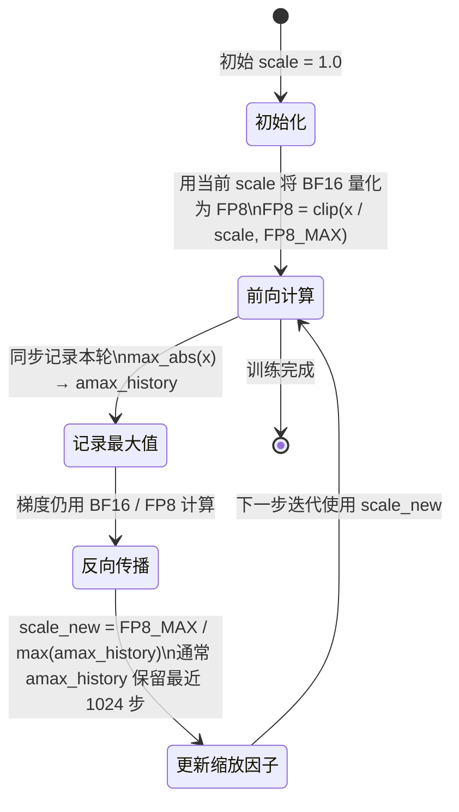

# a03 · 量化算法原理 — GPTQ / AWQ / SmoothQuant / FP8 scaling

> **一句话总结:** 量化将模型权重或激活值压缩到更低比特数，核心挑战是在压缩过程中最小化精度损失，GPTQ 用 Hessian 矩阵最优舍入，AWQ 保留少量关键权重，SmoothQuant 将异常值从激活迁移到权重，FP8 scaling 通过动态缩放因子适配浮点范围。

## 1. 是什么 / 为什么有它

模型量化（Quantization）是将神经网络的权重或激活值从高精度浮点（通常是 FP32 或 BF16）压缩到更低比特宽度整数（INT8、INT4）或低精度浮点（FP8、FP4）的技术。量化的核心目标是在保持模型推理质量的前提下，大幅降低内存占用、提升计算吞吐、降低延迟。量化可以分为两大类：训练后量化（PTQ，Post-Training Quantization）在模型训练完成后做一次性量化，代价是精度损失可能较大；量化感知训练（QAT，Quantization-Aware Training）在训练过程中引入量化噪声，精度损失更小但需要重新训练（或微调）。

对于大语言模型推理而言，量化几乎是必不可少的工程手段。以 Llama-3-70B 为例，BF16 格式存储需要约 140 GB 显存，需要两张 H100 SXM5 才能加载；而 INT4 量化后仅需约 35 GB，单张 H100 即可服务。不仅如此，量化还能将内存带宽转化为更高的计算吞吐：以 INT4 权重和 FP16 激活（W4A16）格式运行时，权重从内存加载的速度比 BF16 快约 4 倍，对于内存带宽受限的推理场景（小批次推理，arithmetic intensity 低）能直接转化为约 4 倍的吞吐提升，延迟大幅降低。在服务化场景下，这意味着在相同硬件成本下可以支撑 4 倍的并发请求量。

量化算法在大语言模型时代面临的独特挑战是激活值异常大（outlier，极端值）的问题。与卷积神经网络的激活值分布相对平滑不同，大语言模型的某些激活维度（如注意力层的查询/键输出、前馈网络的中间激活）可能存在极少数数值比其他维度大 100 倍以上的极端值。这一现象在层数深、参数量大的模型中更为显著，如 Llama-3-70B 的部分层激活值极差可达 1000 倍以上。如果用简单的均匀量化，这些极端值会"抢占"大部分量化范围，导致大量普通值的精度严重损失。

GPTQ、AWQ 和 SmoothQuant 三种算法从不同角度应对激活 outlier 挑战，分别代表了训练后量化领域的三种主流思路：GPTQ 用 Hessian 矩阵最优舍入在权重量化时最小化输出误差；AWQ 通过激活幅度识别并保留关键权重列以高精度存储；SmoothQuant 通过数学等价变换将激活中的 outlier"平滑"迁移到权重侧，使两者都更容易量化。FP8 则代表了另一个维度的量化思路——用低精度浮点格式替代 BF16，通过动态缩放因子保持数值范围，主要用于训练加速。

本章重点讲解这四种量化算法的内部工作原理：Hessian 矩阵最优舍入（GPTQ）、激活感知权重保留（AWQ）、通道级缩放因子迁移（SmoothQuant）、以及 FP8 动态缩放状态机，为理解量化工具的行为、合理选择量化配置参数（如 group_size、alpha 迁移系数、amax_history_len）和排查精度问题奠定原理层面的基础。掌握这些原理后，在遇到量化精度异常时才能快速定位是校准数据不足、粒度设置不当还是数值范围溢出等具体原因，而不是在茫然中反复调参。

## 2. 硬件 / 系统视角（微架构 / 拓扑 / 协议）

### 三种量化算法数据流对比

三种算法的数据流和量化时机存在根本差异：

```mermaid
flowchart LR
    subgraph GPTQ["GPTQ：Hessian 最优舍入"]
        G1[校准数据集\n前向传播] --> G2[计算权重\nHessian 矩阵 H]
        G2 --> G3[Cholesky 分解\nH = LL^T，数值稳定]
        G3 --> G4[逐列量化\n选最优舍入 Q(w)]
        G4 --> G5[用 H^-1 传播\n量化误差到后续列]
        G5 --> G6[INT4 权重\n+ FP16 激活]
    end
    subgraph AWQ["AWQ：激活感知"]
        A1[校准数据集\n采集激活幅度] --> A2[识别 1% 显著权重\n按激活幅度排序]
        A2 --> A3[显著权重\n保持 FP16 精度]
        A3 --> A4[其余权重\nINT4 量化]
        A4 --> A5[混合精度权重\n显著列 FP16 + 其余 INT4]
    end
    subgraph SQ["SmoothQuant：通道迁移"]
        S1[校准数据集\n统计激活通道最大值] --> S2[计算迁移因子 s\ns_i = max_x_i^α / max_w_i^{1-α}]
        S2 --> S3[激活除以 s\nY = X/s·sW]
        S3 --> S4[激活幅度变小\n权重幅度变大但均匀]
        S4 --> S5[INT8 量化\n激活 + 权重均可量化]
    end
```

### FP8 延迟缩放状态机

FP8 量化训练中，缩放因子（scale）的更新策略是影响训练稳定性的关键。延迟缩放（delayed scaling）用上一轮迭代观测到的激活最大值来设置当前轮的缩放因子，形成一个状态机：



延迟缩放的风险在于：若激活值在某步突然增大（如训练初期的梯度爆炸，或学习率设置过大），当前步的缩放因子来自历史最大值，可能不够大，导致 FP8 截断（overflow），产生 NaN 或 Inf，进而污染整个训练批次。这是 FP8 训练中最常见的失败模式之一，通常表现为损失在训练 100-1000 步后突然出现 NaN，且难以从历史 checkpoint 恢复，因为数值污染可能在几步内就扩散到所有参数。解决方法是增大 `amax_history_len`（保留更长历史，提高缩放因子的稳定性）或将 `amax_compute_algo` 改为 "most_recent"（响应速度更快但不稳定）。

### 量化粒度对精度的影响

量化粒度越细，精度损失越小，但额外的缩放因子（scale factor）存储开销越大，且缩放因子本身也需要以更高精度（FP32 或 FP16）存储，部分抵消了量化带来的显存节省。以 INT4 分组量化（group_size=128）为例，权重占 4bit/权重，缩放因子占 16bit/128个权重，等效平均比特数约 4.125bit，与裸 INT4 相差不大但精度大幅提升。

| 量化粒度 | 缩放因子数量 | 精度 | 主要用途 |
|---|---|---|---|
| 按张量（per-tensor） | 1 个 | 最低 | 不推荐用于大语言模型激活量化 |
| 按通道（per-channel） | 每输出通道 1 个 | 中等 | INT8 权重量化的标准做法 |
| 按组（per-group，g=128） | 每 128 个权重 1 个 | 高 | GPTQ/AWQ INT4 的行业标准 |
| 按词元（per-token） | 每个词元 1 个 | 高 | SmoothQuant 激活量化 |

量化粒度的选择还影响内核实现的复杂度。per-channel 量化的缩放因子可以在矩阵乘法完成后批量应用（dequantize epilogue），对内核结构影响很小；per-group 量化需要在矩阵乘法内部每隔 128 列更新缩放因子，需要特殊的内核实现（如 CUTLASS 的 grouped GEMM + epilogue 融合）；per-token 激活量化需要在每次输入推理时动态计算每个词元的最大绝对值，引入额外的同步开销。

## 3. CUDA / 框架编程接口

量化工具链已经高度工程化，从量化过程到部署推理都有成熟的 Python 接口和命令行工具。以下是主要框架的使用方式：

**TensorRT-LLM** 是 NVIDIA 官方的生产级量化推理框架，支持最全面的量化模式，是 Hopper GPU 上量化推理的首选方案：

```python
from tensorrt_llm.quantization import QuantMode

# INT4 AWQ 量化：权重 4bit，激活 16bit
quant_config = QuantMode.from_description(
    quantize_weights=True,
    quantize_activations=False,
    per_token=False,
    per_channel=True,
    use_int4_weights=True,
    use_awq=True,
)

# FP8 量化：前向 E4M3 + KV cache FP8
quant_config = QuantMode.from_description(
    use_fp8_qdq=True,
    use_fp8_kv_cache=True,
)
```

**Transformer Engine**（NVIDIA 官方训练量化库）提供 FP8 训练的核心接口，支持延迟缩放和当前缩放两种模式：

```python
import transformer_engine.pytorch as te
from transformer_engine.common.recipe import Format, DelayedScaling

# FP8 前向 E4M3 + 反向 E5M2（HYBRID 格式是训练推荐配置）
recipe = DelayedScaling(
    margin=0,                    # scale = FP8_MAX / (amax * 2^margin)
    interval=1,                  # 每步更新 amax_history
    fp8_format=Format.HYBRID,    # 前向 E4M3，反向 E5M2
    amax_history_len=1024,       # 保留最近 1024 步的 amax 历史
    amax_compute_algo="max",     # 用历史 amax 中的最大值
)

with te.fp8_autocast(enabled=True, fp8_recipe=recipe):
    output = te_linear(input)    # 自动 FP8 量化 + 反量化
```

**AutoGPTQ** 提供 Python 接口进行 GPTQ INT4 量化：

```python
from auto_gptq import AutoGPTQForCausalLM, BaseQuantizeConfig

quantize_config = BaseQuantizeConfig(
    bits=4,
    group_size=128,       # 每 128 列一组，分组量化
    desc_act=True,        # 激活重排（提升精度）
    sym=False,            # 非对称量化（通常比对称精度更好）
)
model = AutoGPTQForCausalLM.from_pretrained(model_path, quantize_config)
model.quantize(calibration_dataset)  # 运行 GPTQ 校准
model.save_quantized(output_path)
```

**AutoAWQ** 的接口更简洁，无需 Hessian 计算，量化速度更快：

```python
from awq import AutoAWQForCausalLM

model = AutoAWQForCausalLM.from_pretrained(model_path)
model.quantize(
    tokenizer,
    quant_config={"w_bit": 4, "q_group_size": 128, "zero_point": True, "version": "GEMM"},
    calib_data=calibration_dataset,
)
model.save_quantized(output_path)
```

## 4. 关键性能指标

### 精度与速度实测数据

**GPTQ INT4 量化精度**：Llama-3-70B 在 MMLU（大规模多任务语言理解）基准上，FP16 基线得分约 79.5，GPTQ INT4（group_size=128，非对称量化）得分约 79.1，精度损失约 0.4 个百分点，几乎可以忽略。在 GSM8K 数学推理任务上，精度损失略大，约 1-2 个百分点，因为数学推理对精确的数值计算更敏感。这一结果表明，GPTQ INT4 量化对知识记忆类任务影响极小，对多步推理类任务有轻微影响但在大多数生产场景中仍可接受。GPTQ 的 Hessian 计算通常需要约 512 条校准样本和数十分钟至数小时的 GPU 计算时间（70B 模型约 1-2 小时），但量化完成后权重可以直接保存复用，无需重新运行校准过程。

**AWQ INT4 量化精度**：AWQ 与 GPTQ 在相同比特数（4bit，group_size=128）下精度非常接近，差距通常在 0.1-0.2 个百分点以内，难以区分哪种方法绝对更优。AWQ 的量化过程无需计算完整的 Hessian 矩阵，量化速度快约 3-5 倍（70B 模型约 15-30 分钟）。AWQ 的核心优势在于对长尾激活分布的鲁棒性：在 Mixtral 等 MoE 模型上，不同专家的激活幅度差异极大，GPTQ 的 Hessian 计算对这种高方差分布更敏感，而 AWQ 通过保留激活幅度最大的 1% 显著权重列为 FP16 精度，直接规避了对极端值精确建模的需求。

**SmoothQuant W8A8 对比 FP8**：SmoothQuant 使用 INT8 权重和 INT8 激活（W8A8），依赖 CUDA 的 dp4a 整数点积指令实现矩阵乘法，而 Hopper GPU 上的 FP8 张量核（E4M3 格式）具有专用的硬件加速路径，理论峰值吞吐更高。实测中，W8A8 SmoothQuant 推理速度比等效 FP8 路径慢约 10-15%，主要原因在于 dp4a 的实现效率不如 FP8 张量核，且激活量化的动态缩放计算（per-token scale 更新）会增加额外的延迟。选择哪种方案主要取决于硬件世代：Hopper 及更新架构首选 FP8，Ampere 以下架构只能使用 INT8。

**FP8 键值缓存量化**：将注意力层的键值缓存（KV cache）从 BF16 量化为 FP8（E5M2 格式，动态缩放），精度损失通常低于 0.5 个基准分，但显存占用减半（每个词元每个注意力头节省 2 字节），允许在相同显存下将最大服务批次大小翻倍。在 H100 8 卡集群上，开启 FP8 键值缓存后，Llama-3-70B 的最大在线批次从约 32 提升到约 64，推理吞吐（tokens/s）近似翻倍，是高性价比的显存优化手段。

**FP8 延迟缩放 vs 当前缩放**：延迟缩放（delayed scaling）用历史激活最大值设置当前步的缩放因子，存在"一步滞后"，在激活值剧烈变化时保守性更强（设置更宽的缩放范围，牺牲少量精度换取数值稳定）。当前缩放（current scaling）用当前步的实际激活最大值计算缩放因子，精度更高，但需要额外的跨 GPU all-reduce 同步 amax 值。在大规模训练（1k+ GPU）时，current scaling 的同步开销（每步每层一次标量 all-reduce）不可忽视，延迟缩放通常是工程首选，其精度损失在实践中可忽略不计。

### 量化方案选择矩阵

| 量化方案 | 精度损失 | 推理提速 | 主要适用场景 |
|---|---|---|---|
| FP8 W8A8（Hopper+） | 低（< 0.3 pt） | 1.5-2× vs BF16 | 训练加速、高精度推理 |
| INT8 W8A8 SmoothQuant | 中低（0.3-0.5 pt） | 1.2-1.5× vs BF16 | Ampere/Turing 推理 |
| INT4 GPTQ（group=128） | 中低（0.3-0.5 pt） | 3-4× vs BF16 | 单卡服务大模型，精度优先 |
| INT4 AWQ（group=128） | 中低（0.3-0.5 pt） | 3-4× vs BF16 | 快速量化，MoE 模型 |

## 5. 代码示例

```python
# ── GPTQ 逐列量化核心逻辑（简化伪代码） ──────────────────────────
import torch

def gptq_quantize_layer(W: torch.Tensor, H: torch.Tensor, bits: int, group_size: int):
    """
    W: [out_features, in_features] 权重矩阵
    H: [in_features, in_features] 输入激活 Hessian 矩阵
    bits: 量化比特数（通常 4）
    group_size: 分组大小（通常 128）
    """
    # Cholesky 分解 Hessian（避免直接求逆的数值不稳定）
    H = H + 0.01 * torch.eye(H.size(0), device=H.device)  # 正则化
    L = torch.linalg.cholesky(H)                            # H = LL^T
    H_inv = torch.cholesky_inverse(L)                       # H^{-1}

    W_q = torch.zeros_like(W)
    error = torch.zeros_like(W)   # 量化误差累积

    for i in range(W.size(1)):    # 逐列（逐 in_feature）量化
        # 对第 i 列取分组量化（per-group scale + zero point）
        col = W[:, i] + error[:, i]  # 加上前面列传播来的误差
        col_q = quantize_int(col, bits, group_size)
        W_q[:, i] = col_q
        # 用 H_inv 将本列量化误差传播到后续列
        quant_error = col - col_q
        error[:, i+1:] += quant_error.unsqueeze(1) * (H_inv[i, i+1:] / H_inv[i, i]).unsqueeze(0)

    return W_q
```

```python
# ── Transformer Engine FP8 DelayedScaling 完整配置 ───────────────
import transformer_engine.pytorch as te
from transformer_engine.common.recipe import Format, DelayedScaling
import torch

recipe = DelayedScaling(
    fp8_format=Format.HYBRID,   # 前向 E4M3（精度优先），反向 E5M2（范围优先）
    amax_history_len=1024,
    amax_compute_algo="max",    # 取历史窗口内的最大值（保守策略）
    margin=0,
    interval=1,
)

model = te.Linear(in_features=4096, out_features=4096)

with te.fp8_autocast(enabled=True, fp8_recipe=recipe):
    x = torch.randn(batch_size, seq_len, 4096, dtype=torch.bfloat16, device="cuda")
    y = model(x)  # 自动在 FP8 精度下执行矩阵乘法
```

```python
# ── SmoothQuant 迁移因子计算 ──────────────────────────────────────
import torch

def compute_smooth_scale(activation_max: torch.Tensor,
                          weight_max: torch.Tensor,
                          alpha: float = 0.5) -> torch.Tensor:
    """
    activation_max: [in_channels] 每个输入通道的激活最大值
    weight_max: [in_channels] 每个输入通道的权重最大值
    alpha: 迁移强度，0=全迁到权重，1=全保留在激活
    """
    # s_i = max_x_i^alpha / max_w_i^(1-alpha)
    scale = activation_max.pow(alpha) / weight_max.pow(1 - alpha)
    return scale

# 激活量化前除以 scale，等价于权重量化前乘以 scale
# X_smooth = X / scale[None, :]   (激活幅度减小，可量化)
# W_smooth = W * scale[:, None]   (权重幅度增大但均匀，可量化)
```

## 6. 实测手段

量化效果的评估需要从精度、速度和数值稳定性三个维度同时追踪。精度评估要用覆盖多种能力维度的下游任务基准，而不能只看困惑度；速度评估要在目标硬件（H100/A100）和真实服务批次大小下测量端到端延迟和吞吐；数值稳定性评估（主要针对 FP8 训练）要持续监控每层的激活最大值历史趋势，确保没有突然的激增或 NaN 传播。三个维度缺一不可，只关注其中一两个会产生误导性的评估结论，导致在生产部署后才发现问题，付出更高的修复代价。量化评估应在每次模型更新（基础模型版本变更、校准数据集变更）后重新运行，而不是一次量化后永久复用评估结果。

**精度评估** — 量化完成后必须立即在代表性基准上重新测试精度，不能仅凭困惑度（perplexity）判断：

```bash
# 使用 lm_evaluation_harness 跑 MMLU + GSM8K 基准
lm_eval --model hf \
  --model_args pretrained=./quantized_model \
  --tasks mmlu,gsm8k \
  --num_fewshot 5 \
  --batch_size auto

# 重点关注：相对基线的精度变化不超过 1%（INT4）或 0.5%（INT8/FP8）
```

**TRT-LLM 量化延迟基准** — 量化模型的推理速度提升需要在目标硬件上实测：

```bash
# TensorRT-LLM 性能基准（批次=1 延迟 + 批次=32 吞吐）
python benchmarks/benchmark.py \
  --engine_dir ./trt_engine \
  --batch_size 1 32 \
  --input_output_len "128,128" \
  --dtype float16 \
  --quantization int4_awq
```

**FP8 训练数值监控** — FP8 训练中的数值稳定性问题有时会以"沉默"方式出现：损失看起来正常下降，但某些层的权重实际上在 FP8 精度下已经严重失真。因此应持续监控以下指标以早期发现数值问题：

```python
# 监控每层的 amax 历史（如果突然激增，说明数值不稳定）
# Transformer Engine 的 fp8_autocast 上下文会自动记录
for name, module in model.named_modules():
    if hasattr(module, 'fp8_meta'):
        amax = module.fp8_meta['scaling_fwd'].amax_history
        if amax.max() > 1e4:  # 阈值，根据模型调整
            print(f"Warning: {name} amax={amax.max():.2e}, 可能数值不稳定")
```

## 7. 常见反模式

**反模式一：校准数据集样本量不足**

GPTQ 和 AWQ 在量化过程中需要校准数据集来估计权重的重要性（GPTQ 用于计算 Hessian，AWQ 用于识别显著权重列）。若校准集样本量少于 128 条，长尾激活值（outlier）可能没有被覆盖，导致量化后这些通道的精度严重下降，而在常规基准测试上看不出问题，只有在测试特定领域数据时才会暴露。建议使用不少于 512 条多样性强的样本进行校准，覆盖模型的主要使用场景。

**反模式二：对大语言模型使用按张量（per-tensor）量化**

大语言模型的激活值在不同通道之间幅度差异极大，某些通道比其他通道大 10-100 倍（即激活极端值问题）。使用单个缩放因子的 per-tensor 量化会让大多数通道的数值被压缩到量化范围的极小部分，导致精度损失极大。正确做法是至少使用 per-channel（权重）加 per-token（激活）的组合量化粒度，对于 4bit 量化还应启用 per-group（group_size=128）以进一步提升精度。

**反模式三：FP8 训练使用纯 E4M3 格式（不分前向/反向）**

FP8 有两种格式：E4M3（4 位指数 3 位尾数，动态范围 ±448，精度高）和 E5M2（5 位指数 2 位尾数，动态范围 ±57344，范围大）。前向传播中激活值的范围较小，E4M3 提供的精度更合适；反向传播中梯度可能出现极大或极小值，E5M2 更大的动态范围更安全。Transformer Engine 的 HYBRID 格式（前向 E4M3，反向 E5M2）是经过大量验证的最优配置。若前后向都用 E4M3，反向传播中的梯度 overflow 风险大幅增加。

**反模式四：忘记配置 DelayedScaling 导致 FP8 训练在初期 NaN**

如果不使用 DelayedScaling（直接用固定缩放因子 scale=1.0），在训练初期模型权重还未收敛时，激活值的幅度可能超出 FP8 的表示范围（E4M3 最大值约 448），产生 overflow，出现 NaN。即使缩放因子不为 1，若不动态跟踪 amax 历史，在某些训练阶段仍可能出现静默精度损失。DelayedScaling 的 amax_history 机制是 FP8 训练稳定性的保障，不应绕过或简化。

**反模式五：量化后未在下游任务上验证精度**

量化后仅依靠困惑度（perplexity）判断精度是严重误导性的做法。困惑度对量化误差不敏感——INT4 量化可能将 perplexity 从 7.0 提升到 7.5（仅 7% 恶化），而某些下游任务（如数学推理、代码生成）的精度会下降 5-10 个百分点（相对恶化 10-20%）。这种不一致性源于困惑度是对所有词元的平均困难度，而不能反映特定推理链路（chain-of-thought）或特定技能（数学符号操作）的保留程度。量化后必须在 MMLU（多任务知识）、GSM8K（数学推理）、HumanEval（代码生成）等覆盖不同能力维度的基准上重新评测，确认精度损失在可接受范围内，才能向生产部署推进。

**反模式六：KV 缓存使用 INT4 量化**

将注意力层的 KV 缓存量化为 INT4 虽然显存减少更多，但精度损失通常超过可接受阈值（尤其是长序列场景下注意力分数的精度非常敏感）。业界验证的最优 KV 缓存量化配置是 FP8（E5M2 格式，确保大范围覆盖）或 INT8（对称量化），两者在长序列上的精度损失都低于 0.5 个基准分。INT4 KV 缓存只在精度要求极低或序列极短（<512 token）的场景下考虑。

**反模式七：在不稳定或未充分训练的模型上做训练后量化**

训练后量化对基础模型的稳定性和收敛程度非常敏感。如果基础模型的权重还处于训练早期（损失尚未充分收敛）或训练过程出现过数值不稳定（出现过损失尖刺或 NaN），量化后的精度损失会远大于从稳定收敛模型量化的结果。原因是不稳定训练导致的权重分布异常会被量化误差进一步放大。正确做法是先确保 FP16 基础模型完全收敛后再进行量化；若基础模型质量不确定，应在量化前和量化后都运行基准测试对比，而不是依赖量化过程的顺利完成来判断基础模型的质量。对于从头开始的量化流程（即没有稳定的 FP16 基础模型可用），应改用量化感知训练（QAT），在训练过程中加入模拟量化噪声，得到对量化更鲁棒的模型权重。

## 8. 延伸阅读

```
GPTQ 算法原始论文（Hessian-based 最优量化舍入）：
  arxiv.org/abs/2210.17323

AWQ 算法论文（Activation-aware Weight Quantization）：
  arxiv.org/abs/2306.00978

SmoothQuant 论文（通道级平滑迁移）：
  arxiv.org/abs/2211.10438

FP8 混合精度训练论文（NVIDIA）：
  arxiv.org/abs/2209.05433

Transformer Engine 文档（DelayedScaling + FP8 配方）：
  docs.nvidia.com/deeplearning/transformer-engine/

TensorRT-LLM 量化文档（INT4 AWQ + FP8 + SmoothQuant）：
  github.com/NVIDIA/TensorRT-LLM/tree/main/examples/quantization

AutoGPTQ：
  github.com/AutoGPTQ/AutoGPTQ

AutoAWQ：
  github.com/casper-hansen/AutoAWQ

GGUF 格式（llama.cpp 使用的量化格式，适合 CPU 推理）：
  github.com/ggerganov/llama.cpp/blob/master/docs/gguf.md
```
