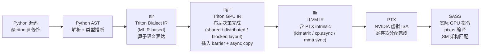
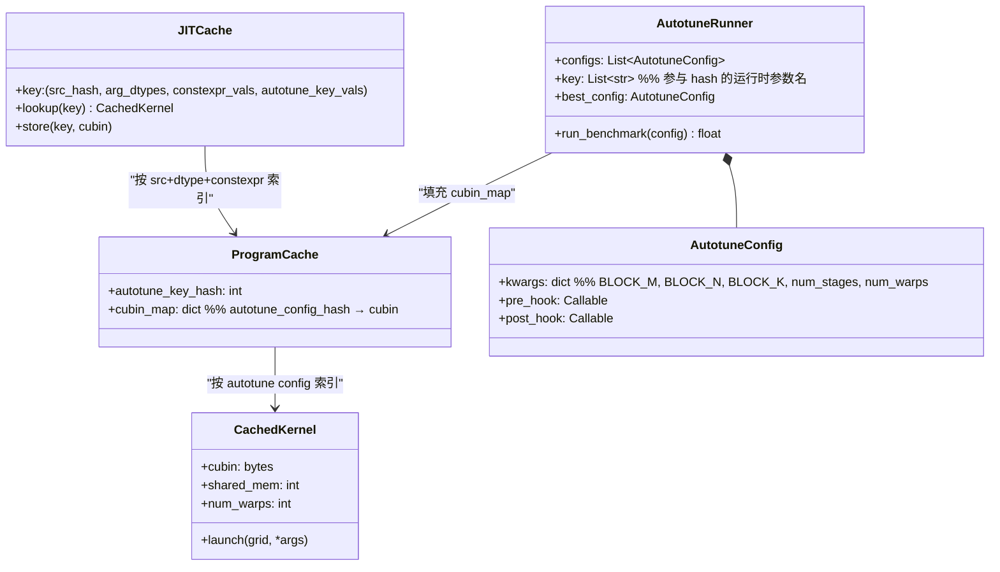

# a04 · Triton 工程化 — compiler stack + autotune + torch.compile

> **一句话总结:** Triton 是 OpenAI 推出的 GPU kernel Python DSL，通过 `@triton.jit` + `@triton.autotune` 将 Python 函数编译为高效 CUDA cubin，PyTorch 2.x inductor 默认以 Triton 为后端生成 kernel，是当前 senior AI Infra 工程师写自定义 kernel 的首选工具链。

## 1. 是什么 / 为什么有它

Triton 是 OpenAI 于 2019 年发布的 GPU 编程语言与编译器，其设计目标是让研究人员和工程师能用 Python 语法编写接近 CUDA 极限性能的 GPU kernel，同时屏蔽 warp-level 线程管理、共享内存 bank conflict、寄存器压力等底层细节。与原生 CUDA C 相比，Triton 的编程模型以"块"（block/tile）为基本操作单位：程序员指定每个 program 处理哪个 tile，编译器负责在 tile 内部做 vectorization、barrier 插入、SMEM 管理与指令选择。这一设计让 Triton 把 CUDA 编程的"线程粒度"提升到"块粒度"，程序员不再需要手动计算 `threadIdx.x`、分配 `__shared__` 内存或者手写 `__syncthreads()`，极大降低了写出正确高性能 kernel 的门槛。

Triton 在生产中的覆盖面远超许多人的预期。PyTorch 2.x 的 `torch.inductor`（`torch.compile` 的默认后端）在生成 GPU kernel 时几乎全面使用 Triton：简单的 elementwise op、reduction、normalization 都会被 inductor 降级（lower）成 Triton kernel，再由 Triton 编译为 cubin。FlashAttention 早期版本（v1/v2 Triton 实现）在 GPU 注意力运算上展示了 Triton 能达到手写 CUDA 接近 80-90% 性能的潜力。PagedAttention（vLLM）的部分 paging 相关辅助 kernel、RoPE embedding、kv-copy 等也用 Triton 实现。Triton 还被用于实现各类高性能量化 kernel（INT4 dequant + matmul fusion）、Mamba selective scan 算子，以及各种 LLM serving 框架中的 kv cache 操作。

对于 senior AI Infra 工程师，掌握 Triton 的重要性在于它覆盖了三类核心场景：①新算子快速原型（比 CUDA C 快 5-10 倍开发速度，从想法到跑通验证通常只需数小时而非数天）；② `torch.compile` 生成代码的读懂与调优（inductor 出了性能问题必须能看懂生成的 Triton 代码，定位 fusion 失败或 layout 不优的位置）；③在 CUTLASS / cuBLASLt 不覆盖的 op fusion 模式上手写高性能 kernel（如在 attention 之后 fuse softmax + dropout + output projection 的联合操作）。经验法则是：senior 写自定义 kernel 约 90% 在 Triton 完成，只有在 GEMM 最后 5-10% 性能压榨，或需要用到 wgmma 特定变体（如 sparse 结构化稀疏 wgmma）时，才下沉到 CUTLASS 模板或 inline PTX asm。此外，Triton 的开放式编译器架构（基于 MLIR）也使得社区能快速添加对新硬件特性的支持，是目前跟进最新 GPU 特性的最快路径之一。

## 2. 硬件 / 系统视角（微架构 / 拓扑 / 协议）

### Triton 编译器 pipeline

Triton kernel 从 Python 装饰函数到最终在 GPU 执行的 SASS，经历了以下多阶段编译流程：



关键阶段说明：

**ttir（Triton Dialect IR）** 是 Triton 自定义的 MLIR dialect，保留了 `tl.load`、`tl.dot`、`tl.store` 等高层语义，编译器在此阶段做常数折叠、死代码消除与简单的代数化简。此阶段的 IR 还不包含任何 GPU 特定的 layout 信息，是 Triton 可移植性的基础层——原则上可以针对不同后端（不限于 CUDA）做目标代码生成。

**ttgir（Triton GPU IR）** 是最重要的中间表示，也是 Triton 编译器差异化的核心所在。这里决定 tensor 的 layout 策略：`BlockedLayout` 描述 tensor 如何映射到 thread × warp × CTA 的 register file，`SharedLayout` 描述 SMEM 中的 swizzle 模式（确保 128-bit 向量 load 时不产生 bank conflict）。`tl.dot` 在此阶段被展开为 wgmma（SM90/Hopper）或 `mma.sync.aligned.m16n8k16`（SM80/Ampere），并在 tile 迭代边界插入 `tt.barrier` / pipeline barrier。此阶段的决策直接影响寄存器压力（layout 不当会导致 register spill 到 global memory）、共享内存使用量（swizzle 错误导致 bank conflict）以及最终的 TC 利用率。可以通过 `TRITON_DEBUG=1` 将此阶段的 IR dump 出来查看，对于性能分析极有价值。

**llir** 阶段将 ttgir 降级为 LLVM IR，内联 PTX intrinsic，如 `ldmatrix.sync.aligned.x4.m8n8.shared.b16` 用于从 SMEM 加载 fragment 到寄存器（为 mma.sync 准备输入），`cp.async.cg.shared.global` 用于异步全局内存到 SMEM 的拷贝（Ampere+），`wgmma.mma_async.sync.aligned.*` 系列指令用于 Hopper 的异步 warp-group matmul。在此阶段，Triton 会根据 SM 代数选择最合适的 PTX 指令变体。

**PTX 到 SASS** 由 NVIDIA 的 `ptxas` 完成（Triton 调用系统安装的 CUDA toolkit 中的 ptxas），主要工作是寄存器分配、指令调度（latency hiding）、bank conflict 检测与部分重排。ptxas 的版本与 CUDA Driver 版本需要匹配；Triton 会缓存编译好的 cubin（以 kernel 源码哈希 + 编译参数为 key），确保相同 kernel 不重复编译。

### Triton runtime cache 与 autotune key 机制

Triton 的 kernel 缓存与自动调优是强耦合的系统：



关键概念解析：

**JITCache 的分层结构非常重要。** 缓存的第一层 key 是 `(src_hash, arg_dtypes_tuple, constexpr_vals_tuple, autotune_key_vals_tuple)`：源码 hash 确保代码修改后失效；arg_dtypes 确保 BF16 与 FP16 得到不同 cubin（这也是 autotune key 必须包含 dtype 的原因）；constexpr_vals 包含所有 `tl.constexpr` 参数值，如 `BLOCK_SIZE=128` 与 `BLOCK_SIZE=256` 编译出完全不同的 cubin。ProgramCache 在 JITCache 的基础上进一步按 autotune 选出的最优 config 索引不同 cubin，允许同一组外部参数（M,N,K,dtype）对应多个 benchmark 过的 cubin 版本，并选出最优的一个驻留。

**`@triton.jit` 标记 device 函数。** 被修饰的 Python 函数不会在 host 上执行，而是被 Triton 编译器解析为 AST 并走完整编译 pipeline。调用时通过 `kernel[grid](args...)` 语法传递 launch config 与参数。

**`tl.program_id(axis)` 获取当前 program 的 grid 坐标。** axis=0 是 x 维，axis=1 是 y 维，类比 CUDA 的 `blockIdx.x/y`。一个 Triton program 对应一个 CUDA block，但 Triton 的 block 内部是向量化操作，程序员看不到 thread 层面。

**`tl.load(ptr + offsets, mask=mask)` 带 mask 的向量化加载。** `offsets` 是 int32 向量（通常是 `tl.arange(0, BLOCK_SIZE)`），`mask` 是 bool 向量，mask=False 的位置使用 `other` 参数（默认 0.0）填充，防止越界访问。内部会生成 vectorized global load 指令，并在 SM90 上尝试用 TMA（Tensor Memory Accelerator）替代标量 ldg。

**`tl.dot(a, b)` 调用矩阵乘法硬件。** 在 SM90（Hopper）上，Triton 会尝试生成 `wgmma.mma_async.sync.aligned.m64n*k16.f32.bf16.bf16` 系列指令（warp-group 级 MMA，由 4 个 warp 协同完成一次大 MMA，吞吐远高于 mma.sync）；在 SM80（Ampere）上生成 `mma.sync.aligned.m16n8k16.row.col.f32.f16.f16.f32`。具体选择哪个 wgmma 变体取决于 layout 配置与 tile 大小，部分 wgmma 变体（如非标准 accumulator 类型，或 structured sparse wgmma）Triton 尚不支持，会 fallback 到 mma.sync（SM80 路径），性能损失可达 30-40%。`allow_tf32=True` 参数允许在 FP32 输入时使用 TF32 精度的 TC 运算（精度近似，速度大幅提升）。

**autotune key 决定 cubin 粒度与 benchmark 触发时机。** `@triton.autotune(configs=[...], key=['M','N','K'])` 中，`key` 指定哪些运行时参数参与 autotune hash。每个独特的 key 值组合会触发一次完整 benchmark（对所有 configs 逐一运行若干次，取最快的），选出最优 config 后编译并缓存对应 cubin。key 设置不当（如漏掉 `dtype`）会导致不同 dtype 共享同一 cubin，在精度没问题的情况下产生隐性性能退化。key 值过多（如 key 包含 seq_len 而 seq_len 有几十种不同值）会导致 autotune 反复触发，总启动延迟成倍增加。

## 3. CUDA / 框架编程接口

### 核心装饰器体系

**`@triton.jit`** 是最基础的装饰器，标记一个函数为 Triton kernel。函数内只能使用 Triton language（`triton.language as tl`）提供的原语，不能有 Python 运行时特性（如动态 list、dict）。`tl.constexpr` 修饰的参数在编译时固化为常数，编译器可以对其进行完全展开（unroll）。

```python
import triton
import triton.language as tl

@triton.jit
def add_kernel(x_ptr, y_ptr, output_ptr, n_elements, BLOCK_SIZE: tl.constexpr):
    pid = tl.program_id(axis=0)
    block_start = pid * BLOCK_SIZE
    offsets = block_start + tl.arange(0, BLOCK_SIZE)
    mask = offsets < n_elements
    x = tl.load(x_ptr + offsets, mask=mask)
    y = tl.load(y_ptr + offsets, mask=mask)
    output = x + y
    tl.store(output_ptr + offsets, output, mask=mask)
```

**`@triton.autotune(configs, key)`** 包裹在 `@triton.jit` 外层，指定候选配置列表与运行时 key。`configs` 是 `triton.Config` 对象列表，每个 Config 包含 `kwargs`（传给 kernel 的 constexpr 参数）和 `num_warps`、`num_stages`（pipeline 深度）。`key` 列表指定触发重新调优的运行时参数名，必须包含所有影响最优 config 的参数（如 `M`、`N`、`K`、`dtype`）。

**`@triton.heuristics`** 用于在 autotune 之上添加规则，根据输入参数计算某些 constexpr 参数，避免把所有可能性穷举进 autotune。

### Triton Language 常用原语

| 原语 | 用途 |
|------|------|
| `tl.program_id(axis)` | 获取当前 program 在 grid 中的 id |
| `tl.load(ptr, mask, other)` | 带 mask 的向量化 global/SMEM 读 |
| `tl.store(ptr, value, mask)` | 带 mask 的向量化写 |
| `tl.dot(a, b, allow_tf32)` | tile-level matmul，调 TC 硬件 |
| `tl.zeros([M, N], dtype)` | 在 SMEM/寄存器分配零初始化 tile |
| `tl.cumsum(x, axis)` | 前缀和，生成高效 scan 指令 |
| `tl.where(cond, x, y)` | 按元素条件选择（生成 predicated 指令）|
| `tl.arange(start, end)` | 生成范围向量（编译期常数 size）|
| `tl.atomic_add(ptr, val)` | 原子加法（reduce 场景）|

### 与 torch.compile / torch.inductor 的集成

PyTorch 2.x 中，`torch.compile(model)` 会触发 `torch.inductor` 对计算图做 lowering。在 GPU 路径上，inductor 默认将大部分 op（elementwise、reduction、softmax、layernorm、RoPE 等）降级为 Triton kernel 代码，再由 Triton 编译为 cubin。PyTorch 2.4 起，Triton backend 的覆盖率已超过 90% 的 inductor lowering pattern。Inductor 对 Triton 的使用方式与手写 Triton 有所不同：inductor 会根据 graph 结构自动决定 tile 大小，并生成经过 fusion 的复合 kernel（如把 `add + relu + dropout` 合并进同一个 Triton kernel），大幅减少 HBM 读写往返。在不使用 `torch.compile` 的情况下，这三个 op 会分别调用三次 GPU kernel，每次都需要把中间结果写回 HBM；而 inductor 融合后只写一次最终结果，对于 elementwise-heavy 的模型（如大量 SwiGLU activation）收益尤为明显。

理解 inductor 与 Triton 的交互对于调优 `torch.compile` 性能问题至关重要。常见场景：inductor 在某些 op 上触发 "graph break"（回退到 eager mode），可以通过 `torch._dynamo.explain(fn)(*args)` 找到 break 原因；inductor 生成的 Triton kernel BLOCK 尺寸不合适时，可以通过 `torch._inductor.config.triton.max_block` 系列参数调整。

**三档方案选择指南：**
- **手写 Triton**：op fusion 涉及复杂的 tile 访问模式（如 FlashAttention 的在线 softmax），inductor 无法自动融合，需手写；新的量化 kernel（如 INT4 dequant + linear）；LLM serving 中的 paging / copy 类 kernel。
- **下沉 CUTLASS**：对 GEMM 极限性能有要求（差距 Triton 约 10%），需要 collective mainloop + persistent kernel 级别控制；或需要利用 wgmma + TMA 的完整流水线（Triton 对此的支持还不完整）。
- **inline PTX asm**：wgmma 的特定非标准变体（如 sparse wgmma with structured sparsity in operand B，Triton 目前不支持）；或需要精确控制寄存器分配与指令排列顺序以避免 ptxas 重排导致的性能下降。

## 4. 关键性能指标

### 实测数字

**Triton vs CUTLASS H100 GEMM 对比：** 在典型 LLM 训练 GEMM 形状（M=N=K=4096，BF16 输入）上，经过 autotune 的 Triton GEMM 可以达到 H100 TC peak 约 80%，而 CUTLASS 3.x 集成了 TMA + wgmma + persistent kernel 后可达 87-92%。约 10% 的差距来自于 Triton 编译器在 wgmma pipeline 调度、prefetch 深度控制、TMA 指令组合上的局限。对于大多数自定义 op，这 10% 可以接受；对 GEMM 性能极限敏感（如 MoE expert linear 占训练步 30%）时才有必要换 CUTLASS。

**autotune 耗时：** 每次 autotune 需要 benchmark 所有 configs，典型 20 个 config 在 H100 上约耗时 15-30 秒（每个 config warm-up 若干次后取平均）。如果 autotune key 漏掉 `dtype`，那么 BF16 与 FP16 的不同调用会共享同一 autotune result，而 BF16 和 FP16 的最优 BLOCK 大小可能不同，导致某个 dtype 的实际性能比最优低 20-30%，同时还要每次在新进程启动时重跑 30s 的 tune。

**`torch.compile` 覆盖率：** PyTorch 2.4+ 中，对标准 Transformer forward pass 使用 `torch.compile(model, backend='inductor')`，约 90% 的 FLOP 会由 Triton kernel 执行，10% 可能仍走 cuDNN（attention）或 cuBLAS（GEMM fallback）。与非 compile 相比，中等规模模型（Llama-7B）端到端训练吞吐提升 15-25%，主要来自 kernel fusion 减少 HBM 读写往返。

**FlashAttention-2 Triton 实现：** 在单 H100 SXM5 上，对 70B 推理（seq_len=2048，head_dim=128，32 heads）的 attention 计算，FlashAttention-2 Triton 实现占整体前向时间约 10%（其余由 GEMM 和通信占据）。与朴素 PyTorch 实现（materialized attention matrix）相比，FlashAttention-2 节省约 16× HBM 读写，在长序列场景（seq_len=8192+）优势更大。

**编译时间与启动延迟：** Triton JIT 编译单个 kernel（从 ttir 到 PTX）在 H100 平台通常需要 0.5-2 秒。若 autotune configs 过多（如 50 个），首次调用时总启动延迟可达 1-2 分钟，在需要快速迭代的调试环境中体验很差。

**编译时间与进程间 cubin 复用：** Triton 默认将编译好的 cubin 缓存在 `~/.triton/cache/` 目录（按 kernel 源码哈希 + 编译参数作为 key）。在多进程训练（如 DDP 或 FSDP）中，各进程默认共享同一磁盘缓存，因此第一个编译完成的进程会写入 cubin，后续进程直接加载，不会重复编译。但 autotune 的 benchmark 过程是进程独立的（无法共享 autotune 结果），每个进程都会独立跑 benchmark。这在大规模训练（如 1k+ GPU）中会产生"thundering herd"效应：1024 个进程同时对同一个 kernel 跑 autotune，GPU compute 资源被 benchmark 占用导致整体启动延迟。解决方案是在正式训练前单独跑一次 "warm-up" 让 autotune 结果写入共享存储，或使用固定 config（`triton.Config(..., num_stages=3, num_warps=8)` 直接指定不 autotune）。

### 性能分析要点

Triton kernel 的性能瓶颈通常来自以下三方面：HBM 带宽受限（load/store 过多，tile 过小，每次 tl.load 的数据量不足以隐藏 global load 延迟）、TC 利用率低（tile 尺寸不是 TC 友好的 16 的倍数，或 dtype 不匹配 TC 要求，如 FP32 输入但不开 `allow_tf32` 导致走 CUDA core 而非 TC）、SMEM bank conflict（tl.dot 的 layout 与 SMEM 排列不对齐，leading 到 shared load 需要多路串行）。ncu（NSight Compute）是定量分析这三类问题的主要工具，关键 counter 包括：`l2_global_load_bytes`（实际 HBM 流量，对比理论下界）、`sm__pipe_tensor_op_hmma_cycles_active.avg.pct_of_peak_sustained_active`（TC 利用率）、`l1tex__data_bank_conflicts_pipe_lsu_mem_shared_op_ld.sum`（SMEM bank conflict 总次数）。

## 5. 代码示例

### 完整 Triton GEMM kernel（含 autotune）

```python
import torch
import triton
import triton.language as tl

# autotune configs：覆盖不同 BLOCK_M/N/K 组合和 pipeline 深度
@triton.autotune(
    configs=[
        triton.Config({'BLOCK_M': 128, 'BLOCK_N': 256, 'BLOCK_K': 64,
                       'GROUP_SIZE_M': 8}, num_stages=3, num_warps=8),
        triton.Config({'BLOCK_M': 64,  'BLOCK_N': 256, 'BLOCK_K': 32,
                       'GROUP_SIZE_M': 8}, num_stages=4, num_warps=4),
        triton.Config({'BLOCK_M': 128, 'BLOCK_N': 128, 'BLOCK_K': 32,
                       'GROUP_SIZE_M': 8}, num_stages=4, num_warps=4),
        triton.Config({'BLOCK_M': 128, 'BLOCK_N': 64,  'BLOCK_K': 32,
                       'GROUP_SIZE_M': 8}, num_stages=4, num_warps=4),
        triton.Config({'BLOCK_M': 64,  'BLOCK_N': 128, 'BLOCK_K': 32,
                       'GROUP_SIZE_M': 8}, num_stages=4, num_warps=4),
        triton.Config({'BLOCK_M': 64,  'BLOCK_N': 64,  'BLOCK_K': 64,
                       'GROUP_SIZE_M': 8}, num_stages=3, num_warps=4),
    ],
    # key 中必须包含 dtype，否则 BF16 / FP16 会共享 suboptimal config
    key=['M', 'N', 'K'],
)
@triton.jit
def matmul_kernel(
    a_ptr, b_ptr, c_ptr,
    M, N, K,
    stride_am, stride_ak,
    stride_bk, stride_bn,
    stride_cm, stride_cn,
    BLOCK_M: tl.constexpr, BLOCK_N: tl.constexpr, BLOCK_K: tl.constexpr,
    GROUP_SIZE_M: tl.constexpr,
):
    """BF16 matmul：C[M,N] = A[M,K] @ B[K,N]，支持 TMA-friendly tile 排布"""
    pid = tl.program_id(axis=0)
    num_pid_m = tl.cdiv(M, BLOCK_M)
    num_pid_n = tl.cdiv(N, BLOCK_N)
    # 分组调度：提高 L2 cache 命中率（超节点 swizzle）
    num_pid_in_group = GROUP_SIZE_M * num_pid_n
    group_id = pid // num_pid_in_group
    first_pid_m = group_id * GROUP_SIZE_M
    group_size_m = min(num_pid_m - first_pid_m, GROUP_SIZE_M)
    pid_m = first_pid_m + (pid % num_pid_in_group) % group_size_m
    pid_n = (pid % num_pid_in_group) // group_size_m

    # 计算本 program 负责的 tile 起始位置
    offs_am = (pid_m * BLOCK_M + tl.arange(0, BLOCK_M)) % M
    offs_bn = (pid_n * BLOCK_N + tl.arange(0, BLOCK_N)) % N
    offs_k  = tl.arange(0, BLOCK_K)
    a_ptrs  = a_ptr + (offs_am[:, None] * stride_am + offs_k[None, :] * stride_ak)
    b_ptrs  = b_ptr + (offs_k[:, None] * stride_bk + offs_bn[None, :] * stride_bn)

    # 累加器：在 TC 硬件上以 float32 累加
    accumulator = tl.zeros((BLOCK_M, BLOCK_N), dtype=tl.float32)

    for k in range(0, tl.cdiv(K, BLOCK_K)):
        # 加载 A/B tile，mask 处理 K 维边界
        a = tl.load(a_ptrs, mask=offs_k[None, :] < K - k * BLOCK_K, other=0.0)
        b = tl.load(b_ptrs, mask=offs_k[:, None] < K - k * BLOCK_K, other=0.0)
        # tl.dot 在 SM90 生成 wgmma，SM80 生成 mma.sync.m16n8k16
        accumulator = tl.dot(a, b, accumulator)
        a_ptrs += BLOCK_K * stride_ak
        b_ptrs += BLOCK_K * stride_bk

    # 写回结果，转换为 BF16 存储
    c = accumulator.to(tl.bfloat16)
    offs_cm = pid_m * BLOCK_M + tl.arange(0, BLOCK_M)
    offs_cn = pid_n * BLOCK_N + tl.arange(0, BLOCK_N)
    c_ptrs  = c_ptr + stride_cm * offs_cm[:, None] + stride_cn * offs_cn[None, :]
    c_mask  = (offs_cm[:, None] < M) & (offs_cn[None, :] < N)
    tl.store(c_ptrs, c, mask=c_mask)


def matmul(a: torch.Tensor, b: torch.Tensor) -> torch.Tensor:
    """host 端包装：计算 C = A @ B，A/B 必须是 BF16 + contiguous"""
    assert a.is_cuda and b.is_cuda
    assert a.dtype == torch.bfloat16 and b.dtype == torch.bfloat16
    M, K = a.shape
    K2, N = b.shape
    assert K == K2
    c = torch.empty((M, N), device=a.device, dtype=torch.bfloat16)
    grid = lambda meta: (triton.cdiv(M, meta['BLOCK_M']) *
                         triton.cdiv(N, meta['BLOCK_N']),)
    matmul_kernel[grid](
        a, b, c,
        M, N, K,
        a.stride(0), a.stride(1),
        b.stride(0), b.stride(1),
        c.stride(0), c.stride(1),
    )
    return c
```

### torch.compile inductor 生成的 Triton 片段（示例）

`torch.compile` 生成的 Triton 代码可通过 `TORCH_COMPILE_DEBUG=1` 或 `torch._inductor.config.trace.enabled = True` 导出。以下是对 `x = a + b; y = torch.relu(x)` 的典型 inductor lowering 结果：

```python
# 由 torch.inductor 自动生成（示意，实际变量名会含哈希）
@triton.jit
def triton_poi_fused_add_relu_0(in_ptr0, in_ptr1, out_ptr0, xnumel,
                                 XBLOCK: tl.constexpr):
    xoffset = tl.program_id(0) * XBLOCK
    xindex   = xoffset + tl.arange(0, XBLOCK)[:]
    xmask    = xindex < xnumel
    tmp0 = tl.load(in_ptr0 + xindex, xmask)   # a
    tmp1 = tl.load(in_ptr1 + xindex, xmask)   # b
    tmp2 = tmp0 + tmp1                          # add
    tmp3 = tl.where(tmp2 > 0, tmp2, 0.0)       # relu (fused)
    tl.store(out_ptr0 + xindex, tmp3, xmask)
```

inductor 自动完成了 `add` + `relu` 的 fusion，避免了中间结果写回 HBM——这正是 `torch.compile` 的主要收益之一。

## 6. 实测手段

### 环境变量调试

**`TRITON_DEBUG=1`** 输出完整的 Triton 编译日志，包括从 ttir 到 PTX 的每个 IR 阶段的 dump。对于怀疑 Triton 生成了错误指令（如 wgmma 退回 mma.sync）的情况，设置此变量后检查 ttgir 阶段的 `tt.dot` 是否被展开为 wgmma 相关 intrinsic。日志输出到 stderr，会大量增加输出量，建议重定向到文件：`TRITON_DEBUG=1 python script.py 2>triton_debug.log`。

**`TRITON_PRINT_AUTOTUNING=1`** 在 autotune 结束后打印每个 config 的 benchmark 耗时与最终选中的 config。对于排查 autotune key 是否覆盖了正确的参数组合、config 数量是否合理，非常有用。输出格式为：`[autotune] best config: BLOCK_M=128, BLOCK_N=256, BLOCK_K=64, num_stages=3, num_warps=8, time=0.0218ms`。

**`TRITON_CACHE_DIR`** 控制 Triton cubin 缓存目录（默认 `~/.triton/cache`）。生产环境中可以指定共享存储路径，让多进程复用已编译 cubin，避免每个进程重复编译 30 秒的 autotune 开销。

**`TORCH_COMPILE_DEBUG=1`** 导出 `torch.compile` 生成的 Triton 源码文件，保存到 `torch_compile_debug/` 目录，可以逐行检查 inductor 的 fusion 效果。

**`TRITON_CACHE_DIR=/shared/triton_cache`** 在多节点训练中将缓存目录指向共享网络存储（NFS / Lustre），确保所有节点的进程共享同一批已编译的 cubin，避免每节点重复编译（单个 kernel 约 0.5-2 秒，100 个 kernel 就是 1-2 分钟的额外启动延迟）。需要注意的是共享目录的并发写入可能导致 race condition，Triton 用原子文件操作处理大部分情况，但在极端高并发场景（数百进程同时首次编译同一 kernel）下仍可能有少量重复编译，通常影响不大。

### NSight Compute 分析 Triton 生成的 cubin

Triton 生成的 cubin 可以直接用 ncu（NSight Compute）进行 profiling，无需额外配置，因为 Triton 生成的 PTX 和 cubin 与普通 CUDA kernel 格式完全相同，ncu 不需要感知 Triton 编译器的存在。关键指令：

```bash
# profile Triton kernel，输出 roofline 相关指标
ncu --set full --target-processes all \
    --metrics sm__throughput.avg.pct_of_peak_sustained_elapsed,\
l1tex__t_bytes.sum,l2_global_load_bytes.sum,\
sm__pipe_tensor_op_hmma_cycles_active.avg.pct_of_peak_sustained_active \
    python my_triton_script.py

# 导出可在 GUI 中查看的报告
ncu --export triton_profile.ncu-rep python my_triton_script.py
```

重点关注指标：`sm__pipe_tensor_op_hmma_cycles_active`（TC 利用率，Ampere mma.sync 路径）、`sm__pipe_tensor_op_wgmma_cycles_active`（wgmma TC 利用率，Hopper 专属）、`l2_global_load_bytes`（HBM 读量，对比理论最小值）、`l1tex__data_bank_conflicts_pipe_lsu_mem_shared_op_ld.sum`（SMEM bank conflict 次数）。对于 Triton GEMM，TC 利用率若低于 70%，通常说明 BLOCK 尺寸不对或 `num_stages` pipeline 深度不足（增加 stages 可以更好地隐藏 global load latency），可以先调大 `BLOCK_M`/`BLOCK_N` 或增加 `num_stages` 至 4-5。

Triton 还支持通过 `triton.testing.perf_report` 生成性能报告，将不同 problem size 下的 kernel throughput 可视化为折线图，方便找出性能"悬崖"（如 M 从 512 涨到 513 时 TC 利用率骤降，暗示 BLOCK 尺寸对齐问题）。

**PyTorch profiler 集成：** 用 `torch.profiler.profile(activities=[ProfilerActivity.CUDA])` 也可以捕获 Triton kernel 执行时间，kernel 名称会包含 Triton 内核的函数名前缀（如 `matmul_kernel_0d1d2d3d4d5d6d7d8d`，其中数字代表参数 hash），便于在 Chrome trace 或 TensorBoard 中定位具体的慢 kernel。对于复杂模型（Transformer 的 attention + MLP + norm 等），通常会看到十几个甚至几十个不同的 Triton kernel，通过 profiler 可以快速识别哪个 kernel 占比最高，优先优化。

## 7. 常见反模式

### 反模式 1：autotune key 漏掉 dtype

`key=['M','N','K']` 中漏掉 dtype 是高频错误，在混合精度训练（BF16 前向 + FP32 梯度）的代码中尤为常见。当同一个 kernel 函数被以 BF16 和 FP16 两种 dtype 分别调用时，Triton 会将两者的 autotune 结果混用：第一次调用的 dtype（假设 BF16）完成 30 秒 autotune 并选出最优 config，第二次调用的 FP16 则直接复用 BF16 的结果，而 BF16 和 FP16 的最优 tile 尺寸完全可能不同（特别是 BF16 路径走 wgmma 但 FP16 路径因为某个 tile 尺寸不对走了 mma.sync），导致 FP16 调用性能比最优差 20-30%，且这个问题在 benchmark 不细致时极难发现，往往以为是 "FP16 本来就慢" 而忽视。正确做法是 `key=['M','N','K','dtype']`（dtype 用 `str(a.dtype)` 传入），或通过 `@triton.heuristics({'IS_BF16': lambda args: args['a_ptr'].dtype == tl.bfloat16})` 将 dtype 信息映射为 constexpr 参数参与 hash。每种 dtype 会独立触发 30 秒左右的 autotune，属于一次性开销，之后走缓存无额外成本。

### 反模式 2：SMEM 分配超容量时静默 fail

Triton 中用 `tl.zeros([BLOCK_M, BLOCK_K], dtype=tl.float32)` 在 shared memory 分配 tile 时，如果多个 tile 的总 SMEM 需求（A tile + B tile + 可能的 C accumulator）超过了当前 SM 的可用 SMEM（H100 SXM5 单 CTA 最大约 228 KiB，Ampere A100 约 164 KiB），并不会在编译时报错，而是在运行时静默地降级——Triton 会把溢出的数据放到 L1/L2 或全局内存，CTA 占用率（occupancy）也会同时下降（因为每个 SM 能同时运行的 CTA 数减少），性能可能骤降 5-10 倍，且没有任何警告信息。举例：`BLOCK_M=128, BLOCK_K=128, dtype=float32` 时单 A tile 就需要 128×128×4=64 KiB，若同时有两个 tile（A + B）则需要 128 KiB，加上 pipeline double-buffer 就是 256 KiB，已超出 H100 228 KiB 的 SMEM 上限。调试方法是设置 `TRITON_DEBUG=1` 查看 ttgir 中 `smem_size` 字段，或在 ncu 中查看 `l1tex__data_bank_conflicts_pipe_lsu_mem_shared_op_ld.sum` 与 `shared_mem_per_block` 实际值，若后者远小于预期，说明 SMEM 请求被截断。

### 反模式 3：`BLOCK_SIZE` 不标注为 `tl.constexpr`

```python
# 错误：BLOCK_SIZE 是运行时参数
@triton.jit
def kernel(ptr, n, BLOCK_SIZE):   # BLOCK_SIZE 不是 constexpr
    offsets = tl.arange(0, BLOCK_SIZE)  # 编译器无法在编译期确定 size
```

`tl.arange(start, end)` 要求 `end` 是编译期常数（`tl.constexpr`）。如果 `BLOCK_SIZE` 不标注为 `tl.constexpr`，Triton 会报编译错误，或在某些版本中每次参数变化都触发重编译（JIT cache miss），导致每次调用额外 0.5-2 秒的编译延迟，在训练循环中积累成灾难性开销。正确写法：`def kernel(ptr, n, BLOCK_SIZE: tl.constexpr)`。

### 反模式 4：期望 tl.dot 生成 wgmma 但实际生成 mma.sync

Triton 在 SM90（Hopper）上优先尝试生成 `wgmma.mma_async`，但有若干条件限制：tile 大小必须是 wgmma 支持的形状（如 `M=64/128, N=64/128/256, K=16`），accumulator dtype 必须与 wgmma 支持的组合一致（如 FP32 acc + BF16 input）。当 tile 尺寸不满足条件或使用了 wgmma 不支持的 dtype 组合时，Triton 会静默 fallback 到 `mma.sync.aligned.m16n8k16`，性能可能损失 30-40%。排查方法：`TRITON_DEBUG=1` 查看 ttgir 是否出现 `triton_gpu.wgmma`，或 ncu 检查 `sm__pipe_tensor_op_wgmma_cycles_active` 是否为 0。

### 反模式 5：autotune configs 数量过多

将所有可能的 `BLOCK_M/N/K/num_stages/num_warps` 组合穷举进 configs 列表，导致单个 kernel 函数有 50-100 个 config。在 H100 上，每个 config 的 benchmark 约需 0.5-1 秒，100 个 config 意味着首次调用时 autotune 要花 50-100 秒。对于 `key=(M, N, K, dtype)` 的四元组，每种新的形状组合都会重新触发完整 autotune，训练初期的不同 shape（warmup 阶段）会让启动时间爆炸。合理做法是：①先用小 grid search 确定有效 config 范围；②为最常见形状预注册已知最优 config；③configs 数量控制在 8-16 以内。

### 反模式 6：`torch.compile` + 自定义 Triton op 的 dispatch 顺序错乱

在 `torch.compile` 图模式下使用自定义 Triton kernel（通过 `torch.library.triton_op` 或 `torch._custom_op`）时，如果 op 注册的 dispatch key 与 inductor lowering 规则冲突，可能导致多种难以诊断的问题：自定义 kernel 被 inductor 识别为可进一步 fuse 从而被改写（破坏原有的正确语义，结果出现数值不匹配）；autograd 捕获了错误的 backward 路径，因为 `torch.compile` 会重写 autograd 图，若自定义 op 没有正确注册 `setup_context` 与 `backward`，梯度就会走错路径或直接报错；op 被 `torch.export` 序列化时因为 dispatch key 不完整而失败，导致模型无法部署。正确做法是：首先用 `torch.library.opcheck(myop, ...)` 验证 op 注册正确性（包括 autograd、shape 推断、dtype 推断 key 的完整性）；其次在不希望被 inductor 修改的 kernel 区域用 `torch.compiler.disable()` 装饰器显式保护；最后注意 `triton_op` 与普通 `custom_op` 的差异——`triton_op` 的 inductor 后端会直接使用传入的 Triton kernel，不会走普通 lowering path，但需要指定正确的 `grid` 计算逻辑。在混合场景（inductor 生成的部分 kernel + 手写 Triton kernel）中，还需要确认两者的 CUDA stream 对齐，避免 async kernel 的执行顺序错乱。

## 8. 延伸阅读

```
Triton 项目源码（含编译器与语言定义）
  github.com/openai/triton
  核心 IR 定义：triton/include/triton/Dialect/
  autotune 实现：python/triton/runtime/autotuner.py

Triton 论文
  "Triton: An Intermediate Language and Compiler for Tiled Neural Network Computations"
  Philippe Tillet, H. T. Kung, David Cox — MLSys 2019
  arxiv.org/abs/1903.07082

FlashAttention-2 Triton 实现
  github.com/Dao-AILab/flash-attention/blob/main/flash_attn/flash_attn_triton.py
  完整展示 Triton 实现在线 softmax 与 tiling 策略的生产级代码

PyTorch inductor + Triton backend 文档
  pytorch.org/docs/stable/torch.compiler_inductor_profiling.html
  TORCH_COMPILE_DEBUG 用法 + inductor 内部 lowering pass 说明

torch.compile 调试指南
  pytorch.org/docs/stable/torch.compiler_troubleshooting.html
  涵盖 graph break 分析、fallback 检测、Triton codegen dump

Triton GPU IR 规范（ttgir dialect）
  github.com/openai/triton/blob/main/include/triton/Dialect/TritonGPU/IR/TritonGPUOps.td
  理解 distributed layout vs shared layout 的底层定义

NSight Compute Triton kernel 分析
  developer.nvidia.com/nsight-compute
  ncu CLI 与 Triton kernel 配合：直接 attach cubin，无需源码
```