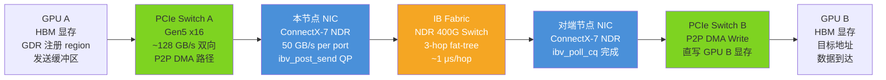
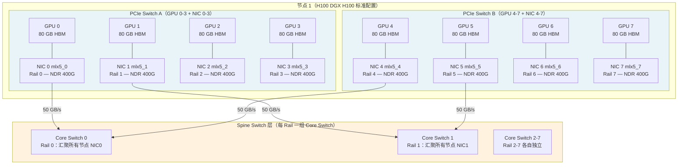
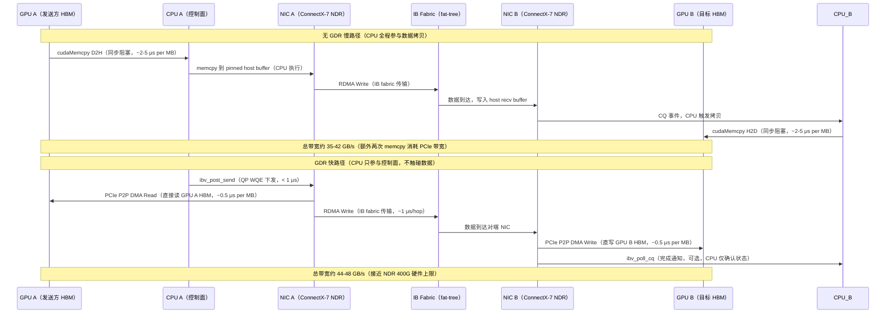

# a05 · RDMA + NCCL transport — 跨节点通信完整路径

> **一句话总结:** 多节点 GPU 训练的跨节点通信由 InfiniBand NDR 400G、GPUDirect RDMA 和 NCCL transport plugin 三层协同驱动，rail-optimized 拓扑与 GDR bypass 是实现接近硬件上限带宽的关键，任何一层配置错误都会静默降速 50% 以上。

## 1. 是什么 / 为什么有它

主体教程的 NVLink / NVSwitch 章节聚焦于单节点 8 GPU 内部互连，带宽最高可达 900 GB/s（Hopper NVSwitch 全双工）。但真实生产训练集群规模远超 8 GPU：Llama-3 405B 在 H100 × 16384 上训练，Gemini Ultra 据报道在更大规模上运行，单节点 NVLink 完全解决不了跨节点通信问题。跨节点 GPU 通信的完整技术栈由三个关键层构成。

**物理层：InfiniBand NDR 400G。** 当前主流 HPC/AI 集群使用 NDR（Next Data Rate）400G InfiniBand，单 link 双向带宽为 400 Gbps（等效 50 GB/s）。IB 网络采用 fat-tree 拓扑，通常 2-3 层交换机，每一跳延迟约 100-200 ns，端到端 3 hop 总延迟约 1-3 μs，远低于以太网的 10-50 μs。IB 网络采用基于信用的流量控制（credit-based flow control），确保零丢包（lossless），这是 RDMA 可靠运行的前提——RDMA 协议假设网络不丢包，丢包会触发 QP 重传，导致吞吐骤降。

**驱动层：GPUDirect RDMA（GDR）。** GDR 是 NVIDIA 与 Mellanox 联合开发的技术，允许 InfiniBand 网卡通过 PCIe P2P DMA 直接读写 GPU 显存，整个数据传输过程 CPU 不参与数据拷贝。实现 GDR 的关键是 `nvidia_peermem` 内核模块（或老版本的 `nv_peer_mem`），它将 GPU 显存的物理地址映射到 IOMMU 中，使 NIC 的 DMA 引擎能够合法访问 GPU 内存区域。没有 GDR 时，每次跨节点通信都需要两次额外 `cudaMemcpy`（D2H + H2D），有效带宽降低 20-30%，延迟增加 2-5 μs。

**软件层：NCCL transport plugin。** NCCL（NVIDIA Collective Communications Library）是 PyTorch / Megatron / DeepSpeed 等所有主流训练框架进行集合通信的基础库。NCCL 通过 transport plugin 层实现后端可插拔：默认 IB transport 通过 `NCCL_NET=IB` 启用，也可通过 `NCCL_NET_PLUGIN` 环境变量加载自定义 `.so` 文件（如 AWS EFA 的 `nccl-net-ofi` 插件）。transport plugin 实现 `ncclNet_v8_t` 接口，包含内存注册、非阻塞发送接收、RDMA flush 等功能点，让各类 RDMA 网络都能接入 NCCL 框架。

这三层的协同优化决定了 allreduce、allgather、reduce-scatter 等集合通信的延迟与带宽上限。在 Llama-3 405B 训练中，跨节点 allreduce 占每个 global step 时间的 15-25%，DeepSeek-V3 671B 在 H800 × 2048 上的训练中这一比例更高，因为其 MoE 结构还引入了跨节点的 expert all-to-all 通信。对 senior AI Infra 工程师而言，理解这条完整路径是在生产环境中排查"GPU 利用率只有 40%"、"NCCL 超时反复重启"、"跨节点 allreduce 比预期慢 3 倍"等问题的基础。每一类故障都有其特定的诊断工具和修复策略，盲目重启训练不仅浪费时间，还可能掩盖真正的硬件故障或配置错误，最终影响整个训练任务的完成质量。

## 2. 硬件 / 系统视角（微架构 / 拓扑 / 协议）

### 跨节点 GPU-to-GPU 完整数据路径

理解跨节点通信首先需要梳理数据从 GPU A 的显存到达 GPU B 显存的完整物理路径，以及每一跳的带宽限制和延迟特征。



**GDR 路径详解。** 在 GPUDirect RDMA 启用的情况下，数据流向如下：GPU A 的 CUDA kernel 将数据写入一块已通过 `nvidia_peermem` 向 RDMA 子系统注册的显存 region。注册时 NIC 获得该 GPU 内存的 IOMMU 映射，允许直接 DMA 访问。NCCL 随后调用 `ibv_post_send` 通过 RC（Reliable Connected）队列对发起 RDMA Write 操作，NIC 硬件通过 PCIe P2P DMA 读取 GPU A 显存（零 CPU 参与），经 IB fabric 传输到对端 NIC，对端 NIC 通过 PCIe DMA 直接写入 GPU B 的显存目标地址。CPU 只参与控制面（QP 建立、completion event 轮询），完全不触碰数据平面。

**无 GDR 的退化路径造成双重损失。** 没有 GDR 时，每次跨节点传输需要额外两次同步 memcpy：发送侧 `cudaMemcpy D2H`（GPU A 显存 → CPU pinned memory）+ CPU 写到 NIC send buffer，以及接收侧 RDMA 数据到达 CPU buffer 后再 `cudaMemcpy H2D`（CPU pinned memory → GPU B 显存）。这两次 memcpy 不仅增加约 2-5 μs 延迟，还会使 PCIe 带宽被数据通路占用两次，导致有效带宽从 47 GB/s 下降到 35-42 GB/s，降幅约 15-25%。

**InfiniBand RC QP 协议细节。** NCCL 为每对通信 GPU 建立专用的 RC（Reliable Connected）队列对（QP），避免不同 GPU 对之间的队列竞争与 Head-of-Line 阻塞。RC QP 提供可靠传输语义：发送端维护发送窗口，接收端定期回 ACK，超时未 ACK 则重传。NDR 400G 的 IB MTU 通常配置为 4096 字节，大消息（allreduce 中常见的 100 MB+ 消息）被自动拆分为多个 RDMA Write 并行传输，通过流水线填满 NIC 发送队列实现满线速。小消息（< 1 KB）走 Send/Recv 路径以降低建连开销。

### Rail-Optimized 拓扑结构

Rail-optimized 是大规模 GPU 训练集群中 GPU 与 NIC 的标准配对方式，也是充分利用多 NIC 节点带宽的必要条件。其核心原则是：每个 GPU 有且仅有一条专属 IB rail（一个独立的 NIC 端口），同一 PCIe switch 下的 GPU 绝不共享 NIC，这样节点的总跨节点出口带宽等于 NIC 数量乘以单 NIC 带宽。



**Rail-optimized 的带宽叠加原理。** DGX H100 服务器配备 8 块 ConnectX-7 NIC，每块 NIC 对应一条独立的 NDR 400G 链路（50 GB/s）。8 GPU 节点的总跨节点出口带宽 = 8 × 50 GB/s = 400 GB/s。这比只有 2 块 NIC 的配置（100 GB/s）高 4 倍。每条 Rail 的 Core Switch 只汇聚来自所有节点同编号 NIC 的流量，互不干扰，实现了理想的带宽叠加。

**NCCL 的两级 ring 算法利用 rail 拓扑。** NCCL 在检测到 rail-optimized 拓扑时，自动切换到节点内 NVLink ring + 节点间 IB ring 的两级分层算法。节点内使用 NVSwitch 全互连（带宽充足，900 GB/s），先做节点内的 partial reduce，然后每个 Rail 上只有一个 rank 代表该节点参与跨节点 ring。这种设计大幅减少跨节点流量（从 world_size 份减到 node_count 份），使跨节点 IB 带宽能充分被利用。NCCL 通过读取 `/sys/bus/pci/devices/` 下的 PCIe 拓扑信息和 GPU 的 NUMA 节点亲和信息来自动发现 rail 配置，也可通过 `NCCL_TOPO_FILE` 指定 XML 文件覆盖自动发现。

**PCIe 亲和性对 GDR 性能的影响。** 在 DGX H100 的双 PCIe switch 设计中，同一 PCIe switch 下的 GPU 与 NIC 之间走 P2P DMA 路径（无需经过 CPU 的 root complex），延迟最低，带宽最高（接近线速）。跨 PCIe switch 的 GPU-NIC 对（例如 GPU 0 通过 NIC 4 发数据）需要经过 root complex（CPU），PCIe P2P 带宽受限于 CPU PCIe root complex 的吞吐，通常降低 30-50%。这也是为什么正确的 rail-optimized 配置必须确保每个 GPU 只使用同 PCIe switch 下的 NIC，而不能跨 switch 混用。

### GPUDirect RDMA 绕过 CPU 的协议对比



**GDR 的关键前提条件与实现细节。** 首先需要加载 `nvidia_peermem` 内核模块（Ubuntu 系统包名为 `nvidia-peermem`），该模块将 GPU 显存的 BAR（Base Address Register）映射到系统 IOMMU 中，允许 NIC 的 DMA 引擎合法访问。其次，发送侧的 GPU 显存 region 必须通过 RDMA verbs 的 `ibv_reg_mr` 注册，获得内存 key（lkey/rkey），NIC 在执行 RDMA Write 时通过 rkey 验证访问权限。NCCL 在初始化阶段调用 `ncclIbRegMr`（NCCL 源码 `src/transport/net_ib.cc`）尝试注册 GPU 内存，成功则启用 GDR，失败则降级到 CPU 中转路径。`NCCL_NET_GDR_LEVEL` 控制 GDR 的启用范围（0=关闭，1=同 PCIe switch，2=同 NUMA 节点，3=任意），默认值根据拓扑自动选择，Level 1 性能最佳但要求 GPU 与 NIC 在同一 PCIe switch 下。

## 3. CUDA / 框架编程接口

NCCL 环境变量是跨节点通信调优的主要接口，生产集群的启动脚本需要精心配置以确保最优性能和可靠性。以下是完整的生产配置模板及各参数的深层含义。

```bash
# ===== NCCL IB Transport 核心配置 =====
export NCCL_NET=IB
export NCCL_IB_DISABLE=0
export NCCL_IB_HCA=mlx5_0:1,mlx5_1:1,mlx5_2:1,mlx5_3:1,mlx5_4:1,mlx5_5:1,mlx5_6:1,mlx5_7:1
export NCCL_IB_GID_INDEX=3        # RoCE v2 时必须（纯 IB 模式不需要）
export NCCL_IB_TC=106              # Traffic Class，用于 QoS
export NCCL_IB_SL=0                # Service Level，IB 优先级
export NCCL_IB_TIMEOUT=22          # RC QP timeout，指数退避单位（22 ≈ 4 秒）
export NCCL_IB_RETRY_CNT=7        # QP 重试次数（网络抖动容忍）

# ===== GPUDirect RDMA 配置 =====
export NCCL_NET_GDR_LEVEL=2        # 2=同 NUMA，3=全拓扑 GDR
export NCCL_NET_GDR_READ=1         # 允许 NIC P2P read GPU 显存

# ===== Topology 配置 =====
export NCCL_TOPO_FILE=/etc/nccl_topo.xml   # 自定义拓扑（可选）
export NCCL_P2P_DISABLE=0                  # 保持节点内 P2P 开启

# ===== 性能调优 =====
export NCCL_BUFFSIZE=33554432      # 32 MB（大集群必须调大，默认 4 MB 会阻塞）
export NCCL_NTHREADS=512           # NCCL kernel 线程数（SM90 推荐 512）
export NCCL_MAX_NCHANNELS=8        # 与 NIC 数量匹配（每 NIC 一个 channel）
export NCCL_MIN_NCHANNELS=4        # 最少 channel 数

# ===== 调试模式（生产时关闭） =====
export NCCL_DEBUG=INFO
export NCCL_DEBUG_SUBSYS=NET,TOPO,INIT
```

**关键参数深层解析。** `NCCL_IB_HCA` 指定可用的 HCA（Host Channel Adapter）端口列表，格式为 `<device_name>:<port_number>`。当节点有多块 NIC 时，NCCL 会在列表中的 HCA 之间轮转分配各 NCCL channel，每个 channel 使用独立的 QP，从而实现多 NIC 带宽的并行利用。正确配置这个参数是 rail-aware 部署的关键：需要将 8 个 `mlx5_0:1` 到 `mlx5_7:1` 全部列出，而不只是第一个。`NCCL_IB_TIMEOUT` 控制 RC QP 的重传超时，以 4.096 μs × 2^timeout 为单位，`NCCL_IB_TIMEOUT=22` 对应约 17 秒，在不稳定网络环境下适当增大可避免误报超时导致 NCCL abort。`NCCL_BUFFSIZE` 是 ring allreduce 的中间 buffer 大小，在大集群（512+ GPU）中需要增大到 16-64 MB 以保持 ring pipeline 满载，避免 buffer starvation 导致有效带宽只有理论值的 60%。

```bash
# IB 链路验证与故障诊断工具链
ibstat                              # 查看所有 HCA 状态（需 Port State: Active）
ibv_devinfo -d mlx5_0               # 详细参数：port_state、rate、active_mtu
mlxlink -d mlx5_0 --show_ber        # 链路误码率（BER > 1e-9 需更换线缆）

# 带宽基准测试（NDR 400G 预期 ~47 GB/s）
ib_write_bw -d mlx5_0 -F --report_gbits -D 30 &  # server 后台跑 30 秒
ib_write_bw -d mlx5_0 -F --report_gbits -D 30 <server_ip>  # client 测试

# nccl-tests：集合通信性能基准
mpirun -np 16 -H node1:8,node2:8 \
    -x NCCL_NET=IB -x NCCL_IB_HCA=mlx5_0:1 \
    ./build/all_reduce_perf -b 1M -e 4G -f 2 -g 1
# busbw 列预期接近 400 GB/s（8 rail × 50 GB/s）
```

**Megatron-LM 多 communicator 设计。** Megatron-LM 在 `megatron/core/parallel_state.py` 中为 TP（tensor parallel）、PP（pipeline parallel）、DP（data parallel）分别建立独立的 NCCL communicator。每个 communicator 有自己的 QP 集合、ring 拓扑和 channel 配置，不同并行维度的通信互不干扰，可以在多个 CUDA stream 上并发执行。例如 TP 的 allreduce（节点内，走 NVLink）和 DP 的 allreduce（跨节点，走 IB）可以在不同 stream 上重叠，与 compute kernel 形成 compute-communication overlap，从而提高硬件利用率。

## 4. 关键性能指标

### 硬件规格与生产实测数字对比

跨节点 IB 通信在各种场景下的实测数字汇总：

| 场景 | 理论上限 | 生产实测（H100 DGX H100 节点） |
|------|----------|-------------------------------|
| NDR 400G 单链路带宽 | 50 GB/s 双向 | 47-49 GB/s（`ib_write_bw` 稳定测试） |
| 8-rail 节点跨节点总带宽 | 400 GB/s | 350-390 GB/s（`nccl-tests all_reduce_perf`） |
| GDR 关闭时 P2P 带宽 | — | 35-42 GB/s（经 CPU 主内存中转，额外 memcpy） |
| GDR 开启时 P2P 带宽 | — | 44-48 GB/s（PCIe P2P DMA 直接路径） |
| Rail-optimized allreduce（256 GPU，4 MB，BF16） | — | 8-12 ms（两级 ring 算法） |
| Rail-unaware allreduce（256 GPU，4 MB，4 GPU 共享 1 NIC） | — | 25-40 ms（带宽减至 1/4，延迟 3-4 倍） |
| 跨节点 allreduce（2048 GPU，4 GB BF16 梯度，Llama-3 场景） | — | 45-70 ms（fat-tree，实测） |
| IB 链路错误时降级带宽（大量重传） | — | 5-15 GB/s（误码率高时性能骤降）  |

**关键结论。** 第一，GDR 带来约 15-25% 的有效带宽提升，影响虽然不如 rail 配置大，但在极限优化时不可忽略。第二，rail-optimized 是带宽乘数，8-rail 节点比 1-NIC 节点的总跨节点出口带宽高 8 倍，这是 DGX H100 配备 8 块 ConnectX-7 NIC 的根本原因。第三，IB 链路质量问题（光纤老化、SFP 污染、线缆弯折）会导致大量 CRC 错误和重传，有效带宽从 47 GB/s 骤降到 5-15 GB/s，而 NCCL 不会主动报错，只有通过 `perfquery` 的错误计数才能发现。

### 大规模训练通信开销分析

在 Llama-3 405B 训练（H100 × 16384，TP=8，PP=16，DP=128）中，各类集合通信的时间分解如下：DP allreduce（BF16 梯度，约 1.6 GB per step）约 35-60 ms，其中节点内 NVSwitch 分量约 3-5 ms，跨节点 IB 分量约 30-55 ms，是最大的通信瓶颈；TP allgather（按序列维度切分的激活值，约 16 MB per microbatch）约 3-8 ms（节点内 NVLink，极少跨节点）；PP 的 activation send/recv（每个 microbatch 边界，约 1-4 MB）约 1-5 ms per microbatch。总通信时间占 global step 时间的 20-35%，是 MFU（模型有效算力利用率）低于 50% 的重要因素之一，因此通信优化是提升 MFU 的关键方向。

**梯度压缩与带宽需求的权衡。** 对于数据并行 allreduce，一种降低带宽需求的方案是梯度压缩（gradient compression），如 PowerSGD 或 1-bit Adam 可以将通信量减少 4-8 倍，但会引入额外的计算开销（SVD 分解或量化）和约 0.3-0.8% 的模型质量损失（视压缩率而定）。对于 dense 大模型的训练，通常不做梯度压缩而是充分优化网络带宽；只有在带宽确实不足（如使用廉价以太网而非 IB）时才考虑压缩。

**NCCL 集合通信算法选择机制。** NCCL 根据消息大小和 world_size 自动选择算法：小消息（< 128 KB）倾向于 Recursive Halving/Doubling（对数级消息传递次数，适合延迟敏感场景）；大消息（> 1 MB）倾向于 ring allreduce（带宽效率 (N-1)/N，适合吞吐优先场景）；中等消息使用 tree 或 double binary tree 算法折中。在检测到 rail-optimized 拓扑时，NCCL 2.x+ 会自动启用 `NCCL_ALGO=RING` 的分层变体，节点内先用 NVLink 做 partial allreduce，节点间用 IB 做 final allreduce，充分利用两层网络的不同带宽特性。

**跨 DC 通信的灾难性影响。** 同一数据中心内的 IB 端到端延迟约 1-3 μs（3-hop fat-tree），跨数据中心的 WAN 延迟通常 0.5-10 ms，是同 DC 的 100-5000 倍。对于 DP allreduce（大消息，延迟影响相对小），跨 DC 在 WAN 带宽充足时尚可接受；但对于 PP 的 activation send/recv（小消息，对延迟高度敏感），跨 DC 会让 pipeline bubble 时间从 5 ms 变为几百 ms，训练 MFU 从 40% 跌到 5% 以下，完全不可行。Google Pathways 的特别贡献是在跨 DC 训练架构中识别并严格隔离了延迟敏感通信（PP activation 必须在同 DC 内），只让延迟不敏感的异步 checkpoint 流量跨 DC 传输。

## 5. 代码示例

```python
# 多节点 NCCL 初始化 + rail-aware NIC 配置 + 通信质量验证
import os, time
import torch
import torch.distributed as dist

def configure_nccl_multinode(local_rank: int, world_size: int):
    """Rail-aware NCCL 多节点配置，每 GPU 绑定专属 NIC"""
    # 每个 GPU 对应同编号 NIC（mlx5_N:1 是 DGX H100 标准命名）
    os.environ["NCCL_NET"] = "IB"
    os.environ["NCCL_IB_DISABLE"] = "0"
    os.environ["NCCL_IB_HCA"] = f"mlx5_{local_rank % 8}:1"
    os.environ["NCCL_NET_GDR_LEVEL"] = "2"   # 同 NUMA GDR
    os.environ["NCCL_NET_GDR_READ"] = "1"
    # 大集群必须调大 buffer（512+ GPU 用 32 MB）
    buf_size = 32 * 1024 * 1024 if world_size >= 512 else 4 * 1024 * 1024
    os.environ["NCCL_BUFFSIZE"] = str(buf_size)
    os.environ["NCCL_NTHREADS"] = "512"
    os.environ["NCCL_MAX_NCHANNELS"] = "8"

def verify_nccl_transport():
    """验证 NCCL 使用 IB transport 而非 Socket 降级"""
    rank = dist.get_rank()
    # 简单 allreduce 验证正确性
    t = torch.ones(1, device="cuda") * rank
    dist.all_reduce(t)
    expected = sum(range(dist.get_world_size()))
    if abs(t.item() - expected) > 1e-3:
        raise RuntimeError(f"rank {rank}: allreduce 结果错误")
    # 粗略带宽评估（256 MB allreduce）
    if rank == 0:
        buf = torch.randn(128 * 1024 * 1024, dtype=torch.bfloat16, device="cuda")
        dist.barrier()
        t0 = time.perf_counter()
        dist.all_reduce(buf)
        torch.cuda.synchronize()
        dt = time.perf_counter() - t0
        ws = dist.get_world_size()
        busbw_gbs = 2 * buf.numel() * 2 * (ws - 1) / ws / dt / 1e9
        print(f"allreduce busbw: {busbw_gbs:.1f} GB/s (world={ws})")
        # 8-rail H100 集群 16 GPU 预期 > 300 GB/s
```

## 6. 实测手段

**系统化的跨节点通信性能诊断流程分为四个步骤。**

**步骤一：确认 NCCL 使用 IB transport。** 设置 `NCCL_DEBUG=INFO`，启动时在日志中搜索关键行："Using IB transport" 表示正常；"Using Socket transport" 表示降级到 TCP，必须立即排查；"GDR enabled for HCA mlx5_0" 表示 GDR 工作正常；"GDR disabled" 表示 `nvidia_peermem` 未加载或 IOMMU 未正确配置。在生产启动脚本中应添加自动断言：检测到 Socket transport 时直接 abort（不允许以 TCP 慢速继续训练）。具体做法是将 NCCL 日志重定向到文件，训练启动后立即 grep 关键字，若包含 "Socket" 字样则发出告警并终止进程，而非让训练以 10 倍慢速静默运行数小时。

**步骤二：IB 链路质量基准测试。** 使用 `ib_write_bw` 对所有 NIC 进行带宽测试，NDR 400G 预期 47-49 GB/s，低于 40 GB/s 需检查链路。用 `mlxlink` 检查 Pre-FEC BER（误码率），高于 1e-9 时应更换线缆；高于 1e-6 时链路可能完全不可用。全集群扫描时，用脚本对所有节点对和所有 NIC 端口执行测试，确保没有薄弱链路。新集群上线时，建议做 24 小时的连续带宽测试（`-D 86400`），排查线缆热膨胀导致的间歇性接触不良。

**步骤三：nccl-tests 集合通信基准。** 用 `all_reduce_perf` 扫描从 1 KB 到 4 GB 的消息大小，关注 `busbw` 列（总线带宽，归一化后的实际传输效率）。8-rail H100 集群的 busbw 预期接近 400 GB/s（大消息场景）；低于 300 GB/s 通常意味着 rail 配置问题、GDR 失效或 NCCL_BUFFSIZE 不足三类原因之一。通过对比有无 GDR、有无正确 rail 配置的 busbw 数值，可以定量评估每项优化的实际收益，并在配置变更后快速验证效果。

**步骤四：持续监控 IB 端口错误。** 在 Prometheus 中接入 `infiniband_exporter`，持续监控 `node_infiniband_port_receive_errors_total`（接收错误，对应 CRC 校验失败）和 `node_infiniband_port_symbol_error_total`（符号错误，光纤质量下降的早期信号）。任何计数器的持续增长都应触发告警，在错误累积导致带宽骤降之前提前处理硬件问题。良好的集群应该在 24 小时监控窗口内这两类计数器的增量为 0；如果每小时有数十次错误，说明已经存在链路质量问题，需要立即用 `mlxlink` 排查并可能需要更换线缆或 SFP。

## 7. 常见反模式

**反模式 1：Rail 不对齐部署（最常见，静默降速 4 倍）**

在 8 GPU 节点上只配 2 块 NIC，每块 NIC 绑定 4 GPU，跨节点总出口带宽从 400 GB/s 降到 100 GB/s，allreduce 延迟变为正确配置的 4 倍。这种配置通常发生在自建集群时为了降低成本而减少 NIC 数量，但代价是网络效率下降 4 倍，完全得不偿失。检测方法：`nvidia-smi topo -m` 查看 GPU-NIC 亲和矩阵，`NCCL_DEBUG=TRACE` 观察 ring 排列是否与 NIC 配置一致。修复方案是确保每 GPU 一块 NIC，并在 `NCCL_IB_HCA` 中按 local rank 指定对应 NIC。

**反模式 2：IB 链路错误无监控（静默降速到 10-20%，无任何报错）**

InfiniBand 链路质量下降（光纤接触不良、SFP 老化、线缆过长或弯折过急）导致大量 CRC 错误，RC QP 进入重传循环，有效带宽从 47 GB/s 骤降到 5-10 GB/s，但 NCCL 不会报错，训练 step 时间莫名增加 3-10 倍，运维人员往往以为是模型计算慢。必须在 Prometheus 中持续监控 IB 端口错误计数，任何增长都应立即触发告警。

**反模式 3：nvidia_peermem 未加载导致 GDR 失效**

节点内核更新或重启后，`nvidia_peermem` 模块没有自动加载，GDR 静默失效，P2P 带宽从 47 GB/s 降到 38 GB/s，allreduce 多 20% 时间，但没有任何明显报错。在 `/etc/modules` 或 systemd unit 中配置开机自动加载 `nvidia_peermem`，并在监控脚本中检查 `lsmod | grep nvidia_peermem`。

**反模式 4：NCCL 降级 TCP 但运维未发现**

IB HCA 驱动未加载或 IB 端口 DOWN 时，NCCL 静默降级到 Socket（TCP）transport，带宽从 50 GB/s 降到 1-10 GB/s，训练速度骤降但无明显报错。必须在启动脚本中用 `NCCL_DEBUG=INFO` 解析日志，检测到 "Using Socket transport" 时自动 abort 并报警，绝不允许以 TCP 慢速进行大规模训练。

**反模式 5：跨数据中心部署数据并行 allreduce**

将数据并行 rank 跨两个数据中心部署，WAN 延迟（0.5-10 ms）使 allreduce 比同 DC 慢 100-5000 倍，训练 MFU 从 40% 跌到 5% 以下。跨 DC 只能用于 pipeline 并行（传输 activation，消息相对较大，延迟容忍度高），数据并行 allreduce 必须严格限制在同一数据中心内完成。

**反模式 6：NCCL_BUFFSIZE 默认值在大集群导致 pipeline 阻塞**

默认 `NCCL_BUFFSIZE=4 MB`，在 1024+ GPU 的 ring allreduce 中，ring 中间节点需要同时维持多个 in-flight chunk，4 MB 不足以填满 ring pipeline，有效带宽只有理论值的 60-70%。大集群应调为 16-64 MB（代价是每 GPU 额外消耗对应显存），可将 allreduce 吞吐提升 30-50%。

**反模式 7：NCCL_TOPO_FILE 拓扑描述错误导致次优 ring**

手动编写 `topo.xml` 时 GPU-NIC 亲和关系写反，NCCL 选择了跨 rail 的 ring 排列，节点间通信走非直连路径，延迟增加 2-3 倍。建议首先信任 NCCL 的自动拓扑发现（它读取真实的 PCIe 设备树和 NUMA 亲和信息），只在自动发现结果不正确时才提供 XML 覆盖，且必须用 `NCCL_DEBUG=TRACE` 验证 NCCL 实际选择的 ring 拓扑是否符合预期。任何拓扑配置变更后，都应用 nccl-tests 重新跑一遍基准，确认 busbw 没有下降。

## 8. 延伸阅读

**NCCL 官方资源**
- NCCL User Guide（含 transport 环境变量完整参考）: `https://docs.nvidia.com/deeplearning/nccl/user-guide/`
- NCCL 源码 IB transport 层（`net_ib.cc`）: `https://github.com/NVIDIA/nccl/blob/master/src/transport/net_ib.cc`
- nccl-tests 集合通信性能基准: `https://github.com/NVIDIA/nccl-tests`

**GPUDirect RDMA 技术文档**
- GPUDirect RDMA 官方文档: `https://docs.nvidia.com/cuda/gpudirect-rdma/`
- nvidia_peermem 模块说明: `https://network.nvidia.com/products/GPUDirect-RDMA/`

**IB 工具与监控**
- perftest（`ib_write_bw` 等工具）: `https://github.com/linux-rdma/perftest`
- infiniband_exporter（Prometheus 监控）: `https://github.com/prometheus-community/infiniband_exporter`
- Mellanox OFED 安装指南: `https://network.nvidia.com/products/infiniband-drivers/linux/mlnx_ofed/`

**大规模训练通信工程实践**
- Megatron-LM 并行通信组实现 `parallel_state.py`: `https://github.com/NVIDIA/Megatron-LM/blob/main/megatron/core/parallel_state.py`
- Llama-3 训练报告（含跨节点通信分析）: `https://arxiv.org/abs/2407.21783`
- Google Pathways 跨 DC 大规模训练架构: `https://arxiv.org/abs/2203.12533`
- DeepSeek-V3 训练基础设施（H800 集群 IB 配置）: `https://arxiv.org/abs/2412.19437`
