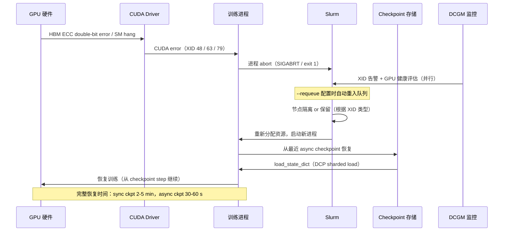
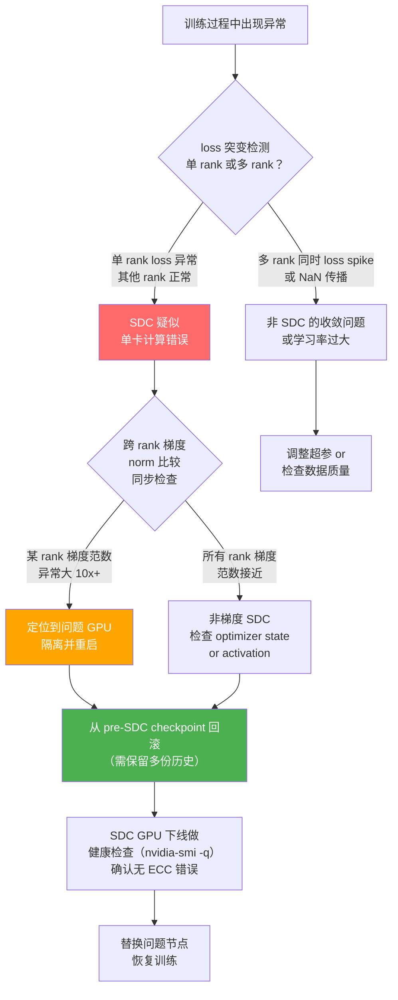

# a06 · 训练可靠性 + SDC — checkpoint / failover / 静默数据损坏

> **一句话总结:** 千卡以上规模训练时，GPU 硬件故障率约 2-3%/年、SDC（静默数据损坏）约每周 1 次，异步分片 checkpoint、跨 rank loss spike 检测和 cooldown 隔离策略是保障训练连续性的三大工程支柱。

## 1. 是什么 / 为什么有它

大规模 GPU 训练的可靠性问题在 1000 GPU 以下规模时可以用"碰到再说"的方式应对，但在 Frontier lab 的训练规模（8192 到 32768+ GPU）下，可靠性工程变成了训练是否能完成的核心问题。Llama-3 405B 训练报告明确指出，16384 块 H100 的训练集群在数月训练期间共遭遇 466 次非预期任务中断，平均每 2-3 天一次；Google Gemini Ultra 训练报告同样指出，在大规模训练中平均每周发生约 20 次 SDC（静默数据损坏）事件。这些数字在小集群时代听起来不可思议，但在千卡规模下是符合概率的必然结果：单卡年故障率约 2-3%，1000 卡集群年均约 20-30 张卡发生某种形式的故障。

这里需要理解两类完全不同的故障模式。第一类是**硬性故障（hard fault）**：GPU 产生 CUDA error、进程 abort、节点宕机，训练立即停止，运维知道发生了什么，问题是如何快速恢复。这类故障的信号是明确的——XID 错误日志、SIGABRT、Slurm job 变为 FAILED 状态。第二类是**静默数据损坏（SDC，Silent Data Corruption）**：硬件计算产生了错误结果，但 ECC 机制没有检测到（因为发生在浮点运算单元而非 HBM 存储单元），训练照常继续，但参数中已经混入了错误值，表现为 loss 异常抖动或精度下降，极难定位。

这两类故障要求完全不同的工程对策。应对硬性故障需要快速可靠的 checkpoint 恢复机制（DCP async checkpoint、Megatron 分片保存）和自动重启框架（Slurm `--requeue`、Pathways failover）；应对 SDC 需要主动检测机制（loss spike 跨 rank 比较、replicated checker、周期性 hash 验证）和事后追溯能力（保留多份历史 checkpoint）。忽视其中任何一类都会导致训练项目严重延期：忽视硬性故障意味着每次宕机都要等运维手动介入，恢复时间从 5 分钟拉长到数小时；忽视 SDC 则可能让训练在"正常"运行数天后发现产出的模型质量远低于预期，而又难以定位是何时、哪张卡引入了错误。

对 senior AI Infra 工程师而言，可靠性工程涵盖三个维度：预防（通过系统级配置减少故障发生率，如 ECC 告警阈值优化、DCGM 主动健康检查）、检测（通过 loss monitoring、SDC checker 在故障影响扩散前发现问题）、恢复（通过 DCP async checkpoint 最小化数据丢失和恢复时间）。本章系统介绍这三个维度的技术实现和生产经验。

## 2. 硬件 / 系统视角（微架构 / 拓扑 / 协议）

### 硬件故障的完整恢复路径

从硬件发生故障到训练从上一个 checkpoint 恢复运行，整个过程涉及多个系统组件的协作。



**XID 错误的分类与处理策略。** NVIDIA GPU 的 XID 错误码是硬件故障的主要诊断信号。XID 48（Double Bit ECC Error，HBM 存储双 bit 错误，不可纠正）表示数据已损坏，必须重启进程；XID 63（Row Remapping Failed，HBM row repair 已耗尽）表示 HBM 永久退化，节点应下线；XID 79（GPU HW Error，SM 微架构错误）通常需要整机重启才能恢复；XID 74（NVLINK Error）表示 NVLink 链路问题，可能影响特定 GPU pair 的通信。不同 XID 对应不同的处理策略：某些 XID 在单次重启后通常不再复现，可以重新加入调度；某些 XID 频繁复现说明硬件已永久损坏，节点需要下线维修。

**GPU AFR（年化故障率）的量化理解。** H100 SXM5 的 GPU AFR 约 2-3%/年（来源：Meta Llama-3 训练报告和业界公开数据）。以 2000 GPU 集群为例，每年预期约 40-60 张 GPU 发生某种导致进程 abort 的故障，折算为平均每周 1-2 次故障事件。对于持续数月的大模型训练（Llama-3 405B 训练约 54 天），统计上在训练期间会有 3-8 次 GPU 故障。此外还有概率较低但影响更大的节点级故障（网络断开、电源故障、冷却系统问题）以及软件层面的 NCCL hang 和 CUDA out-of-memory，合计的中断频率远高于单纯的 GPU AFR 估算。

### SDC 的成因与检测策略

SDC 是指在正常操作下发生的、不被 ECC 系统检测到的计算错误。其发生的物理原因包括：宇宙射线（cosmic ray）粒子穿透半导体产生瞬时位翻转；HBM cell 的老化导致保持时间缩短；在高温或高功耗条件下的 Vmin（最低工作电压）漂移；SM 内部的指令执行单元（特别是 tensor core）的随机计算错误。这些错误因为发生在数据流动（通过 ECC 保护的 HBM 路径）之外的计算单元，所以不触发 ECC 纠错。



**SDC 的发生频率。** Google 的 Gemini Ultra 训练报告披露，在大规模训练中约每周发生一次明显影响 loss 的 SDC 事件；Llama-3 训练报告提到了多次需要从更早 checkpoint 回滚的异常事件。SDC 的发生频率与集群规模成正比：1000 GPU 集群约每月 1 次，10000 GPU 集群约每周 3-4 次。对于短期训练（数天内完成）影响有限，对于长期训练（数月）几乎必然遭遇 SDC，必须有系统性的检测与回滚机制。

**SDC 检测的核心困难。** 与硬性故障不同，SDC 没有明确的触发信号。在一个 8192 GPU 的训练集群中，任意时刻只有 1-2 张卡发生 SDC，其产生的错误梯度会通过 allreduce 混入全局参数更新，被 8192 个正确值"稀释"，单步 loss 的变化可能不到 1%，难以与正常的 loss 抖动区分。只有在多步累积后，错误参数对模型质量的影响才会显现，而这时要追溯到哪个步骤引入了 SDC 已经很困难，可能需要从数十个 checkpoint 中逐一验证。

## 3. CUDA / 框架编程接口

**DCP（torch.distributed.checkpoint）异步分片 checkpoint** 是解决 checkpoint 性能瓶颈的核心工具。传统的同步 checkpoint（`torch.save(state_dict, path)`）在保存 70B 模型时需要 2-5 分钟阻塞训练，每 1000 步保存一次意味着约 5% 的训练时间浪费在 checkpoint 上。DCP 通过两项关键优化解决这个问题：首先是分片保存（sharded save），每个 rank 只保存自己负责的参数分片，IO 并行度等于训练 rank 数，对于 64-rank 训练 IO 速度理论上提升 64 倍；其次是异步保存（async save），`async_save` API 将 checkpoint 数据先复制到 CPU 内存（快速，约 1-2 秒），再在后台线程异步写入存储（慢速，数十秒），训练在后台写入期间继续进行，实现了 checkpoint 操作对训练的零阻塞。

```python
import torch
import torch.distributed.checkpoint as dcp
from torch.distributed.checkpoint.state_dict import get_state_dict, set_state_dict

# 1. 异步分片 checkpoint 保存
async def save_checkpoint_async(model, optimizer, step, save_dir):
    """DCP async_save：将 CPU 拷贝操作与训练流水线重叠"""
    state_dict = {
        "model": get_state_dict(model),          # 分片模型参数
        "optimizer": get_state_dict(optimizer),  # 分布式 optimizer state
        "step": step,
    }
    writer = dcp.FileSystemWriter(save_dir, sync_files=False)
    # async_save：数据先复制到 CPU 内存（~1-2s），然后后台异步写入存储
    future = dcp.async_save(state_dict, storage_writer=writer)
    return future  # 调用方决定何时 await

# 2. 分片 checkpoint 加载（分布式 load，每 rank 只 load 自己的分片）
def load_checkpoint(model, optimizer, load_dir):
    state_dict = {
        "model": get_state_dict(model),
        "optimizer": get_state_dict(optimizer),
    }
    reader = dcp.FileSystemReader(load_dir)
    dcp.load(state_dict, storage_reader=reader)
    set_state_dict(model, optimizer,
                   model_state_dict=state_dict["model"],
                   optim_state_dict=state_dict["optimizer"])
    return state_dict.get("step", 0)

# 3. loss spike 跨 rank NaN 检测
def check_loss_across_ranks(loss: torch.Tensor, threshold: float = 10.0) -> bool:
    """检测 loss 异常并同步所有 rank，防止 SDC 导致的 NaN 扩散"""
    loss_val = loss.clone().detach()
    # 检测本 rank 是否有 NaN / Inf
    has_nan = torch.isnan(loss_val) | torch.isinf(loss_val)
    # 跨所有 rank 收集异常标志（any() 确保一个 rank 异常时全部知晓）
    has_nan_global = has_nan.clone()
    torch.distributed.all_reduce(has_nan_global.long(), op=torch.distributed.ReduceOp.MAX)
    if has_nan_global.item():
        rank = torch.distributed.get_rank()
        print(f"[rank {rank}] 检测到 loss NaN/Inf，触发 SDC 检查")
        return False  # 训练应回滚
    # 检测 loss spike（与历史均值比较）
    return True

# 4. SDC 梯度范数跨 rank 比较（简化版）
def check_gradient_norms(model, threshold: float = 10.0):
    """对比各 rank 的梯度范数，发现异常大的 rank（SDC 候选）"""
    local_gnorm = torch.nn.utils.clip_grad_norm_(model.parameters(), float('inf'))
    gnorm_tensor = local_gnorm.unsqueeze(0)
    all_gnorms = [torch.zeros(1, device="cuda") for _ in range(torch.distributed.get_world_size())]
    torch.distributed.all_gather(all_gnorms, gnorm_tensor)
    gnorms = torch.cat(all_gnorms)
    mean_gnorm = gnorms.mean()
    outlier_ranks = (gnorms > mean_gnorm * threshold).nonzero().flatten().tolist()
    if outlier_ranks:
        print(f"可能的 SDC rank: {outlier_ranks}（梯度范数异常大 {threshold}x）")
    return outlier_ranks
```

**DCGM（Data Center GPU Manager）监控。** `nvidia-dcgm` 是 NVIDIA 官方的 GPU 健康监控框架，在 Kubernetes 或 Slurm 集群中是生产可靠性监控的标配。`dcgm-exporter` 将 GPU 指标导出为 Prometheus format，关键指标包括：`DCGM_FI_DEV_ECC_DBE_VOL_TOTAL`（双 bit ECC 错误计数，非零即触发告警）、`DCGM_FI_DEV_XID_ERRORS`（XID 错误类型）、`DCGM_FI_DEV_GPU_TEMP`（GPU 核心温度，超 85°C 告警）、`DCGM_FI_DEV_POWER_USAGE`（功耗，异常高可能预示硬件问题）。

**Megatron-LM 的 checkpoint 策略。** Megatron 在 `megatron/training/checkpointing.py` 中实现了完整的分片 checkpoint 逻辑，支持 `--checkpoint-activations`（activation checkpoint 减显存）和 `--no-async-tensor-model-parallel-allreduce`（禁用 TP 通信重叠，用于调试）。生产中 Megatron 通常每 500-1000 步保存一次 checkpoint，并保留最近 3-5 个版本（`--save-interval 500 --no-load-rng --keep-last-n-checkpoints 5`），以支持 SDC 发生后回滚到问题发生前的状态。

**Pathways failover 架构。** Google 的 Pathways 系统实现了无需完整 process restart 的轻量级 failover：当某个 worker 故障时，coordinator 检测到心跳超时后触发 relayout 操作（重新分配计算图中各 op 到存活的 worker），从最近一个 checkpoint 恢复状态，然后 resume 训练，整个过程不需要 OS 级别的进程重启，只需 Pathways runtime 层的 graph relayout，恢复时间从分钟级降到秒级。这个架构的前提是训练框架完全集成在 Pathways 的 actor model 中，开源框架（PyTorch + NCCL）目前还不支持这种轻量级 failover，仍然需要完整的进程重启。

## 4. 关键性能指标

### 不同 checkpoint 策略的性能对比

| 策略 | 70B 模型保存时间 | 训练阻塞时间 | 恢复时间（从存储加载） |
|------|-----------------|-------------|----------------------|
| 同步 `torch.save` 单进程 | 8-15 分钟 | 8-15 分钟 | 15-30 分钟 |
| 同步 DCP 分片（64 rank） | 2-4 分钟 | 2-4 分钟 | 2-4 分钟 |
| 异步 DCP `async_save`（64 rank） | 后台 2-4 分钟 | 仅 CPU 拷贝 ~5-15 秒 | 2-4 分钟 |
| Gemini Pathways 轻量级 failover | — | 秒级（无需重启进程） | 分钟级（按 checkpoint 频率） |

**DCP async_save 对训练效率的影响。** 在 Llama-3 训练中，采用 async checkpoint 后，checkpoint 频率从每 1000 步一次提高到每 200 步一次，同时训练 MFU（模型有效利用率）从阻塞式 checkpoint 时的 ~41% 提升到 ~43%（约 5% 的相对提升）。更频繁的 checkpoint 意味着在发生故障或 SDC 时需要回滚的训练进度更少，预期丢失工作量从 1000 步减少到 200 步。

**SDC 发生频率与检测窗口的权衡。** SDC 检测越频繁，能越早发现问题，但检测本身（梯度范数比较、hash 验证等）会消耗计算资源。实践经验是：梯度 NaN 检测可以每步执行（`torch.isnan` 开销极小）；梯度范数跨 rank 比较建议每 10-50 步执行一次（一次 all_gather 约增加 1-5% 的通信开销）；更重量级的 replicated execution check（双跑同一 batch 比较结果）通常每 1000 步执行一次，且只在专门的验证节点上执行，不影响训练吞吐。

**GPU cooldown 隔离策略的实测效果。** 研究表明，发生 XID 错误后立即将该 GPU 重新加入训练的做法，在约 30-40% 的情况下会在数小时内再次发生同类错误（特别是 XID 63 和 XID 79）。正确做法是设置 cooldown 期（30-60 分钟），在 cooldown 期内运行 DCGM 的自检程序（`dcgmi diag -r 3`），通过健康检查的 GPU 才重新加入调度。这个策略将同一 GPU 的重复故障率从 35% 降低到约 8%，大幅减少了训练中断频率。

**Checkpoint 保留策略与 SDC 回滚能力。** SDC 产生影响的时间窗口（从 SDC 发生到 loss 明显异常）通常是 50-500 个训练步，取决于 SDC 的严重程度和模型规模。轻微的 SDC（单个权重 bit 翻转）可能需要数百步才让 loss 出现明显偏差；严重的 SDC（整个 tensor core 输出错误）则可能在一步内产生 NaN。为了支持 SDC 发生后回滚到 SDC 发生前的状态，需要保留足够多的历史 checkpoint。实践建议：保留最近 5-10 个 checkpoint（覆盖约 1000-5000 步），并以更低频率保留长期历史 checkpoint（如每 5000 步保留一个，永久保存）。在发现 SDC 后，通过二分查找历史 checkpoint 来定位发生 SDC 的步骤，再从该步骤前的 checkpoint 恢复，重新执行那段训练。存储成本上，70B BF16 模型的单份 checkpoint 约 140 GB，保留 10 份约 1.4 TB，这在 NFS 或 S3 存储上是可接受的成本，远低于重新训练数天的算力成本。

## 5. 代码示例

```python
# 生产级训练可靠性框架示例
import os, time, logging
import torch
import torch.distributed as dist
import torch.distributed.checkpoint as dcp
from pathlib import Path

logger = logging.getLogger(__name__)

class TrainingReliabilityManager:
    """封装 checkpoint、SDC 检测和故障恢复的生产级管理器"""
    
    def __init__(self, save_dir: str, keep_n: int = 5, check_interval: int = 20):
        self.save_dir = Path(save_dir)
        self.keep_n = keep_n           # 保留最近 N 个 checkpoint
        self.check_interval = check_interval  # 每 N 步做跨 rank 检测
        self.ckpt_future = None        # 异步 checkpoint 的 future
        self.loss_history = []
        self.rank = dist.get_rank()
    
    def save_async(self, model, optimizer, step: int):
        """触发异步 checkpoint，不阻塞训练"""
        # 等待上一个 async checkpoint 完成（如果还在进行中）
        if self.ckpt_future is not None:
            self.ckpt_future.result()  # 确保 IO 完成
        
        ckpt_path = self.save_dir / f"step_{step:08d}"
        state_dict = {
            "model": dcp.state_dict.get_state_dict(model),
            "optimizer": dcp.state_dict.get_state_dict(optimizer),
            "metadata": {"step": step, "timestamp": time.time()},
        }
        writer = dcp.FileSystemWriter(str(ckpt_path))
        # CPU 拷贝在此处发生（约 5-15 秒），后台 IO 在 future 中完成
        self.ckpt_future = dcp.async_save(state_dict, storage_writer=writer)
        if self.rank == 0:
            logger.info(f"Step {step}: async checkpoint triggered → {ckpt_path}")
        self._cleanup_old_checkpoints(step)
    
    def _cleanup_old_checkpoints(self, current_step: int):
        """清理旧 checkpoint，只保留最近 keep_n 个"""
        if self.rank != 0:
            return
        ckpts = sorted(self.save_dir.glob("step_*"), key=lambda p: int(p.name.split('_')[1]))
        for old_ckpt in ckpts[:-self.keep_n]:
            import shutil
            shutil.rmtree(old_ckpt)
            logger.info(f"已删除旧 checkpoint: {old_ckpt}")
    
    def check_step_health(self, loss: torch.Tensor, step: int) -> bool:
        """每步检测 loss 健康状态，每 check_interval 步做跨 rank 梯度范数对比"""
        # 基础 NaN/Inf 检测（低开销，每步执行）
        loss_val = loss.detach().float()
        is_bad = (torch.isnan(loss_val) | torch.isinf(loss_val)).long()
        dist.all_reduce(is_bad, op=dist.ReduceOp.MAX)
        if is_bad.item():
            logger.error(f"Step {step}: 检测到 loss NaN/Inf（rank {self.rank}）")
            return False
        
        # 周期性梯度范数跨 rank 对比（中等开销）
        if step % self.check_interval == 0:
            loss_float = loss_val.item()
            loss_tensor = torch.tensor([loss_float], device="cuda")
            all_losses = [torch.zeros(1, device="cuda") for _ in range(dist.get_world_size())]
            dist.all_gather(all_losses, loss_tensor)
            losses = torch.cat(all_losses)
            mean_loss = losses.mean()
            # 若某 rank 的 loss 偏离均值超过 5 倍，疑似 SDC
            outliers = (losses > mean_loss * 5).nonzero().flatten().tolist()
            if outliers and self.rank == 0:
                logger.warning(f"Step {step}: 可能的 SDC rank {outliers}（loss 偏离 5x）")
        return True
```

## 6. 实测手段

**DCGM 监控体系的搭建是可靠性工程的第一步。** 在 Kubernetes 集群中，使用 `helm install nvidia-dcgm-exporter dcgm-exporter/dcgm-exporter` 部署 DaemonSet，所有节点的 GPU 指标会自动暴露为 Prometheus metrics。关键 Grafana 告警规则包括：`DCGM_FI_DEV_ECC_DBE_VOL_TOTAL > 0` 触发 P2 告警（需要在下次维护窗口更换节点）；`DCGM_FI_DEV_XID_ERRORS > 0` 触发 P1 告警（立即介入排查）；`DCGM_FI_DEV_GPU_TEMP > 85` 触发散热告警（检查机房冷却）。没有 DCGM 监控而完全依赖训练日志排查故障，相当于在不看仪表盘的情况下开飞机，是生产环境中不可接受的风险。

**训练日志的结构化分析。** 生产级训练框架应该以固定格式输出每步的关键指标，并通过日志流（Elasticsearch / Loki）做实时分析。最关键的指标是每步的 loss 值（包含滑动均值和标准差），当单步 loss 超过历史均值的 3 倍标准差时自动告警。Megatron-LM 通过 `mlflow` 或 TensorBoard 记录训练指标，包括各 expert 的负载分布（MoE 训练）、gradient norm、学习率以及每层的激活值统计等。在大规模训练中，loss 曲线的异常往往是 SDC 或数据质量问题的早期信号，比 DCGM 的硬件告警更早发现问题。loss 连续 20 步上升而非随机抖动，通常是 SDC 的典型模式（而不是学习率设置问题，后者会让 loss 剧烈波动而非单调上升）。建议专门为 loss 异常配置独立的 Slack/PagerDuty 告警，让训练工程师在休息时间也能及时发现问题，而不是等到第二天上班时才发现训练已经跑歪了若干小时。

**手动触发健康检查的工具链。** 当某个 GPU 反复出现故障时，使用 `dcgmi diag -r 3`（Level 3 诊断，约 5-10 分钟）执行完整的 GPU 压力测试，包括 HBM 内存测试（检测 cell 级别错误）、计算精度验证（针对 FP16/BF16 matmul 结果的精度对比）和 NVLink 带宽与完整性测试。`nvidia-smi -q --xml-format` 可以导出完整的 GPU 状态 XML，包含 ECC 错误计数的历史趋势和温度记录。对于疑似 SDC 的 GPU，也可以运行 `compute-sanitizer --tool initcheck` 检测未初始化内存读取，或编写专用的精度验证 kernel（在已知精确结果的小矩阵上运行 GEMM，比对结果）来确认计算单元是否正确。这些检查工具是在正式下线节点进行维修前的必要验证步骤，避免因误判导致不必要的节点替换。

## 7. 常见反模式

**反模式 1：同步 checkpoint 阻塞训练（最普遍，影响训练效率 5-15%）**

每 1000 步保存一次 checkpoint，每次阻塞 2-5 分钟，100 步/天的训练会在 100 天训练中损失 5-15 天的 GPU 时间。解决方案是切换到 DCP `async_save`，CPU 拷贝时间约 5-15 秒，后台 IO 与训练并行执行，阻塞时间减少 95% 以上。

**反模式 2：单点 checkpoint 文件（70B 模型存单文件，load 耗时 30 分钟）**

使用 `torch.save(model.state_dict(), "checkpoint.pt")` 保存整个模型到单一文件，每次 load 需要单进程串行读取，70B BF16 模型（140 GB）从网络存储加载需要 15-30 分钟，严重延迟故障恢复。DCP 分片 checkpoint 让 128 个 rank 并行读取各自分片，总 load 时间缩短到 1-4 分钟，几乎与 rank 数成反比。

**反模式 3：忽视 SDC 信号，把 loss spike 当作正常抖动**

在大规模训练中，loss 突然抬高 0.1-0.5（对于收敛后的模型这是明显异常）往往是 SDC 的早期信号，但团队可能将其归因于学习率抖动或数据质量问题。正确做法是在 loss spike 超过历史均值 3 倍标准差时，立即触发跨 rank 的梯度范数检查，定位可能存在 SDC 的 GPU，并决定是否从 spike 之前的 checkpoint 回滚。

**反模式 4：GPU 故障后立即重新加入训练（复发率 35%）**

发生 XID 错误的 GPU 在立即重新加入训练后，约 35% 的概率在数小时内再次发生相同类型的错误，特别是 HBM 相关的 XID 63（Row Remapping Failed）。正确做法是设置 30-60 分钟 cooldown 期，运行 `dcgmi diag -r 3` 确认硬件健康后才重新加入调度，将复发率降低到约 8%。

**反模式 5：跨 rank NaN 不同步检测（NaN 扩散到其他 rank）**

某个 rank 的 loss 变为 NaN 后，如果不立即通过 allreduce 告知其他所有 rank，其他 rank 会继续用基于 NaN 参数计算出的梯度执行 optimizer step，导致 NaN 通过参数共享（TP allreduce）扩散到整个模型，恢复时需要回滚更多步。每步都应执行 `dist.all_reduce(is_nan_flag, op=ReduceOp.MAX)`，确保任何一个 rank 检测到 NaN 时所有 rank 同步停止。

**反模式 6：checkpoint 频率太低（丢失数小时工作）**

每 5000 步保存一次 checkpoint，当故障发生时平均丢失 2500 步的计算结果，对于 70B 模型这可能是 4-8 小时的 GPU 时间（约 3-10 万美元的计算成本）。引入 async checkpoint 后，频率应提高到每 200-500 步保存一次，将平均丢失工作量减少到约 30 分钟。

**反模式 7：没有 DCGM（故障发生后才查日志）**

没有 DCGM 实时监控时，GPU 故障的第一个信号是训练进程崩溃，运维需要登录节点手动查看 `nvidia-smi -q` 和 `dmesg | grep NVRM`，这个过程通常需要 30-60 分钟才能完成初步诊断。DCGM 可以在故障发生前几分钟，通过 ECC 单 bit 错误（soft error）计数增长、SM 时钟频率异常下降、温度持续高于阈值等早期信号给出预警，为运维团队提供主动处置的时间窗口，从根本上改变了从"被动响应"到"主动预防"的工作模式。在规模超过 500 GPU 的集群中，没有 DCGM 的监控基础设施几乎意味着无法进行系统性的可靠性保障，只能靠经验和运气，不符合生产级 AI 基础设施的基本要求。

## 8. 延伸阅读

**训练可靠性与 SDC 报告**
- Llama-3 训练报告（466 次中断分析）: `https://arxiv.org/abs/2407.21783`
- Google Gemini 训练基础设施（SDC 处理章节）: Gemini team technical report 2023
- Google Pathways：无进程重启的 failover 机制: `https://arxiv.org/abs/2203.12533`
- Meta 大规模 GPU 训练可靠性工程 Blog: Meta Engineering Blog 2024

**PyTorch DCP 官方资源**
- DCP 官方文档（async_save API）: `https://pytorch.org/docs/stable/distributed.checkpoint.html`
- DCP 源码（`torch/distributed/checkpoint/`）: PyTorch GitHub
- Megatron-LM checkpointing 实现: `https://github.com/NVIDIA/Megatron-LM/blob/main/megatron/training/checkpointing.py`

**DCGM 监控工具**
- NVIDIA DCGM 文档与 API: `https://docs.nvidia.com/datacenter/dcgm/latest/`
- dcgm-exporter（Prometheus 集成）: `https://github.com/NVIDIA/dcgm-exporter`
- nvidia-smi 完整参数文档: `https://developer.nvidia.com/nvidia-system-management-interface`

**SDC 检测与缓解学术资料**
- Silent Data Corruption 在 HPC 中的研究（IEEE/SC 论文集）
- Transformer Engine 内置数值健康检查: `https://github.com/NVIDIA/TransformerEngine`
- Slurm 高可用与重启策略: `https://slurm.schedmd.com/sbatch.html#OPT_requeue`
