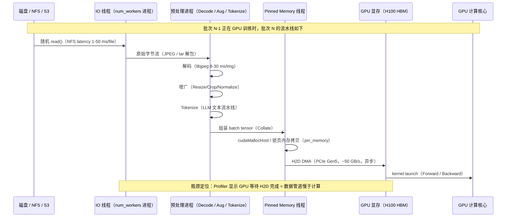
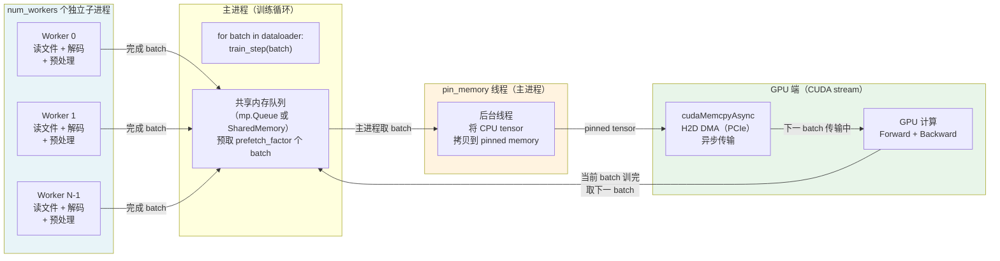

# a07 · 数据流水线工程化 — CPU 瓶颈 / DALI / Ray Data

> **一句话总结:** 真实训练中 30% 的 GPU 空闲时间往往源于数据流水线设计缺陷，从 `num_workers=0` 的单线程 DataLoader 到 DALI GPU 侧解码，每一层优化都有明确的性能收益和适用场景，数据管道是 MFU 提升的隐藏红利。

## 1. 是什么 / 为什么有它

主体教程的内容几乎全部聚焦于 GPU 侧的计算优化：kernel 融合、量化、并行策略。然而在真实大规模训练中，"数据饥饿"（data starvation，GPU 等待数据而空转）是一个被严重低估的效率杀手。PyTorch Profiler 在实际训练项目中经常显示 10-30% 的 GPU idle 时间是因为下一个 batch 尚未准备好——这意味着同样的计算资源、同样的模型、同样的并行策略，仅仅因为数据管道没有优化，有效 MFU 就损失了 10-30 个百分点。

**数据流水线的多个瓶颈层。** 从磁盘上的原始数据到 GPU 显存中的训练 batch，整个流程包含以下环节，每一个都可能成为瓶颈：磁盘 IO（网络文件系统的随机读写延迟）；解压缩（JPEG/PNG/WebP 图像解码、视频解码，CPU 密集型）；预处理（归一化、增广、tokenize，CPU 密集型）；Shuffle（随机采样，内存访问模式不规律）；批次组装（Collate）；Pinned Memory 拷贝（将 CPU 内存中的 tensor 拷贝到 CUDA pinned memory 区域）；H2D DMA 传输（从 pinned memory 通过 PCIe DMA 到 GPU 显存）。其中任何一个环节的吞吐低于 GPU 消耗速率，都会导致 GPU 等待数据。

**多模态大模型训练使问题更复杂。** Llama-3 等纯 LLM 的数据管道相对简单：文本 tokenize 可以离线预处理一次，训练时直接读取已经 tokenized 的 int32 序列，CPU 负担极低。但视觉语言模型（如 LLaVA、Flamingo、PaLM-E）需要在训练时实时 decode 图像并做增广，这会引入大量 CPU 计算；视频模型（如 Sora 前身的 Video DiT）还需要实时 decode 视频帧序列，CPU 解码成为严重瓶颈。对于这类场景，从 CPU 侧解码迁移到 GPU 侧解码（DALI）的收益可以达到 15-25% 的端到端加速。

对于 senior AI Infra 工程师，数据流水线优化的价值在于：它不需要修改模型架构或训练策略，只需要正确配置 DataLoader 参数和替换数据加载库，就能显著提升 MFU。通常这是新集群上线后第一个要解决的工程问题，因为它的投入产出比极高：几个小时的调优工作可以节省数百 GPU 天的计算资源。一个简洁的量化：H100 集群每 GPU 时成本约 3-5 美元，128 GPU 集群每小时成本约 400-640 美元，如果数据流水线 bug 导致 GPU idle 20%，相当于每小时额外浪费 80-128 美元的算力。一个月下来是数万美元的纯损失，仅仅因为 `num_workers=0` 或漏了 `pin_memory=True` 这类初级配置错误。此外，数据流水线的瓶颈与 GPU 计算的瓶颈在 Profiler 里的表现完全不同，需要专门的工具链（PyTorch Profiler 的 DataLoader idle 分析、`nvidia-smi dmon` 的 GPU 利用率监控、perf/htop 的 CPU 热点分析）才能准确定位，不能凭直觉猜测。本章系统性地介绍从初级优化（`num_workers`/`pin_memory`）到高级优化（DALI GPU 解码、Ray Data 分布式预处理）的完整技术栈，以及定量评估每层优化效益的方法。

## 2. 硬件 / 系统视角（微架构 / 拓扑 / 协议）

### 训练数据完整流路与瓶颈分布



**各环节的典型延迟分析。** 磁盘 IO 在本地 NVMe SSD 上读取顺序大文件约 3-7 GB/s（延迟约 0.1 ms），但在网络文件系统（NFS）上随机读小文件（如每个样本一个 JPEG 文件）延迟可达 1-50 ms/file，批次大小 256 时累计 IO 时间可能超过 1 秒，完全超过 H100 的前向计算时间（约 0.1-0.5 秒）。这就是为什么 FFCV、WebDataset 等"数据集打包"方案（将大量小文件合并为顺序读取的 TAR 或 ffcv `.beton` 格式）在网络存储场景下能带来 5-10 倍的 IO 吞吐提升——它们将随机 IO 转换为顺序 IO，充分利用存储设备的带宽。NFS 的元数据操作（`open`、`stat`、`close`）每次需要一次 RPC 往返，延迟通常 100-500 μs，对于 ImageNet-scale 的 128 万个文件，如果每个文件独立打开，总元数据开销可以占到 IO 总时间的 30-60%。

**CPU 解码瓶颈的量化分析。** CPU 解码是图像/视频训练的主要 CPU 瓶颈，且常被低估。标准的 Python Pillow 解码 JPEG 约 15-40 ms/image，libjpeg-turbo 加速后约 5-15 ms/image（使用 AVX2 SIMD 指令），OpenCV 配合 libjpeg-turbo 约 3-10 ms/image。对于 ImageNet-scale 训练（batch=256，crop=224×224），`num_workers=8` 时并行解码吞吐约 8 × (1000 ms / 10 ms) = 800 images/sec，而 H100 训练 batch=256 约 50-150 ms（视模型大小），数据吞吐仅勉强够用，没有余量——任何解码速度的下降（如使用了高质量增广库、数据质量差导致解码慢）都会让 GPU 开始等待。视频训练的情况更差：单帧 H.264 解码约 10-30 ms/frame，对于 16 帧/clip 的视频模型，每个样本的解码时间约 160-480 ms，是图像的 16-32 倍，`num_workers` 不足时 GPU idle 率可达 70-80%。

**H2D DMA 传输的异步化原理。** PCIe Gen5 × 16 带宽约 64 GB/s（单向），使用 pinned memory 的异步 `cudaMemcpyAsync` 可以在 GPU 训练当前 batch 时同时传输下一个 batch，实现完美的 compute-communication overlap。不使用 pinned memory（`pin_memory=False`）时，PyTorch 在执行 `.cuda()` 调用时，必须先将 pageable memory 中的 tensor 同步拷贝到一块临时 pinned buffer（CUDA runtime 维护），再从 pinned buffer 启动 DMA，这个同步等待增加约 50-100% 的拷贝时间，且由于同步性，无法与 GPU 计算并行。在 `batch_size=512`、`dtype=float32`、`input_shape=[3, 224, 224]` 的场景下，一个 batch 约 1.1 GB，PCIe DMA 约 17 ms；不用 pinned memory 时同步拷贝需要约 30-40 ms，GPU 需要空等这段时间。

### PyTorch DataLoader 多进程架构



**DataLoader 的关键设计决策。** `num_workers` 控制并行的子进程数量，每个进程独立完成从 Dataset `__getitem__` 到 collate 的全部工作。Python GIL 的存在使得多线程无法真正并行执行 CPU 密集型代码，因此 DataLoader 使用多进程（`multiprocessing`）而非多线程，以绕开 GIL。每个 worker 进程在启动时复制主进程的 Dataset 对象（fork，Linux 上使用 COW 写时复制，内存消耗较小），独立维护文件句柄和 RNG 状态。`prefetch_factor` 控制每个 worker 进程在队列中预先准备的 batch 数量，默认值为 2，即每个 worker 最多预备 2 个 batch 等待主进程取用。`persistent_workers=True` 让 worker 进程在 epoch 结束后不销毁，避免每个 epoch 开始时的进程重建开销（每个 epoch 重建约 3-10 秒）。

**DALI 的 GPU 侧解码路径。** NVIDIA DALI（Data Loading Library）将图像解码、Resize、Crop、Normalize 等预处理操作从 CPU 迁移到 GPU 上执行，彻底改变了数据管道的瓶颈位置。GPU 具有专用的 NVJPEG 硬件解码引擎（在 H100 SXM5 上，NVJPEG 峰值吞吐约 5000-8000 images/sec，是 CPU libjpeg-turbo 的 5-8 倍），以及高度并行的 CUDA kernel 用于 Resize、RandomCrop、Color Jitter 等增广操作（并行度是 CPU 的数十倍）。DALI 的 pipeline 将从文件系统读取原始 JPEG 字节（CPU IO，速度快），到 GPU NVJPEG 解码，再到 GPU 侧增广，最后直接返回 GPU tensor 的全流程串联起来，数据在 GPU 上全程流动，无需经过 CPU → GPU 的内存拷贝。这使得 DALI 在图像密集型训练中能将端到端训练速度提升 8-15%，在视频训练中收益更大（视频解码可以充分利用 NVDEC 硬件加速，提升 20-30%）。DALI 的一个重要特性是支持预取（prefetch pipeline depth 可配置），让 GPU 的 NVJPEG 解码与 SM 上的前向计算在不同 CUDA stream 上并行执行，最大化硬件利用率。

## 3. CUDA / 框架编程接口

**PyTorch DataLoader 完整参数配置。** DataLoader 的性能受多个参数共同影响，需要根据工作负载类型（IO 密集、CPU 密集、轻量化）分别调优。没有一组参数适用于所有场景：图像训练需要最大化 CPU 并行解码（高 `num_workers`）；文本训练需要最大化 IO 吞吐（适当 `num_workers` + 流式读取）；视频训练需要 GPU 侧解码（DALI）以释放 CPU 瓶颈。理解每个参数的作用机制，才能在遇到新的数据管道性能问题时快速定位并选择正确的优化方向，而不是盲目增加 `num_workers` 希望碰运气。

```python
from torch.utils.data import DataLoader

# 图像训练最优配置（CPU 解码密集型）
train_loader = DataLoader(
    dataset,
    batch_size=256,
    num_workers=8,              # 通常 = CPU 物理核数 / 2（避免超载）
    pin_memory=True,            # 必须开启，否则 H2D 无法异步化，慢 3-4x
    prefetch_factor=2,          # 每 worker 预备 2 个 batch（默认值，通常够用）
    persistent_workers=True,    # 避免每 epoch 重建进程（节省 3-10 秒/epoch）
    drop_last=True,             # 丢弃不完整的最后一个 batch（DDP 训练必须）
    shuffle=True,               # 训练时随机 shuffle（DataLoader 内部实现 buffer shuffle）
    sampler=None,               # 若使用自定义 sampler（DDP 用 DistributedSampler）则 shuffle=False
)

# LLM 文本训练配置（轻量化 tokenize，IO 主导）
text_loader = DataLoader(
    tokenized_dataset,  # 已离线 tokenize 的 HuggingFace Dataset（mmap 格式）
    batch_size=8,       # 对 LLM 通常 = micro-batch-size
    num_workers=4,      # 文本 IO 轻量，4 个 worker 通常够用
    pin_memory=True,
    persistent_workers=True,
    prefetch_factor=4,  # 文本批次小，可以多预取
)
```

**NVIDIA DALI GPU 解码 pipeline。** DALI 将数据加载和预处理建模为 DAG（有向无环图），在 GPU 或 CPU 上调度各个节点，支持 ImageNet 风格的图像分类、目标检测、视频训练等场景。

```python
from nvidia.dali.pipeline import pipeline_def
import nvidia.dali.fn as fn
import nvidia.dali.types as types

@pipeline_def(batch_size=256, num_threads=4, device_id=0)
def imagenet_pipeline(data_dir, crop=224, dali_cpu=False):
    """DALI ImageNet pipeline：从 MXNet RecordIO 格式读取并 GPU 解码"""
    jpegs, labels = fn.readers.mxnet(
        path=data_dir + "train.rec",
        index_path=data_dir + "train.idx",
        random_shuffle=True,
        shard_id=0,               # 当前 GPU 的 shard 编号
        num_shards=8,             # 总 GPU 数
        name="Reader"
    )
    # GPU 侧 JPEG 解码（NVJPEG，比 CPU libjpeg 快 4-8x）
    images = fn.decoders.image(jpegs, device="mixed", output_type=types.RGB)
    # GPU 侧 Resize + RandomCrop + HorizontalFlip（无 CPU 参与）
    images = fn.random_resized_crop(images, device="gpu", size=crop,
                                    random_area=[0.08, 1.0])
    images = fn.flip(images, device="gpu",
                     horizontal=fn.random.coin_flip(probability=0.5))
    # GPU 侧 Normalize（直接产生 GPU float16/bfloat16 tensor）
    images = fn.crop_mirror_normalize(
        images, device="gpu",
        mean=[0.485 * 255, 0.456 * 255, 0.406 * 255],
        std=[0.229 * 255, 0.224 * 255, 0.225 * 255],
        dtype=types.FLOAT16,
    )
    return images, labels

# 与 PyTorch 集成
from nvidia.dali.plugin.pytorch import DALIClassificationIterator
pipe = imagenet_pipeline(data_dir="/data/imagenet/")
pipe.build()
loader = DALIClassificationIterator(pipe, size=1281167 // 8)  # 每 shard 样本数
```

**FFCV 高效数据格式。** FFCV（Fast Forward Computer Vision）通过将原始 JPEG 预处理为内存可直接使用的 `.beton` 格式，将 IO 瓶颈从随机文件访问变为顺序读取。`.beton` 格式对每个字段（图像、标签、文本）分别存储，支持直接 mmap 到内存，多 worker 并行读取互不干扰。

```python
from ffcv.fields import IntField, RGBImageField
from ffcv.fields.decoders import IntDecoder, SimpleRGBImageDecoder
from ffcv.loader import Loader, OrderOption
from ffcv.transforms import ToTensor, ToDevice, ToTorchImage, NormalizeImage
import numpy as np

# 读取 beton 格式（超快，IO 不再是瓶颈）
loader = Loader(
    "/data/imagenet_train.beton",
    batch_size=512,
    num_workers=12,
    order=OrderOption.RANDOM,    # 批次内随机（不按序）
    pipelines={
        "image": [SimpleRGBImageDecoder(),
                  NormalizeImage(mean=np.array([0.485, 0.456, 0.406]) * 255,
                                 std=np.array([0.229, 0.224, 0.225]) * 255,
                                 type=np.float16),
                  ToTensor(), ToTorchImage(),
                  ToDevice(0, non_blocking=True)],  # 直接到 GPU 0
        "label": [IntDecoder(), ToTensor(), ToDevice(0, non_blocking=True)],
    }
)
```

**Ray Data 分布式预处理。** Ray Data 适合需要分布式预处理的场景（超大规模数据集、复杂增广、多模态预处理），它将预处理任务分布到 Ray 集群的 CPU 节点上，独立于 GPU 训练节点，从而彻底消除 CPU 与 GPU 对同一节点资源的竞争。

```python
import ray.data
from ray.data.preprocessors import BatchMapper

# 分布式预处理 + 流式提供给训练（跨节点流水线化）
ds = ray.data.read_images("/data/imagenet/train", size=(256, 256))
ds = ds.map_batches(
    lambda batch: {
        "image": batch["image"].astype("float32") / 255.0,
        "label": batch["label"],
    },
    batch_size=1024,
    num_cpus=4,        # 每个 map 任务占用 4 CPU
)
# 转换为 PyTorch DataLoader（迭代器形式，流式消费）
torch_ds = ds.to_torch(batch_size=256, prefetch_blocks=2)
```

**HuggingFace Streaming Dataset（LLM 场景）。** 对于文本预训练，数据集通常超过 10 TB，无法全部加载到内存。流式 Dataset 允许边读边训，结合分布式文件系统（GCS、S3）可以实现线性吞吐扩展。

```python
from datasets import load_dataset

# 流式加载（不预先下载完整数据集）
ds = load_dataset(
    "allenai/c4",
    "en",
    streaming=True,            # 流式，不全量下载
    split="train",
)
# 应用 tokenizer（在 DataLoader worker 中执行）
def tokenize(example):
    return tokenizer(example["text"], max_length=2048, truncation=True)

ds = ds.map(tokenize, batched=True, batch_size=1000)
ds = ds.shuffle(seed=42, buffer_size=10000)  # buffer shuffle（不全量 shuffle）
```

## 4. 关键性能指标

### DataLoader 配置的实测性能收益

| 配置变化 | 典型性能提升 | 适用场景 |
|---------|-------------|---------|
| `num_workers: 0→8` | 3-8× throughput | 图像解码（CPU 密集） |
| `pin_memory: False→True` | H2D 快 3-4×，GPU idle 降 10-20% | 所有 GPU 训练 |
| `persistent_workers: False→True` | 节省 3-10 秒/epoch | epoch 较多（>20）的训练 |
| `prefetch_factor: 1→4` | GPU idle 降 5-10% | num_workers 足够但 batch 小 |
| CPU 解码→DALI GPU 解码 | 端到端加速 8-15% | 图像/视频实时解码场景 |
| 随机文件→WebDataset/FFCV | IO 吞吐 5-10× | NFS/S3 小文件场景 |
| DataLoader→Ray Data（分布式） | 线性扩展到 1k worker | 超大集群多节点预处理 |

**具体生产实测数字。** 在 ImageNet-21k 训练（ResNet-152，H100 × 8，batch=2048/GPU）中，未优化配置（`num_workers=0`，`pin_memory=False`）的 GPU 利用率仅 45%，数据流水线是瓶颈；调整为 `num_workers=8`，`pin_memory=True`，`persistent_workers=True` 后 GPU 利用率提升到 82%；进一步切换到 DALI GPU 解码后提升到 91%（额外 +11%）。在 LLaVA 视觉语言模型训练（H100 × 64）中，实时图像解码和文本编码使 CPU 占用率达到 95%，引入独立的 Ray Data 预处理集群（32 CPU 节点）后，GPU 利用率从 55% 提升到 79%，训练时间缩短 30%。

**`num_workers` 的上限与内存权衡。** 每个 worker 进程通过 fork 复制主进程的内存，对于持有大型 Dataset 对象（如全量文件路径索引、预加载的元数据字典）的场景，每个 worker 的初始 RSS 内存约 0.5-2 GB。`num_workers=16` 在 Dataset 对象占 2 GB 时，全部 worker 的虚拟内存总量约 32 GB，但由于 Linux 的 COW（Copy-on-Write）机制，实际新增 RSS 仅为真正被修改的页面部分，通常 5-10 GB 已足够。更重要的是 IO 竞争问题：当多个 worker 同时向 NFS/S3 发起随机读请求时，若请求速率超过存储的 IOPS 上限（NFS 服务器通常约 10-50k IOPS），过多的 worker 反而因为 IO 等待导致进程上下文切换增加，总吞吐不升反降。最优 `num_workers` 需要通过实测确定：用 Profiler 观察各 worker 进程的 CPU 利用率，若所有 worker 利用率均超过 80% 则可以继续增加，若已出现 IO 等待（CPU 利用率低但 iowait 高）则不应继续增加。经验值：图像训练（CPU 解码密集）用 8-12，文本训练（轻量 IO）用 4-6，视频训练（解码最重）用 4-8（更多时 CPU 内存带宽成为瓶颈）。

**persistent_workers 的必要性与 epoch 间状态管理。** 每个 epoch 开始时，如果 `persistent_workers=False`，所有 worker 进程需要重新 fork 并重建 Dataset 对象，包括重新打开文件句柄、重新建立 S3 连接、重新初始化 RNG 状态等。对于持有大量文件路径索引或预加载元数据的 Dataset，这个过程需要 3-15 秒，8 个 worker 并行初始化需要 3-15 秒（并发但有 fork 开销）。对于 50 epoch 的 ImageNet 训练，总 overhead 约 50 × 10 秒 = 500 秒（约 8 分钟），大约占总训练时间的 3-8%。`persistent_workers=True` 让 worker 进程在 epoch 间进入休眠而不销毁，保留所有文件句柄和初始化状态，epoch 切换时只需更新 DistributedSampler 的 epoch 号（`sampler.set_epoch(epoch)`）即可重新开始采样，overhead 从 10 秒降到毫秒级。唯一需要注意的是：`persistent_workers=True` 时 worker 进程持有的文件句柄不会自动更新，如果训练中途数据集文件发生变化（在线数据管道），需要手动处理 worker 的状态刷新。

**Streaming Dataset 的特殊挑战。** 在 LLM 预训练中，训练数据集通常超过 10 TB，无法完全加载到 CPU 内存（DGX H100 节点约 2 TB 内存，通常 60-70% 被模型和激活值占用），必须流式读取。HuggingFace streaming dataset、Mosaic ML StreamingDataset、WebDataset 都提供了流式读取能力，但在分布式训练中面临共同挑战：如何在不加载完整数据集的情况下实现跨 epoch 的随机 shuffle，确保每个 rank 在每个 epoch 看到不重复的不同子集，且 checkpoint 后能从正确位置恢复。Mosaic ML StreamingDataset 通过将数据集分割为固定大小的 shard（通常 128 MB/shard），在 shard 级别做 shuffle，每个 shard 内部再做 buffer shuffle，实现了可以从任意 shard 位置恢复的流式训练，是目前 LLM 预训练场景的最优方案之一。

## 5. 代码示例

```python
# 生产级 DataLoader 调优完整模板（LLM + 多模态通用）
import os
import torch
from torch.utils.data import DataLoader, DistributedSampler
from typing import Optional

def create_optimized_dataloader(
    dataset,
    batch_size: int,
    is_distributed: bool = True,
    rank: int = 0,
    world_size: int = 1,
    num_workers: Optional[int] = None,
    is_image_task: bool = False,
) -> DataLoader:
    """构造针对训练任务类型调优的 DataLoader"""
    
    # 自动推断 num_workers（基于 CPU 核数和任务类型）
    if num_workers is None:
        cpu_count = os.cpu_count() or 4
        if is_image_task:
            num_workers = min(cpu_count // 2, 12)  # 图像解码 CPU 密集
        else:
            num_workers = min(cpu_count // 4, 6)   # 文本/轻量化任务
    
    sampler = None
    shuffle = True
    if is_distributed:
        sampler = DistributedSampler(
            dataset, num_replicas=world_size, rank=rank,
            shuffle=True, drop_last=True,
        )
        shuffle = False  # DistributedSampler 已处理 shuffle
    
    return DataLoader(
        dataset,
        batch_size=batch_size,
        sampler=sampler,
        shuffle=shuffle if not is_distributed else False,
        num_workers=num_workers,
        pin_memory=True,                # 关键：H2D 异步化，降低 GPU idle
        prefetch_factor=2 if num_workers > 0 else None,
        persistent_workers=True if num_workers > 0 else False,
        drop_last=True,                 # DDP 必须确保各 rank batch 大小一致
    )

# 使用异步 H2D 传输（与 GPU 计算重叠）
def train_step_with_prefetch(model, loader, optimizer):
    """使用 CUDA stream 重叠数据传输和计算"""
    compute_stream = torch.cuda.current_stream()
    transfer_stream = torch.cuda.Stream()
    
    next_batch = None
    for i, batch in enumerate(loader):
        # 在 transfer stream 上预取下一个 batch
        if i < len(loader) - 1:
            with torch.cuda.stream(transfer_stream):
                # pin_memory=True 时，这里的 .cuda() 使用异步 H2D DMA
                next_inputs = batch["input_ids"].cuda(non_blocking=True)
                next_labels = batch["labels"].cuda(non_blocking=True)
        
        # 当前 batch 的 GPU 计算（与上面的 H2D 传输并行）
        compute_stream.wait_stream(transfer_stream)
        loss = model(next_inputs, labels=next_labels).loss
        loss.backward()
        optimizer.step()
```

## 6. 实测手段

**PyTorch Profiler 定位数据流水线瓶颈。** 在训练循环中插入 Profiler，观察 DataLoader 的 idle 时间占比是定量分析数据管道效率的标准方法。Profiler 的 trace 会在 TensorBoard 中显示每个 step 的时间线，重点关注两类模式：一是 CPU 线程上出现长段的 "DataLoader_0:__iter__" 事件（颜色通常是橙色），GPU 在此期间几乎没有 kernel 运行，这是最直接的"数据管道慢于计算"的证据；二是 CUDA 端出现明显的 "cudaMemcpyAsync" 事件且其结束时间晚于前一个 batch 的 kernel 结束时间，说明 H2D 传输没有完全被 GPU 计算隐藏，`prefetch_factor` 或 `num_workers` 需要增大。

```python
import torch
from torch.profiler import profile, ProfilerActivity, tensorboard_trace_handler

with profile(
    activities=[ProfilerActivity.CPU, ProfilerActivity.CUDA],
    schedule=torch.profiler.schedule(wait=2, warmup=2, active=5, repeat=2),
    on_trace_ready=tensorboard_trace_handler("./tb_logs"),
    record_shapes=True, profile_memory=True, with_stack=False,
) as prof:
    for batch in train_loader:
        inputs, labels = batch["input_ids"].cuda(), batch["labels"].cuda()
        loss = model(inputs, labels=labels).loss
        loss.backward()
        optimizer.step()
        prof.step()

# 关键指标解读：
# "DataLoader_0:__iter__" 事件时长 >> GPU kernel 时长 → 数据管道是瓶颈
# "cudaMemcpyAsync" 中 H2D 传输时间 > 0 且与 kernel 不重叠 → pin_memory 问题
```

**nvidia-smi dmon 观察 GPU 利用率和内存拷贝利用率。**

```bash
# 每秒输出 GPU 利用率（sm）和内存传输利用率（mem）
nvidia-smi dmon -s um -d 1

# 若 sm（计算利用率）低于 70% 同时 mem（H2D/D2H 利用率）也低于 50%
# → CPU 瓶颈（数据还没到 GPU 侧就让 GPU 空等了）
# 若 mem 接近 100% 但 sm 有波动 → H2D 传输是瓶颈（考虑 PCIe 带宽或 pin_memory）
```

**worker 进程的 CPU 使用率分析。**

```bash
# 观察 DataLoader worker 进程的 CPU 利用率
ps aux | grep "python" | head -20
top -H -p $(pgrep -d, python)  # 线程级 CPU 使用率

# 若 worker 进程 CPU 利用率均低于 50% → num_workers 可以增加
# 若所有 CPU 核心都满载但 GPU 还在等 → 切换 DALI 或优化 __getitem__ 算法
```

## 7. 常见反模式

**反模式 1：`num_workers=0`（最常见，GPU idle 30-50%）**

PyTorch DataLoader 的默认配置 `num_workers=0` 使用主进程单线程串行加载数据，当数据预处理（JPEG 解码、tokenize、数据增广）需要任何非微量 CPU 时间时，GPU 会空等，idle 率可达 30-50%。图像训练的第一步必须将 `num_workers` 设置为 CPU 核数的一半（通常 8-12），文本训练也应至少设为 4。

**反模式 2：漏设 `pin_memory=True`（H2D 慢 3-4 倍，无法异步化）**

不使用 pinned memory 时，PyTorch 在执行 H2D 拷贝时必须先同步等待数据复制到临时 pinned buffer，这不仅增加了实际拷贝时间（2 倍），还无法使用 `non_blocking=True` 将 H2D 与 GPU 计算并行化。在 PCIe Gen5 × 16（64 GB/s）上，1 GB batch 的 H2D 时间从异步 16 ms 变为同步串行 32-50 ms，占据整个 step 时间的显著比例。

**反模式 3：`persistent_workers=False`（每 epoch 重建进程浪费时间）**

每 epoch 结束后销毁所有 worker 进程，下一 epoch 开始时重新 fork 和初始化。对于持有复杂 Dataset 对象的场景，每次初始化需要 3-15 秒，50 epoch 训练累计损失 2.5-12 分钟（约占总时间 5-10%）。几乎所有训练场景都应该开启 `persistent_workers=True`，除非 Dataset 对象需要在 epoch 间完全重建（极少见）。

**反模式 4：在 DataLoader `__getitem__` 中做在线 tokenize（CPU 大量饥饿）**

对文本数据集，在 `__getitem__` 中实时调用 Hugging Face tokenizer 是常见的性能反模式。tokenize（BPE/Unigram 编码）是 CPU 密集操作，对于长文本（2048+ tokens）每次调用约 1-5 ms，远超纯 IO 场景。正确做法是将 tokenize 作为离线预处理步骤（运行一次，保存结果），训练时只读取已经 tokenized 的 int32 序列，数据加载时间降低 10-100 倍。HuggingFace `datasets.map(tokenize, batched=True, num_proc=32)` 支持并行离线预处理，结果保存为 Arrow 格式后可以极快地 mmap 读取。

**反模式 5：`prefetch_factor=1`（预取不足，GPU 周期性等待）**

默认值 `prefetch_factor=2` 意味着每个 worker 最多在队列中准备 2 个 batch。对于 worker 处理时间抖动较大的场景（NFS 延迟不稳定时 IO 时间波动 10-100×），2 个 batch 的预取 buffer 可能不足以吸收抖动峰值，导致 GPU 周期性等待。建议将 `prefetch_factor` 调高到 4，并结合 Profiler 观察 DataLoader idle 时间的方差（不只是均值），方差大说明需要更多预取缓冲。

**反模式 6：全量 Shuffle 超出内存（应用 buffer shuffle）**

对 TB 级文本数据集使用 `shuffle=True` 时，某些 Dataset 实现会尝试全量 shuffle（构建完整的随机排列索引），对于 1 亿条样本的数据集需要约 400 MB 内存，对于 10 亿条则需要 4 GB，可能触发 OOM。应使用 buffer shuffle（`ds.shuffle(buffer_size=10000)`），只在内存中维持一个固定大小的滑动窗口，以牺牲少量 shuffle 质量（局部有序性）换取线性内存开销。WebDataset 和 HuggingFace streaming dataset 都支持 buffer shuffle 模式。

**反模式 7：NFS 上存放大量小文件（IO 吞吐崩溃）**

将 ImageNet 的 128 万个 JPEG 文件直接存放在 NFS 上，每个文件一次 open/read/close，NFS 的 RPC 延迟（0.1-5 ms/操作）乘以文件数量，成为严重的 IO 瓶颈。128 GPU 训练时同时发起的 NFS 请求数更是放大了问题：NFS 服务器的并发连接数和 IOPS 上限（通常 10-50k IOPS）可能成为全集群的单点瓶颈，让所有训练节点的数据加载速度同时下降。迁移到 WebDataset（TAR 格式打包，顺序读取）或 FFCV（`.beton` 格式，内存可 mmap）后，IO 吞吐可以提升 5-10 倍，同时减少 NFS 服务器的负载压力，让 NFS 不再成为集群级的单点瓶颈。

## 8. 延伸阅读

**PyTorch DataLoader 官方文档**
- DataLoader 参数完整说明: `https://pytorch.org/docs/stable/data.html`
- PyTorch Profiler 使用指南: `https://pytorch.org/tutorials/recipes/recipes/profiler_recipe.html`
- DistributedSampler 文档: `https://pytorch.org/docs/stable/data.html#torch.utils.data.distributed.DistributedSampler`

**NVIDIA DALI**
- DALI 官方文档（Pipeline API + 各种 reader）: `https://docs.nvidia.com/deeplearning/dali/user-guide/`
- DALI GitHub（ImageNet、COCO、视频流水线示例）: `https://github.com/NVIDIA/DALI`
- NVJPEG 文档（GPU 侧 JPEG 解码）: `https://docs.nvidia.com/cuda/nvjpeg/`

**高效数据格式**
- FFCV（Fast Forward Computer Vision）: `https://ffcv.io/` 和 `https://github.com/libffcv/ffcv`
- WebDataset（TAR 打包 + 流式读取）: `https://github.com/webdataset/webdataset`
- HuggingFace Datasets streaming: `https://huggingface.co/docs/datasets/stream`

**分布式数据管道**
- Ray Data 分布式预处理文档: `https://docs.ray.io/en/latest/data/data.html`
- FFCV 训练速度报告（ResNet-50 训练 35 分钟）: `https://arxiv.org/abs/2206.06544`
- Mosaic ML StreamingDataset（大规模 LLM 训练数据加载）: `https://github.com/mosaicml/streaming`
