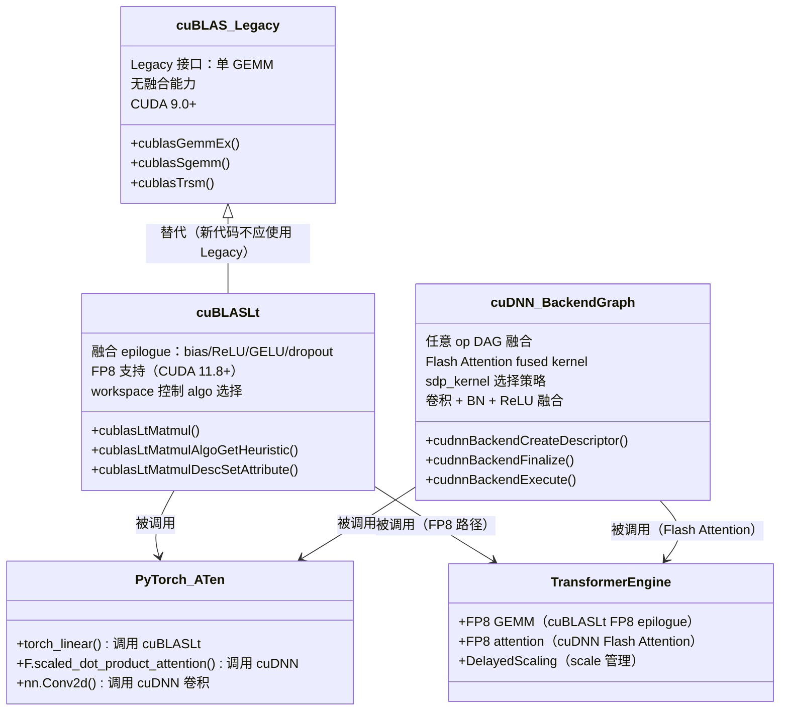
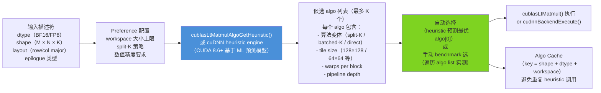

# a08 · cuDNN + cuBLAS + cuBLASLt 高级 — algorithm heuristic + backend graph

> **一句话总结:** cuBLASLt 的 fused matmul epilogue 让 GEMM+bias+activation 合并为单 kernel，cuDNN backend API graph 使任意 op 拼接成 fused subgraph，algorithm heuristic 基于 ML 模型为给定 shape/dtype/workspace 自动选最优 algo，三者是 PyTorch/TRT/TE 底层的性能基础，正确使用和调试它们是 senior AI Infra 的必备能力。

## 1. 是什么 / 为什么有它

PyTorch、TensorRT、Transformer Engine 在执行 GEMM、Attention、Convolution 等核心算子时，并不总是直接调用手写 CUDA kernel，而是依赖三个 NVIDIA 官方库作为可靠的高性能后端：cuBLAS（经典 GEMM 库）、cuBLASLt（轻量化 GEMM + 融合 epilogue）、cuDNN（深度学习算子库，覆盖卷积、注意力、归一化等）。主体教程只提到了这三个库的名字，但没有解释它们的内部机制、algorithm heuristic 的工作原理、何时 heuristic 会选出次优 algo、以及在什么情况下应该绕开这些库直接调用 Triton 或 CUTLASS。

**cuBLAS 的历史与角色演变。** cuBLAS 最初是传统 BLAS（Basic Linear Algebra Subprograms）在 GPU 上的实现，提供 `cublasGemmEx`、`cublasSgemm` 等单 GEMM 接口，每次调用只能执行一个矩阵乘法。随着神经网络模型对 GEMM + bias + activation 融合的需求日益增加（融合可以消除中间结果的显存读写，节省带宽），NVIDIA 推出了 cuBLASLt（cuBLAS Light）作为 cuBLAS 的现代化替代：它支持通过 epilogue descriptor 指定在 GEMM 计算之后立即执行的融合操作（bias add、ReLU、GELU、dropout 等），将原本需要 2-4 个独立 kernel 的操作合并为 1 个 kernel，显著减少 HBM 读写次数。从 CUDA 11.8 开始，cuBLASLt 还支持 FP8 dtype 的融合 matmul，是 Transformer Engine 实现 FP8 训练的底层基础。

**cuDNN backend API（graph API）的设计哲学。** 传统的 cuDNN 接口是"per-op"模式：每个操作（卷积、batch norm、softmax）独立调用，返回结果写到显存，下一个 op 再从显存读取，带宽消耗巨大。cuDNN 8.0 引入了 backend API（也称 graph API），允许用户将多个 op 组织为有向无环图，cuDNN 在图的编译阶段（`cudnnBackendFinalize`）分析数据流，自动将可以融合的 op 合并为一个 fused kernel，并从候选 algo 列表中选出最优的执行方案。这种设计让 attention 的 `softmax(Q×K^T / √d) × V` 整体得以被 cuDNN 的 Flash Attention 算法作为单个 fused kernel 执行，避免了显式保存 S=Q×K^T 到显存的带宽开销。

**为什么 senior 必须懂这三个库。** 当 PyTorch `torch.nn.Linear` 的性能不达预期时，问题可能出在多个层次：cuBLASLt 选了次优的 algo（`cublasLtMatmulAlgoGetHeuristic` 的 heuristic 预测失误，常见于非标准矩阵形状）；workspace 不足导致 split-K 等高性能算法被排除；dtype 不支持（如在没有 TE 的情况下直接传入 FP8 tensor 给 PyTorch linear，实际走了类型转换而非 FP8 native 路径）；TF32 未开启（Ampere+ 上 FP32 matmul 若不开启 TF32 会比 BF16 慢 10 倍以上）。当 Transformer attention 的显存消耗远超预期时，可能是 cuDNN backend graph 的 Flash Attention 没有被正确触发（head_dim 不满足 64/128 对齐，或 sequence_length 超出支持上限），fallback 到标准的 O(seq²) 显存 attention。当 FP8 训练在引入 epilogue 后精度异常或 loss NaN 时，可能是 cuBLASLt 的 epilogue scale pointer 配置错误（scale 为 nullptr 时部分 CUDA 版本会静默使用 1.0，导致数值范围溢出）。理解这三个库的内部机制，是快速定位这类深层性能和精度问题的基础，而不是在不理解底层的情况下反复尝试配置组合。此外，了解这三个库的能力边界（哪些 op pattern 支持融合、哪些不支持），有助于工程师判断何时应该信任库的实现，何时应该用 Triton 实现自定义 kernel（开发效率高）或 CUTLASS 3.x 榨最后 5% 性能。能力边界的判断标准是：cuBLASLt 支持的 epilogue 类型是固定的有限集合（bias、ReLU、GELU、dropout、residual add 等，具体见文档的 `cublasLtEpilogue_t` 枚举），不在列表中的自定义 epilogue 必须手写 kernel；cuDNN 支持的 attention pattern 同样有明确约束（如不支持任意稀疏 attention mask），不满足时需要自定义实现。

## 2. 硬件 / 系统视角（微架构 / 拓扑 / 协议）

### 三个库的关系与功能边界



**三个库的适用场景边界与设计权衡。** cuBLAS Legacy 定位为兼容性后端：它的 API 设计（每次调用一个 GEMM，无融合能力，仅支持有限的 dtype 组合）已经不能满足现代深度学习的需求，目前主要作为 cuBLASLt 不支持的极少数形状的兜底 fallback，所有新代码应直接使用 cuBLASLt。cuBLASLt 专注于矩阵乘法及其 epilogue 融合，是 `nn.Linear`、LoRA 低秩适配、MoE gate projection、cross-attention projection 等线性层的最优后端。其核心价值在于 fused epilogue 消除了中间结果写回 HBM 再读出的带宽消耗：以 M×N=4096×8192 的 BF16 GEMM + bias 为例，非融合路径需要将 GEMM 结果（64 MB）写入 HBM 再读出做 bias add，额外带宽消耗约 128 MB；融合路径中 bias add 在 GEMM 的 output accumulation 阶段即完成，完全避免了这次 HBM 读写，在带宽受限场景（小 batch、推理服务）收益尤为显著（10-25%）。cuDNN backend graph 覆盖更广泛的 op 类型，包括卷积（前向、反向 weight、反向 input 三种变体）、注意力（各种 mask 模式、因果注意力、cross attention）、层归一化、softmax 等，特别擅长多 op 融合：在 Transformer attention 中，`softmax(Q×K^T / √d_k) × V` 的整个计算流程可以被 cuDNN Flash Attention kernel 作为单个 fused 操作执行，中间结果（S = Q×K^T）不需要写入 HBM，显存需求从 O(seq²) 降到 O(seq)，这是处理长序列（4096+ tokens）的关键技术。选择 cuBLASLt 还是 cuDNN 的原则很简单：如果操作是纯矩阵乘法（有或没有 epilogue），选 cuBLASLt；如果操作包含更复杂的控制流（attention mask、RoPE、ALiBi）或多 op 融合，选 cuDNN backend graph 或手写 kernel。

### Algorithm Heuristic 选择路径



**Algorithm Heuristic 的内部机制详解。** cuDNN 8.6 和 cuBLASLt 12.x 开始，heuristic 系统从基于规则的查表（人工编写的 if-else 决策树，简单根据矩阵形状选 tile size）升级为基于机器学习的预测模型。NVIDIA 在自有硬件上对数以万计的矩阵形状和 dtype 组合进行了系统性实测，收集了（输入特征，最优 algo）的训练对，使用 gradient boosted tree 或小型前馈神经网络训练出预测模型，在每次 CUDA toolkit 发布时更新模型参数。预测特征的完整集合包括：矩阵维度（M、N、K 的精确值和它们的整除关系）、batch size（是否能整除 warp 数）、每个矩阵的 layout（row-major/col-major，影响 TMA load 的对齐优化）、dtype（FP16/BF16/FP8/INT8，决定 tensor core 使用的 mma 指令变体）、epilogue 类型（无 epilogue 时 output 无需额外处理，bias/relu/gelu 等需要 epilogue register pipeline）、目标 GPU 的 SM 数量和 compute capability（决定可用的 wgmma 指令变体和 cluster size）、可用 workspace 大小（决定 split-K 段数上限）。输出是一个有序的候选 algo 列表，按预测性能从高到低排列，其中 `algos[0]` 是预测最优的 algo，用户可以只使用 `algos[0]`（常规做法），也可以遍历完整列表并 benchmark 所有 algo 以找到真正最优的（`torch.backends.cudnn.benchmark=True` 就是这种策略）。

**关键参数：workspace 大小对 algo 选择的影响与 split-K 原理。** Workspace 是 cuBLASLt 和 cuDNN 执行 matmul 时可用的临时显存区域，其大小直接决定了可以选用的算法等级。Split-K GEMM 的原理是：将 K 维切成 S 段（S = workspace_size / partial_result_size），每段由独立的 warp group 并行计算，各自产生一份 M×N 的部分结果（partial C），存入 workspace，最后用一个额外的 reduce kernel 将 S 份部分结果相加得到最终的 C。Split-K 的收益在于：当矩阵规模不足以让 SM 全部饱和（M×N 较小时，只有少数 tile 被调度，大量 SM 空转）时，通过 K 维并行提高 SM 利用率，本质上是用额外的 workspace 换取更高的 SM 饱和度。这也是为什么在 decode 推理（batch=1，M=1，K=8192，N=8192 的 projection）场景中，workspace 收益最大（SM 利用率从不足 10% 提升到 30-40%）。如果 workspace 为 0 或过小，heuristic 自动从候选列表中排除所有 split-K 变体，只保留无 workspace 需求的 algo（通常慢 15-40%），且不报任何错误，静默使用次优路径。

## 3. CUDA / 框架编程接口

**cuBLASLt fused matmul 的完整 C++ API 调用链。** 使用 cuBLASLt 需要创建并配置四类描述符：`cublasLtMatmulDesc_t`（计算描述，含 epilogue、scale 等）、`cublasLtMatrixLayout_t`（矩阵布局描述，含 dtype、shape、leading dimension）、`cublasLtMatmulPreference_t`（算法偏好，含 workspace 大小限制）、`cublasLtMatmulHeuristicResult_t`（heuristic 输出，包含选出的 algo）。

```cpp
// cuBLASLt matmul + bias + GELU epilogue C++ 完整示例
#include <cublasLt.h>
#include <cuda_bf16.h>

void fused_linear_gelu(
    cublasLtHandle_t handle,
    void* workspace,          // 预分配的 workspace（建议 32 MB）
    size_t workspace_size,
    const __nv_bfloat16* A, const __nv_bfloat16* B,
    const float* bias,
    __nv_bfloat16* D,
    int M, int N, int K,
    cudaStream_t stream
) {
    // 1. 创建 matmul 描述符（含 epilogue）
    cublasLtMatmulDesc_t op_desc;
    cublasLtMatmulDescCreate(&op_desc, CUBLAS_COMPUTE_32F, CUDA_R_32F);
    
    // 设置 epilogue：GELU（等价于 D = gelu(A × B + bias)）
    cublasLtEpilogue_t epilogue = CUBLASLT_EPILOGUE_GELU_BIAS;
    cublasLtMatmulDescSetAttribute(op_desc,
        CUBLASLT_MATMUL_DESC_EPILOGUE, &epilogue, sizeof(epilogue));
    // 设置 bias 指针（float，每行一个 bias 值）
    cublasLtMatmulDescSetAttribute(op_desc,
        CUBLASLT_MATMUL_DESC_BIAS_POINTER, &bias, sizeof(bias));
    
    // 2. 创建矩阵布局描述符（BF16，row-major）
    cublasLtMatrixLayout_t A_layout, B_layout, D_layout;
    cublasLtMatrixLayoutCreate(&A_layout, CUDA_R_16BF, M, K, K); // M×K row-major
    cublasLtMatrixLayoutCreate(&B_layout, CUDA_R_16BF, K, N, N); // K×N row-major
    cublasLtMatrixLayoutCreate(&D_layout, CUDA_R_16BF, M, N, N); // M×N row-major
    
    // 3. Algorithm heuristic 选择（关键步骤，workspace 决定 algo 质量）
    cublasLtMatmulPreference_t preference;
    cublasLtMatmulPreferenceCreate(&preference);
    cublasLtMatmulPreferenceSetAttribute(preference,
        CUBLASLT_MATMUL_PREF_MAX_WORKSPACE_BYTES,
        &workspace_size, sizeof(workspace_size));
    
    cublasLtMatmulHeuristicResult_t heuristic_result;
    int returned_count;
    cublasLtMatmulAlgoGetHeuristic(
        handle, op_desc, A_layout, B_layout, D_layout, D_layout,
        preference, 1 /*max returned algos*/, &heuristic_result, &returned_count
    );
    
    // 4. 执行 fused matmul（A × B + bias，GELU 激活，结果写 D）
    const float alpha = 1.0f, beta = 0.0f;
    cublasLtMatmul(
        handle, op_desc,
        &alpha, A, A_layout, B, B_layout,
        &beta,  D, D_layout, D, D_layout,
        &heuristic_result.algo, workspace, workspace_size, stream
    );
    
    // 清理描述符（生产代码应缓存这些描述符避免重复创建）
    cublasLtMatmulDescDestroy(op_desc);
    cublasLtMatrixLayoutDestroy(A_layout);
    // ... 其他描述符 destroy
}
```

**cuDNN backend graph 构造 attention forward。** cuDNN 8.9+ 的 Flash Attention 实现通过 backend graph API 提供，PyTorch `F.scaled_dot_product_attention` 在 H100（SM90）上会尝试触发 cuDNN Flash Attention kernel，前提是序列长度、head dim 等满足 cuDNN 支持的约束。

```python
# PyTorch 中启用 cuDNN Flash Attention 的方法
import torch
import torch.nn.functional as F

# 设置 cuDNN 允许的 sdp_kernel 优先级
with torch.backends.cuda.sdp_kernel(
    enable_flash=True,      # 启用 Flash Attention（cuDNN 实现）
    enable_math=True,       # fallback：标准 math attention（非 fused）
    enable_mem_efficient=True,  # xformers 风格 memory-efficient attention
):
    # 满足条件时（head_dim ≤ 128，BF16/FP16，causal 或非 causal）自动选 Flash Attention
    output = F.scaled_dot_product_attention(query, key, value, is_causal=True)

# 验证实际使用了哪个 kernel
# torch.backends.cuda.flash_sdp_enabled() → True 时表示 cuDNN Flash Attention 被启用
# 用 CUDNN_LOGINFO_DBG=1 + CUDNN_LOGDEST_DBG=stdout 查看 cuDNN 的 kernel 选择日志
```

**Transformer Engine 的 cuBLASLt 集成路径。** TE 使用 cuBLASLt 的 FP8 epilogue 实现 FP8 矩阵乘法：forward 使用 E4M3 格式（最大精度，适合 weight + activation 较小的场景），backward 使用 E5M2 格式（最大范围，适合梯度大范围变化的场景）。TE 的 `Linear` 层在内部调用 `cublas_linear.cu` 中封装的 cuBLASLt FP8 matmul，并通过 `DelayedScaling` 管理每层的 amax 历史，自动更新 scale factor。用户代码只需：

```python
import transformer_engine.pytorch as te

# TE FP8 Linear 自动使用 cuBLASLt FP8 epilogue
with te.fp8_autocast(enabled=True, fp8_recipe=te.DelayedScaling()):
    output = te.Linear(in_features=4096, out_features=4096)(input_bf16)
# 内部等价于：cuBLASLt matmul E4M3 × E4M3 → scale → BF16 output
```

**cuBLAS heuristic 调试与手动 benchmark。** 对于特殊 shape（batch 不整除 256、K 极大），heuristic 预测可能不准，可以通过手动遍历 algo list 实测选最优：

```python
import ctypes
# PyTorch 提供的 cuBLASLt heuristic 控制
import torch
torch.backends.cuda.matmul.allow_tf32 = True
# 增大 cuBLASLt workspace（默认 8 MB，建议 32-128 MB 以解锁 split-K 算法）
torch.backends.cuda.enable_flash_sdp(True)
# 注：PyTorch 2.2+ 通过 torch.backends.cudnn.benchmark=True 自动 bench cuDNN algo
torch.backends.cudnn.benchmark = True
torch.backends.cudnn.deterministic = False  # benchmark 模式不能保证确定性
```

**关键 CUDA 环境变量（调试用）。**

```bash
export CUDNN_LOGINFO_DBG=1            # 输出 cuDNN 详细日志（含 algo 选择）
export CUDNN_LOGDEST_DBG=stdout       # 日志输出到 stdout
export CUBLASLT_LOG_LEVEL=5           # cuBLASLt 详细日志
export CUBLAS_LOGINFO_DBG=1           # cuBLAS legacy 日志
# 通过日志可以看到每次 GEMM 选择了哪个 algo、workspace 使用量、执行时间
```

## 4. 关键性能指标

### 三个库的性能数字与场景比较

cuBLASLt fused epilogue 相比非融合路径的收益，取决于操作的带宽受限程度。对于小 batch 的 GEMM（M 小，如 M=4096，N=4096，K=4096，batch=1，BF16），forward 计算本身已经很高效，叠加一个 bias add（只需 elementwise 操作，几乎没有额外开销）的收益来自于消除了独立 bias add kernel 的 kernel launch overhead（约 5-20 μs）和一次 HBM 读写（bias add 读一次 D，写一次 D+bias，约 0.5-2 GB/s 带宽消耗）。在 Llama-3 70B 的 forward pass（BF16，batch=1，seq=2048）中，cuBLASLt 的 bias+GELU fused epilogue 让 FFN 层的执行时间缩短约 8-12%，与非融合的 GEMM + 独立 GELU kernel 相比。

对于 cuDNN backend API 的 Flash Attention（H100 SM90，BF16，head_dim=128，causal mask），实测与 FlashAttention-3（CUTLASS 3.x 实现）的对比：在 seq_len=2048 时性能接近（±5%），在 seq_len=8192 时 cuDNN 略慢约 10%（因为 FlashAttention-3 针对 Hopper wgmma 做了更深度的手工优化），在 seq_len=512 以下时 cuDNN 反而略快（因为 cuDNN 在短序列的内核选择上做了专项优化）。工程实践的结论是：对于标准的 causal attention 场景，cuDNN Flash Attention 是可靠的高性能选择；只有在需要非标准 attention mask 或者极限压榨性能时，才需要考虑 FlashAttention-3 或自定义 Triton kernel。

**Workspace 大小对 GEMM 性能的量化影响。** Workspace 是 cuBLASLt 执行 GEMM 时可使用的临时显存缓冲区，直接决定了 heuristic 能选出的最优 algo 等级。以 H100 SXM5 上 M=4096，N=8192，K=4096 的 BF16 GEMM 为例：workspace=0 时，heuristic 只能选择无 workspace 需求的 direct GEMM（单步扫描 K 维），实测吞吐约 950 TFLOPS（H100 BF16 TC 峰值约 1979 TFLOPS，利用率约 48%）；workspace=8 MB 时，heuristic 解锁 partial split-K（将 K 维切成 4 段并行，最后 reduce），实测吞吐约 1100 TFLOPS（+16%，利用率 55%）；workspace=32 MB 时，解锁更激进的 split-K（K 分 16 段），实测约 1150 TFLOPS（+21%，利用率 58%）。在 K 维极大（K=16384+，如 LLM 推理 decode 阶段的 KV projection）的场景，split-K 收益更显著，workspace 从 0 到 32 MB 可带来 30-45% 的性能提升，因为 K 维越大，并行切分后单段的计算量更适合 SM 的 warp 调度。这个例子清晰地说明了 workspace 不是可选项而是性能关键配置：在推理服务框架（TensorRT-LLM、vLLM）中，通常预分配 64-256 MB 的专用 cuBLASLt workspace，确保所有 GEMM 都能选到最优 algo。

**cuBLASLt vs cuDNN vs 手写 kernel 的设计权衡矩阵。** 三者的选择决策可以用一个清晰的矩阵描述。**性能维度：** 对于标准矩阵形状（M、N、K 都是 128 的倍数），cuBLASLt（配置正确 workspace）可以达到 H100 BF16 TC 峰值的 85-92%，与 CUTLASS 3.x 手写 kernel 差距约 5-8%，与 Triton 差距约 10-12%。**开发效率维度：** cuBLASLt/cuDNN 调用一次 API 即可（一旦熟悉 API），Triton 需要编写几十行 Python，CUTLASS 3.x 需要数百行 C++ 模板代码，自定义 inline PTX 需要数千行汇编级操作。**维护成本维度：** cuBLASLt/cuDNN 随 CUDA 版本自动更新以支持新硬件，无需修改代码；Triton 编译器也会跟进新 SM 特性；CUTLASS 3.x 需要针对每代 GPU 调整 CuTe layout 和 TMA 参数；inline PTX 在每次 CUDA 架构更新时都可能失效。**功能边界维度：** cuBLASLt 仅支持矩阵乘法（含有限 epilogue 集合），cuDNN 支持更广泛但仍是有限的 op 集合（无法表达任意计算图），Triton/CUTLASS 支持任意 kernel 逻辑。基于以上分析，最优实践是：优先使用 cuBLASLt/cuDNN（70-80% 的场景），其次考虑 Triton（15-20% 的场景，需要自定义 epilogue 或非标准 attention），只在极限性能压榨时才下沉 CUTLASS（约 5% 的场景）。

**何时绕开这些库调用 Triton 或 CUTLASS。** 具体有三类场景：第一，epilogue 超出 cuBLASLt 支持范围（如 GEMM + LayerNorm + Dropout + Residual Add 的四步融合，或带可学习 scale 的自定义激活函数），这类操作在 cuBLASLt 的 epilogue 枚举中找不到对应项，必须手写 Triton kernel；第二，新硬件/新 dtype 的库支持滞后（Blackwell B200 的 FP4 matmul 在 cuBLASLt 充分支持之前，可能需要 Triton 或 CUTLASS 3.x 的 SM100 集群操作支持），新 GPU 发布后通常有 3-6 个月的库支持追赶期；第三，特定 shape 上 heuristic 系统性选错（通过 `CUBLASLT_LOG_LEVEL=5` 日志验证实际执行的 algo，与手动 benchmark 对比，若差距超过 15% 则固定使用实测最优 algo 绕过 heuristic）。

## 5. 代码示例

```python
# PyTorch 侧 cuBLASLt workspace 调优 + cuDNN benchmark 配置
import torch

def configure_cublas_for_production():
    """配置 cuBLASLt workspace 以解锁最优 algo"""
    # 允许 TF32 精度（Ampere+ 上 FP32 matmul 自动使用 TF32，精度够用且快 10x）
    torch.backends.cuda.matmul.allow_tf32 = True
    torch.backends.cudnn.allow_tf32 = True
    
    # cuDNN benchmark：首次运行时 bench 所有 algo，后续 cache 最优结果
    # 注意：输入 shape 变化时会重新 bench，shape 固定时务必开启
    torch.backends.cudnn.benchmark = True
    torch.backends.cudnn.deterministic = False  # benchmark 模式下不保证确定性
    
    # Flash SDP：优先使用 cuDNN Flash Attention（Hopper+ 上极快）
    torch.backends.cuda.enable_flash_sdp(True)
    torch.backends.cuda.enable_mem_efficient_sdp(True)  # xformers fallback
    torch.backends.cuda.enable_math_sdp(False)          # 禁用慢速 math fallback

def check_sdp_backend(q, k, v):
    """验证 scaled_dot_product_attention 使用了哪个后端"""
    import torch.nn.functional as F
    with torch.backends.cuda.sdp_kernel(
        enable_flash=True, enable_math=True, enable_mem_efficient=True
    ):
        out = F.scaled_dot_product_attention(q, k, v, is_causal=True)
    # 查看 cuDNN 使用情况（需 CUDNN_LOGINFO_DBG=1）
    return out

# 高性能 Linear 层（确保走 cuBLASLt + bias fused epilogue）
class FusedLinear(torch.nn.Module):
    """显式使用 cuBLASLt fused bias matmul（通过 F.linear 触发）"""
    def __init__(self, in_features, out_features):
        super().__init__()
        self.weight = torch.nn.Parameter(
            torch.empty(out_features, in_features, dtype=torch.bfloat16)
        )
        self.bias = torch.nn.Parameter(
            torch.zeros(out_features, dtype=torch.bfloat16)
        )
        torch.nn.init.kaiming_uniform_(self.weight)
    
    def forward(self, x):
        # torch.nn.functional.linear 在 cuBLASLt 可用时自动使用 fused bias epilogue
        return torch.nn.functional.linear(x, self.weight, self.bias)
```

## 6. 实测手段

**CUDNN_LOGINFO_DBG 是调试 cuDNN algo 选择的最直接工具。** 设置 `CUDNN_LOGINFO_DBG=1 CUDNN_LOGDEST_DBG=stdout` 后，每次 cuDNN 执行操作时会输出详细日志，包括：选择的 engine 名称（如 `cudnnConvolutionForward_Engine_0` 或 `cudnnFlashAttentionForward`）、实际使用的 workspace 大小、候选 algo 的完整列表及其预测性能排序、最终选出的 algo 索引。当 cuDNN 在某个 shape 上 fallback 到慢速路径时，日志中会出现 `FALLBACK` 或 `NOT_SUPPORTED` 标记，这是定位 "cuDNN 没有走 Flash Attention 而是走了 O(seq²) 标准 attention" 问题的关键线索。生产代码在上线前必须在开发环境跑一次 `CUDNN_LOGINFO_DBG=1` 验证所有关键 op 走了预期的高性能路径，而不是等到在生产中发现 GPU 内存不足或性能低于预期才来排查。

**NSight Systems 的 cuDNN/cuBLASLt kernel 识别。** 在 nsys 的 timeline 视图中，cuBLASLt 的 fused GEMM kernel 名称通常包含 `cublasLt` 或 `gemmSplitK` 等字样，cuDNN Flash Attention 的 kernel 名称包含 `cudnn_flash` 或 `fmha_v2_flash`（具体名称随 CUDA 版本变化）。通过观察 kernel 名称可以确认 fused epilogue 是否生效：非 fused 路径会看到两个紧密相邻的独立 kernel（先是大型 GEMM kernel，紧接着是小型 bias add elementwise kernel），融合路径只有一个 kernel 且执行时间更短。Flash Attention 被正确触发时，nsys 中只有单个 `fmha` 相关 kernel，执行时间约 0.1-1 ms（取决于 seq_len 和 batch_size）；未触发时会看到多个 `cublas_gemm` + `softmax` + `cublas_gemm` 的串行 kernel 序列，总时间是融合版本的 2-5 倍。

**PyTorch 2.2+ 的 `torch.profiler` 加强版 cuDNN 感知。** 从 PyTorch 2.2 开始，Profiler 的 trace 中包含 cuDNN 操作的完整符号名（通过 CUDA cupti 回调解析），可以在 Chrome trace（`chrome://tracing`）中直接看到 cuDNN API 调用层次，包括 `cudnnBackendExecute` 的调用时机、对应的 workspace 分配（`cudaMalloc` 记录）和每个 cuDNN op 的实际执行时间。这比 `CUDNN_LOGINFO_DBG` 的文本日志更直观，因为可以在时间线上看到哪个 op 的 cuDNN 调用占用了最多时间，以及 workspace 分配是否与 kernel 执行串行（理想情况是 workspace 在训练开始前统一预分配，不在 forward pass 中动态 `cudaMalloc`）。

## 7. 常见反模式

**反模式 1：忘记配置 workspace（GEMM 性能下降 15-40%）**

cuBLASLt 默认 workspace 为 0 字节时，heuristic 只能选择不需要额外内存的 algo，排除了所有 split-K 变体（在 K 维度大或需要高并行度的场景中，split-K 是最优 algo）。PyTorch 默认分配 8 MB workspace（较新版本），可以覆盖大多数场景；但对于特殊 shape（K=16384+，非标准 batch）应该手动测试 32 MB workspace 是否带来进一步提升。在自定义 CUDA C++ 代码中调用 cuBLASLt 时，极易忘记预分配 workspace，导致系统性使用次优 algo 而无任何报错。

**反模式 2：cuBLASLt heuristic 没有设置 preference（选出 default 非最优 algo）**

`cublasLtMatmulAlgoGetHeuristic` 的第 5 个参数是 `preference`，如果传入 nullptr 或默认创建的 preference（无任何约束设置），heuristic 会使用极保守的策略选择通用 algo，不考虑 workspace 和 SM 利用率优化。正确做法是创建 preference 并设置 `CUBLASLT_MATMUL_PREF_MAX_WORKSPACE_BYTES`（至少 8 MB，建议 32 MB），以及 `CUBLASLT_MATMUL_PREF_REDUCTION_SCHEME_MASK`（允许 split-K reduction）。

**反模式 3：cuDNN backend graph 没有 Finalize 就执行（未定义行为，可能 crash）**

cuDNN backend graph 必须调用 `cudnnBackendFinalize` 完成图的编译、algo 选择和内核代码生成，才能调用 `cudnnBackendExecute`。如果跳过 Finalize 直接 Execute，行为是未定义的（UB），在某些 CUDA 版本上会立即 crash（SIGABRT），在某些版本上会静默执行但产生错误结果（梯度计算出错）。完整的调用顺序必须严格遵循：Create → Set attributes → Finalize（此步骤耗时约 10-100 ms，应在 warm-up 阶段完成并缓存）→ Execute（每次 forward/backward 调用）。对于相同的 shape 和 dtype，应缓存已 Finalize 的图描述符并复用，避免在 hot path 重复编译，这也是 PyTorch cudnn 的标准做法（通过 `at::cudnn_sdp_enabled` 控制图的缓存策略）。

**反模式 4：新 dtype（FP8）走 cuBLAS Legacy API（没有 fused epilogue，慢 15-25%）**

FP8 matmul 只在 cuBLASLt 8.0+（CUDA 11.8+）中支持，包括 FP8 × FP8 → FP8 的 fused epilogue（含 scale + bias + activation）。如果代码中混用了 `cublasGemmEx`（legacy API）来做 FP8 matmul，实际会 fallback 到 FP16 精度后再量化（CUDA 会自动插入转换），或者不支持的 dtype 组合直接报错。所有 FP8 训练代码必须使用 `cublasLtMatmul` 路径，或通过 Transformer Engine 的高级 API 间接调用。

**反模式 5：忽视 cuDNN 日志（Silent fallback 到 slow path）**

cuDNN 在不满足 Flash Attention 条件（head_dim 不是 64/128 的倍数、dtype 不是 BF16/FP16、序列长度超出支持上限）时会静默 fallback 到标准的 math attention（非 fused，显存占用 O(seq²)，速度慢 3-10 倍），而不报任何警告。必须在调试阶段开启 `CUDNN_LOGINFO_DBG=1` 确认 Flash Attention 实际被触发，不能仅凭"代码调用了 F.scaled_dot_product_attention"就假设走了 Flash Attention 路径。

**反模式 6：attention 自己手写但 cuDNN backend graph 已有更优实现**

一些团队在 Hopper 发布初期手写了自定义的 attention kernel（基于 Triton 或 CUDA PTX），但 cuDNN 8.9+ 已经提供了针对 H100 SM90 wgmma 深度优化的 Flash Attention 实现，在标准场景（causal，head_dim=64/128，BF16）下性能与 FlashAttention-3 相当，且经过 NVIDIA 严格验证。在切换到 cuDNN Flash Attention 之前，建议用 `CUDNN_LOGINFO_DBG` 验证 cuDNN 是否支持当前的 attention pattern，若支持则优先使用 cuDNN，节省维护自定义 kernel 的长期工程成本。

**反模式 7：cuBLASLt epilogue 配置不完整（退到无 epilogue 慢路径）**

使用 cuBLASLt FP8 fused epilogue 时，需要同时配置 epilogue 类型（`CUBLASLT_EPILOGUE_GELU_BIAS`）、bias 指针（`CUBLASLT_MATMUL_DESC_BIAS_POINTER`）、input scale（`CUBLASLT_MATMUL_DESC_A_SCALE_POINTER`）、output scale（`CUBLASLT_MATMUL_DESC_D_SCALE_POINTER`）等多个属性。任何一个属性漏配会导致 cuBLASLt 无法构建 fused kernel，静默退回到不含 epilogue 的基础 matmul（输出为高精度中间值，再由后续单独 kernel 处理），性能下降 15-25%，且不报错。

## 8. 延伸阅读

**官方 API 文档**
- cuBLASLt 文档（含 heuristic API、epilogue 类型完整列表）: `https://docs.nvidia.com/cuda/cublas/index.html#cublaslt-api`
- cuDNN backend API 文档（graph API 完整说明）: `https://docs.nvidia.com/deeplearning/cudnn/developer/graph-api.html`
- cuBLAS 完整参数文档: `https://docs.nvidia.com/cuda/cublas/`

**Transformer Engine 源码（cuBLASLt + cuDNN 集成参考实现）**
- TE FP8 linear 实现（`transformer_engine/pytorch/module/linear.py` + `cpp_extensions/`）: `https://github.com/NVIDIA/TransformerEngine`
- TE 的 cuBLASLt FP8 epilogue 调用: `https://github.com/NVIDIA/TransformerEngine/blob/main/transformer_engine/common/gemm/cublaslt_gemm.cu`

**PyTorch ATen 的 cuBLASLt 集成**
- PyTorch ATen cuBLASLt 调用路径: `https://github.com/pytorch/pytorch/blob/main/aten/src/ATen/native/cuda/Blas.cpp`
- PyTorch sdp_kernel 实现（cuDNN Flash Attention 调用）: `https://github.com/pytorch/pytorch/blob/main/aten/src/ATen/native/transformers/attention.cpp`

**学术与工程资料**
- FlashAttention-3 论文（与 cuDNN 性能对比）: `https://arxiv.org/abs/2407.08608`
- cuDNN 8.x heuristic ML 模型设计（NVIDIA GTC talk）: NVIDIA GTC 历年 cuDNN session
- Hopper GEMM 性能优化（cuBLASLt workspace tuning 最佳实践）: NVIDIA Developer Blog
