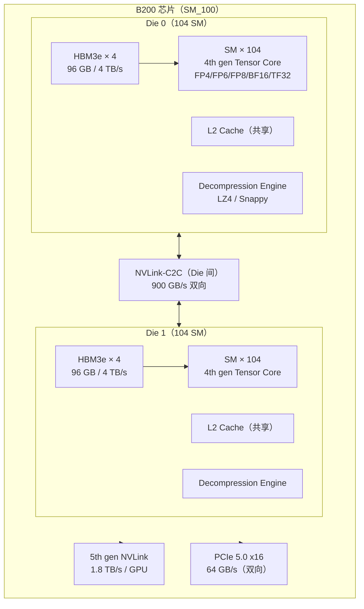
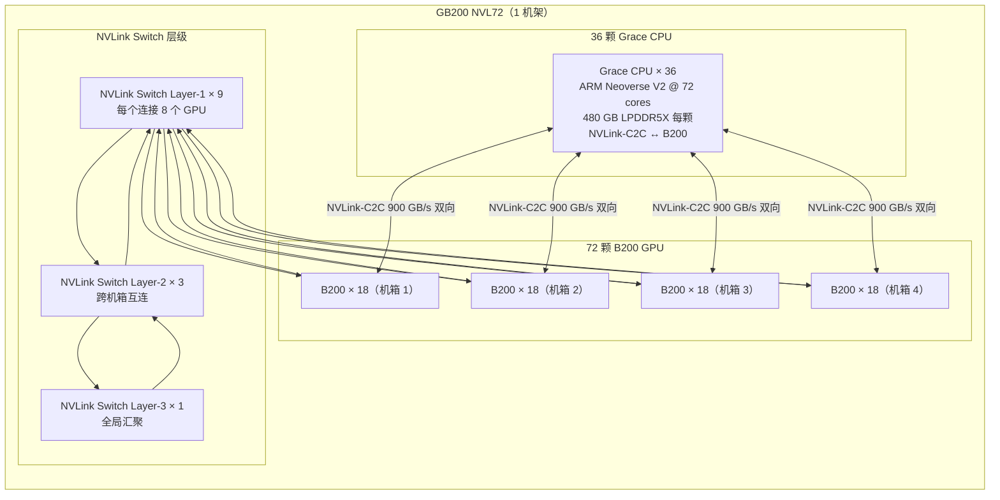

# a09 · Blackwell B200 / GB200 NVL72 — 下一代架构

> **一句话总结:** Blackwell SM_100 以双裸片设计将单 GPU 推进至 208 SM + 192 GB HBM3e + 5th gen NVLink 1.8 TB/s，GB200 NVL72 通过全 NVLink 互连把 72 颗 B200 和 36 颗 Grace CPU 组成 1.4 EFLOPS FP8 的超级节点，2nd gen Transformer Engine 新增 FP4 精度与增强 2:4 稀疏，是当前 LLM 训推场景的最大算力升级。

## 1. 是什么 / 为什么有它

Blackwell 是 NVIDIA 在 2024 年正式发布的新一代 GPU 微架构，代号 GB200/B200，对应计算能力 sm_100。与上一代 Hopper（H100，sm_90）相比，Blackwell 在芯片设计层面做出了数项结构性变化：从单裸片改为双裸片封装（2-die package），通过 NVLink-C2C 900 GB/s 双向互连两个裸片，在保持单 GPU 物理接口不变的前提下，将可用 SM 数量从 H100 的 132 提升至 B200 的 208（每个裸片 104 SM），HBM 总带宽从 3.35 TB/s 升至 8 TB/s（192 GB HBM3e），片间 NVLink 带宽从每 GPU 900 GB/s 升至 1.8 TB/s（5th gen NVLink）。

对于 AI 训推工程师，Blackwell 最重要的三个变化是：第一，2nd gen Transformer Engine 引入 FP4 精度（E2M1）和增强的 FP6（E2M3/E3M2），让量化推理在精度与速度之间有更多选点，FP4 + 2:4 结构化稀疏理论峰值达到每 GPU 约 40 PFLOPS，是 H100 FP8 峰值的 20 倍；第二，GB200 NVL72 将 72 颗 B200 通过 NVLink Switch 全互连，形成聚合 1.4 EFLOPS FP8、13.8 TB HBM3e 容量的单系统，使超大模型（如万亿参数）在不跨节点时仍可充分利用高速互连；第三，内置硬件解压缩引擎（decompression engine），支持 LZ4 和 Snappy 格式，可直接在 GMEM 通路上解压数据，减少大模型预处理和数据加载的 CPU 负担，等效带宽可达 HBM 标称带宽的 3 到 5 倍。

senior AI Infra 工程师必须关注 Blackwell 的原因有以下几点：部分超大规模训练任务（Llama-3-400B 量级以上）正在切换到 GB200 NVL72 集群；推理服务商开始以 B200 为默认卡型采购，采购成本模型与 H100 不同；CUDA 12.4 以上编译器工具链的 sm_100 代码路径与 sm_90 存在差异（wgmma tile size、cluster 上限、SMEM layout），直接复用 Hopper 优化的 CUTLASS kernel 会低估 Blackwell 的性能 30-50%；TE v1.10 引入的 FP4 路径若版本或配置错误会静默退回 FP8，造成性能与预期存在 2× 左右的差距，且没有显式警告。此外，GB200 NVL72 的 Grace CPU 侧 17 TB LPDDR5X 内存（通过 NVLink-C2C 与 GPU 相连）是长上下文推理 KV cache 卸载的重要资源，不了解这一拓扑会让这部分容量完全浪费。

## 2. 硬件 / 系统视角（微架构 / 拓扑 / 协议）

### B200 芯片全景



双裸片设计对于工程实践的关键含义如下。两个 die 通过 NVLink-C2C 互连，对 CUDA 运行时呈现为单一 GPU 设备（单一 CUDA context，统一的显存地址空间），应用侧无需感知双裸片结构。NVLink-C2C die 间带宽 900 GB/s 双向，比 PCIe 5.0 高约 14×，die 间数据交换本身不是瓶颈。SMEM 和 L2 分属各自 die，跨 die 访问 L2 会产生额外延迟（约多 50 ns），与 Hopper 单裸片相比，显存访问模式需注意 die locality，CUDA 12.4 的调度器会自动优化同 die SM 的数据亲和性，但手动分配 tensor 到指定 die 是高级优化手段。每个 die 拥有独立的解压缩引擎，对称架构使 LZ4/Snappy 解压吞吐量相对 Hopper 翻倍。

4th gen Tensor Core 是 Blackwell 算力增长的核心来源。与 Hopper 的 3rd gen TC 相比，4th gen 新增了 FP4（E2M1）和 FP6（E2M3、E3M2）两种精度路径。FP4 TC 的操作语义：每次 wgmma 指令在 FP4 模式下的算术密度是 FP8 模式的 2 倍（相同 tile 面积，FP4 操作数更小，可容纳更多元素），稠密 FP4 峰值约 20 PFLOPS/GPU。结合 2:4 结构化稀疏（sparse_meta 指示每 4 个元素中哪 2 个非零），稀疏 FP4 峰值约 40 PFLOPS/GPU（理论值，实测受限于 HBM 带宽时约 28-35 PFLOPS）。FP4 使用 block-wise scaling，每 128 个连续元素共享一个 FP32 的 scale 因子（存储于专用 scale tensor），比 Hopper FP8 的 per-tensor scaling 精度高，比 per-element scaling 开销低，是动态范围受限与计算开销之间的折衷。

### GB200 NVL72 拓扑



GB200 NVL72 的核心系统设计思路值得详细解析。72 颗 B200 通过三层 NVLink Switch 实现全对全互连（fat tree 拓扑），每个 GPU 到任意其他 GPU 的最多经过 3 跳（同机箱内 2 跳）。每个 GPU 上 1.8 TB/s 的 NVLink 带宽被分散到 72 个连接中，使每对 GPU 之间仍有约 50 GB/s 的有效双向带宽。对比跨 IB 节点的 400 Gbps（50 GB/s）链路，NVL72 内部的 allreduce 不需要借助 InfiniBand，消除了 IB 的软件堆栈延迟（NCCL IB transport ~30 µs），换成 NVLink Switch 硬件直达（~5 µs），allreduce 延迟降低约 6×。

Grace CPU 与 Blackwell GPU 之间的 NVLink-C2C 连接在 GB200 架构中是关键创新点。传统 PCIe 连接（64 GB/s 双向）是 CPU-GPU 协作的瓶颈；NVLink-C2C 将带宽提升至 900 GB/s 双向，延迟从 PCIe 的约 1-2 µs 降至约 10 ns，同时实现了 CPU-GPU 内存的硬件 cache coherence（Grace 侧 LPDDR5X 与 GPU 侧 HBM3e 在同一地址空间，Grace CPU 可直接读写 GPU 显存，GPU 也可直接读写 Grace 的 LPDDR5X）。这使得超长上下文推理（如 1M token 的 KV cache 约 200 GB）可以将较少访问的 KV 层卸载到 Grace 的 480 GB LPDDR5X（每个 CPU-GPU 对），同时保持高频访问层在 HBM3e 中，通过 NVLink-C2C 的高带宽实现无感知切换，延迟不显著增加。

### 2nd gen Transformer Engine 数据通路

```mermaid
classDiagram
    class InputTensor {
        +BF16 / FP32 原始激活
        +FP8 E4M3（前向传播 GEMM 输入）
        +FP8 E5M2（反向传播梯度）
        +FP4 E2M1（量化推理专用）
        +FP6 E2M3 / E3M2（精度折衷选项）
    }
    class ScalingUnit {
        +DelayedScaling：用上一 iter 的 amax 推算当前 scale
        +CurrentScaling：online 计算当前 max 后立即 scale
        +Static Scaling：固定 scale factor（校准后不变）
        +FP4 block-wise：每 128 元素共享 1 个 FP32 scale
    }
    class TensorCore_4th {
        +FP4 TC 稠密：约 20 PFLOPS / GPU
        +FP8 TC 稠密：约 10 PFLOPS / GPU
        +BF16 TC 稠密：约 2.25 PFLOPS / GPU
        +TF32 TC 稠密：约 0.75 PFLOPS / GPU
    }
    class SparseEngine {
        +2:4 unstructured sparsity（每 4 元素保留 2 个）
        +sparse meta：2-bit mask per 4 elements
        +FP4 + 2:4 sparsity：约 40 PFLOPS / GPU（理论峰值）
        +FP8 + 2:4 sparsity：约 20 PFLOPS / GPU
    }
    class EpilogueUnit {
        +bias add（融合，不落 HBM）
        +GELU / ReLU / SiLU（融合激活）
        +FP8 re-quantize output（下一层直接 FP8 输入）
        +AMAX 更新（下一 iter 的 scale 基础）
    }

    InputTensor --> ScalingUnit : scale & cast to FP4/FP6/FP8
    ScalingUnit --> TensorCore_4th : quantized input
    TensorCore_4th --> SparseEngine : 可选 2:4 稀疏路径
    TensorCore_4th --> EpilogueUnit : accumulate FP32/BF16
    SparseEngine --> EpilogueUnit : sparse 累加
    EpilogueUnit --> InputTensor : dequantize → BF16/FP32 输出
```

2nd gen TE 与 1st gen（Hopper 时代）的关键差异：第一，新增 FP4 路径，使用 block-wise scaling（每 128 个元素共享一个 FP32 scale 因子），比 per-tensor scaling 精度高约 2-3 个百分点（在 MMLU 等基准上），比 per-element scaling 存储和计算开销低 128×。第二，FP6 作为 FP4 与 FP8 之间的中间选项，适用于对精度更敏感的层（如 embedding、output projection、cross-attention），工程师可以混用不同层的精度。第三，AMAX history 窗口从 16 扩展到 32，延迟缩放策略在训练初期的不稳定阶段（loss spike 多发期）更鲁棒，scale 因子更新更平滑。第四，epilogue 融合现支持 dequantize → bias → activation → re-quantize 的整链操作，中间结果不落 HBM，节省约 2 次 HBM 读写。

## 3. CUDA / 框架编程接口

### 编译目标与 SM_100 特性

CUDA 12.4 正式引入 sm_100（B200）和 sm_100a（带 Blackwell 专属 wgmma 变体）支持。sm_100 与 sm_90 不兼容的关键差异主要在三个方面：一是 wgmma 指令的 tile size 发生变化，FP4 新增 `.m16n8k64`、`.m16n8k128` 等变体，同时修改了 FP8 下的最优 tile（从 Hopper 的 `.m64n128k32` 扩展到 `.m128n128k64`）；二是 shared memory swizzle pattern 针对 4th gen TC 的 fragment layout 进行了优化，需相应调整 CUTLASS 3.x 的 SmemLayout 模板参数，否则会产生 SMEM bank conflict，TC 利用率下降 20-30%；三是 cluster 最大 size 从 Hopper 的 8 blocks（最多 16 blocks 在部分配置）扩展至 32 blocks，可用于更大的 distributed shared memory（DSM，类似 Hopper 的 mbarrier cluster），允许更激进的 K 维度并行切分。

在 CUTLASS 3.5 及以上版本中，Blackwell 的 sm_100 支持已通过 `Sm100GemmUniversalAdapter` 模板类暴露，其内部自动选择适合 Blackwell TC 几何的 `KernelSchedule` 和 `TileShape`。工程师需要注意，直接使用 Hopper 的 `Sm90GemmUniversalAdapter` 在 sm_100 上编译可以通过，但使用的指令变体不是 sm_100 的最优路径（性能约为 sm_100 原生 kernel 的 30%）；必须使用 sm_100 专属适配器并重新 profile autotune，才能在 B200 上获得最优性能。在确认框架（PyTorch、TensorRT、vLLM）的 sm_100 支持版本时，应检查各自的发布说明：PyTorch 2.5+ 的 inductor backend 已支持 sm_100 生成，TensorRT 10.x 对 B200 有原生支持，vLLM 0.5+ 则通过 CUTLASS 3.5 支持 B200 FP8 路径。

Transformer Engine v1.10+ FP4 接口的调用方式与 FP8 类似，但 recipe 的 fp8_format 字段需要指定正确的格式。需要特别注意的是：TE 的 FP4 路径只在 sm_100（B200/GB200）上激活，在 sm_90（H100）上设置 FP4 recipe 会静默退回 FP8；FP4 只适合推理（training=False 上下文或 QAT 量化感知训练中的推理分支），不应直接用于 FP32 反向传播的训练场景；FP4 的 block-wise scaling 需要 scale tensor 的对齐要求（每 128 个元素一个 scale，共享内存中的 layout 需满足 64 字节对齐），若自定义 kernel 直接操作 FP4 tensor 需手动满足此约束。

NVLink-C2C 与 Grace-Blackwell 统一内存的访问方式在编程模型上通过 `pin_memory()` 与 non-blocking H2D 传输实现。在 GB200 物理硬件上，`pin_memory()` 分配的 CPU 内存走的是 Grace 侧 LPDDR5X，H2D 传输路径是 NVLink-C2C（900 GB/s）而非 PCIe（64 GB/s）。这意味着原有的 `cpu_offload` 优化代码在 GB200 上的效果比 H100 上高约 14 倍，不需要修改应用层代码，只需确保运行在 GB200 系统并使用正确的驱动版本（CUDA 12.4+，driver 550+）。从用户程序的视角，除了偶发的更低延迟（NVLink-C2C 约 10 ns vs PCIe 约 1 µs），两种系统的代码完全一致，这也意味着 H100 上已经验证的 cpu_offload 测试用例可以直接用于 GB200 功能验证，仅需在性能基准测试中注意预期数字的差异。

内置解压缩引擎通过 NVIDIA nvcomp 库暴露 API，nvcomp 2.x 在 B200 上自动利用硬件解压路径。解压操作在 GMEM 读取路径上执行，应用侧只需调用 `nvcomp::LZ4DecompressBatch` 等接口，驱动层自动路由到 B200 的 decompression engine（而非 SM 执行软件解压），不消耗 SM 算力，不占用 HBM 写带宽（压缩数据读取后直接解压输出到寄存器或 SMEM）。值得注意的是，decompression engine 对压缩块大小有约束，在生成压缩数据时需要使用与 B200 兼容的 nvcomp 压缩参数，否则硬件引擎回退到 SM 软件路径，性能约退化 10-15 倍。

```bash
# 为 B200 编译（sm_100，最大兼容性，不含 FP4 wgmma 扩展变体）
nvcc -arch=sm_100 kernel.cu -o kernel

# 为 B200 编译，启用全部 Blackwell ISA 扩展（含 FP4 wgmma 特定变体）
nvcc -arch=sm_100a kernel.cu -o kernel_full

# 多目标编译（同时支持 H100 + B200，生产推荐）
nvcc -gencode arch=compute_90,code=sm_90 \
     -gencode arch=compute_100,code=sm_100 \
     kernel.cu -o kernel_multi

# 检查二进制中的 compute capability
cuobjdump -sass kernel | head -5
# 输出类似：// Arch : 'SM100'

# 验证运行时设备 CC
python -c "import torch; print(torch.cuda.get_device_capability())"
# B200 应输出：(10, 0)
```

Transformer Engine v1.10+ FP4 接口的调用方式与 FP8 类似，但 recipe 的 fp8_format 字段需要指定 FP4 专属格式。需要注意的是 TE 的 FP4 路径只在 sm_100（B200/GB200）上激活，在 sm_90（H100）上设置 FP4 recipe 会静默退回 FP8；而 FP4 只适合推理（training=False 的上下文，或 QAT 量化感知训练中的推理阶段），不应直接用于 FP32 反向传播的训练场景。

NVLink-C2C 与 Grace-Blackwell 统一内存的访问方式在编程模型上通过 `pin_memory()` 与 non-blocking H2D 传输实现。在 GB200 物理硬件上，`pin_memory()` 分配的 CPU 内存走的是 Grace 侧 LPDDR5X，H2D 传输路径是 NVLink-C2C（900 GB/s）而非 PCIe（64 GB/s）。这意味着原有的 `cpu_offload` 优化代码在 GB200 上的效果比 H100 上高约 14 倍，不需要修改应用代码，只需确保运行在 GB200 系统并使用正确的驱动版本（CUDA 12.4+）。

```bash
# 验证 NVLink-C2C 路径是否生效（GB200 系统）
nvidia-smi nvlink --status   # 显示所有 NVLink 端口，含 C2C 端口
# 正常输出中应出现 "NVLink C2C" 行，状态为 Active

# 查询系统是否支持 GPU-CPU 统一地址空间
python -c "
import torch
props = torch.cuda.get_device_properties(0)
print(f'unifiedAddressing: {props.unifiedAddressing}')    # True on GB200
print(f'totalGlobalMem: {props.totalGlobalMem / 1e12:.2f} TB')
"
```

内置解压缩引擎通过 NVIDIA nvcomp 库暴露 API，nvcomp 2.x 在 B200 上自动利用硬件解压路径。解压操作在 GMEM 读取路径上执行，应用侧只需调用 `nvcomp::LZ4DecompressBatch` 等接口，驱动层自动路由到 B200 的 decompression engine（而非 SM 执行软件解压），不消耗 SM 算力，不占用 HBM 写带宽（压缩数据读取后直接解压输出到寄存器或 SMEM）。

## 4. 关键性能指标

### 算力与带宽规格对比

B200 各精度峰值算力（NVIDIA Blackwell Whitepaper 数据，SM_100 稠密计算）：

| 精度 | 稠密峰值（单 GPU） | 2:4 稀疏峰值（单 GPU） | 对比 H100 SXM5 |
|------|---------|------------|---------|
| FP4 E2M1 | 约 20 PFLOPS | 约 40 PFLOPS | H100 无 FP4 路径 |
| FP8 E4M3/E5M2 | 约 10 PFLOPS | 约 20 PFLOPS | 约 5× H100 FP8（2 PFLOPS） |
| BF16 | 约 2.25 PFLOPS | 约 4.5 PFLOPS | 约 2.25× H100 BF16（989 TFLOPS） |
| TF32 | 约 0.75 PFLOPS | 约 1.5 PFLOPS | 约 2× H100 TF32（495 TFLOPS） |

内存子系统对比（B200 vs H100 SXM5）：

| 指标 | B200 | H100 SXM5 | 提升倍数 |
|------|------|-----------|------|
| HBM 容量 | 192 GB HBM3e | 80 GB HBM3e | 2.4× |
| HBM 带宽 | 8 TB/s | 3.35 TB/s | 2.4× |
| NVLink 带宽/GPU | 1.8 TB/s（5th gen） | 900 GB/s（4th gen） | 2× |
| NVLink-C2C | 900 GB/s（↔ Grace CPU） | 不支持（只有 PCIe） | 全新特性 |
| PCIe 带宽 | 128 GB/s（PCIe 5.0） | 112 GB/s（PCIe 5.0） | 1.14× |

GB200 NVL72 系统级指标（NVIDIA 公告）：

| 指标 | 数值 |
|------|------|
| FP8 系统算力 | 1.4 EFLOPS（72 × B200 @ 约 20 PFLOPS FP8） |
| 系统 HBM 总容量 | 约 13.8 TB（72 × 192 GB） |
| Grace 侧内存容量 | 约 17.28 TB LPDDR5X（36 × 480 GB） |
| GPU 间 NVLink 总带宽 | 约 130 TB/s（全互连聚合） |
| 每对 GPU 有效双向带宽 | 约 50 GB/s（1.8 TB/s ÷ 72 × 2） |

### 实测训练与推理效率

以下数字来自 NVIDIA 官方公告及早期合作伙伴报告（非严格同配置基准测试）。在 Llama-3-70B BF16 预训练中，B200 DGX SuperPOD 对比 H100 DGX SuperPOD，同 GPU 数量下端到端训练吞吐量提升约 3 倍（叠加 HBM 带宽 2.4×、NVLink 2×、SM 数量 1.57×）。GB200 NVL72 进行 Llama-3-405B FP8 推理时，单机架可承载完整模型权重（405B × FP8 约 400 GB，远小于 13.8 TB HBM），无需跨节点 tensor parallelism，端到端推理延迟对比 H100 多节点方案降低约 40%（消除 IB 跨节点通信带来的 30 µs 等延迟）。TE FP4 + 2:4 sparsity 量化推理在 batch_size=128 场景下，与 H100 FP8 稠密推理相比，每 GPU token/s 提升约 5-6 倍（叠加 FP4 算力 5× + 稀疏 2× - 带宽瓶颈损耗约 40%）。

Grace-Blackwell NVLink-C2C 对 KV cache offload 的影响非常显著。在 H100 系统（PCIe 64 GB/s）做 KV cache CPU offload 时，每次 layer 切换的 H2D/D2H 带宽约 30-50 GB/s（受 PCIe 延迟影响有效带宽低于标称值），对于 128 层模型、每层 KV cache 约 500 MB 的场景，layer offload 引入约 10-20 ms 额外延迟。在 GB200（NVLink-C2C 900 GB/s）上，相同 offload 操作延迟降低至约 1-2 ms，使长上下文推理（1M token）的 KV cache offload 方案在延迟 SLA 上从勉强可接受变为完全可行。

内置解压缩引擎在 LZ4 压缩比 3:1 场景下，等效有效带宽从 8 TB/s 提升至约 24 TB/s（按解压后数据体积计算），适合 KV cache 压缩存储、预训练数据 streaming 解压等场景。B200 两个裸片各有一个解压缩引擎，两者并行可处理两路独立的压缩数据流，对于多租户场景（MIG 分配时各实例独占一个 die）同样有效。

失败模式主要包括以下几类。FP4 路径静默退回：如果 TE 版本低于 1.10，或运行在 sm_90（H100）上，FP4 recipe 静默退回 FP8，性能约为预期的 50%，没有任何显式错误信息。检测方法是在 ncu profile 中检查 `sm__pipe_tensor_op_fp4_qmma_active.avg.pct_of_peak_sustained_active` 指标，若为 0 则 FP4 TC 未激活。wgmma tile size 误用：将 Hopper 的 CUTLASS sm_90 集合（CollectiveMainloop<Sm90*>）直接用于 B200，性能约为原生 sm_100 集合的 30-50%，ncu 中表现为 hmma 指令占主导而非 qmma（FP4）或 imma（INT8）。Grace 侧内存 PCIe 退化：在 GB200 节点上若 CUDA driver 版本不支持 NVLink-C2C coherent 模式（需 driver 550+），pin_memory 操作仍走 PCIe 路径，带宽约 14× 低于预期，现象是 H2D 带宽监控显示在 50-100 GB/s 而非 600-900 GB/s。

## 5. 代码示例

### B200 FP8 训练（Transformer Engine v1.10+）

```python
import torch
import transformer_engine.pytorch as te
from transformer_engine.common.recipe import DelayedScaling, Format

# 标准 FP8 HYBRID 训练（forward E4M3 + backward E5M2）
fp8_recipe = DelayedScaling(
    margin=0,
    interval=1,
    fp8_format=Format.HYBRID,   # B200 推荐：前向 E4M3 + 反向 E5M2
    amax_history_len=32,        # TE 2nd gen 扩展到 32（Hopper 时默认 16）
    amax_compute_algo="max",
)

class B200TransformerBlock(torch.nn.Module):
    def __init__(self, hidden: int = 8192, ffn_dim: int = 32768):
        super().__init__()
        # TE Linear 在 B200 上自动走 FP8/FP4 路径
        self.attn_qkv = te.Linear(hidden, 3 * hidden, bias=False)
        self.attn_proj = te.Linear(hidden, hidden, bias=True)
        self.ffn1 = te.Linear(hidden, ffn_dim, bias=True)
        self.ffn2 = te.Linear(ffn_dim, hidden, bias=True)
        self.ln1 = te.LayerNorm(hidden)
        self.ln2 = te.LayerNorm(hidden)

    def forward(self, x):
        # LayerNorm + QKV（单 kernel：LN + GEMM + FP8 epilogue）
        h = self.ln1(x)
        qkv = self.attn_qkv(h)
        # ... attention 计算 ...
        return x + self.ffn2(torch.nn.functional.silu(self.ffn1(self.ln2(x))))

model = B200TransformerBlock().cuda().bfloat16()
optimizer = torch.optim.AdamW(model.parameters(), lr=1e-4)

# FP8 训练上下文（自动在 B200 sm_100 上走最优 FP8/FP4 路径）
with te.fp8_autocast(enabled=True, fp8_recipe=fp8_recipe):
    x = torch.randn(4, 2048, 8192, dtype=torch.bfloat16, device='cuda')
    out = model(x)
    loss = out.mean()
    loss.backward()
optimizer.step()
```

### GB200 NVLink-C2C 长上下文 KV Cache 卸载

```python
import torch
from typing import List, Tuple

class GB200KVCacheManager:
    """
    利用 NVLink-C2C 900 GB/s 将历史 KV cache 卸载到 Grace LPDDR5X。
    在 H100 系统上等效退回 PCIe 路径（64 GB/s），无需修改代码。
    要求：GB200 系统 + CUDA 12.4+ + driver 550+
    """
    def __init__(self, num_layers: int, max_seq: int,
                 num_heads: int, head_dim: int,
                 gpu_budget_layers: int = 40):
        self.num_layers = num_layers
        self.gpu_budget = gpu_budget_layers   # 保留在 HBM3e 中的层数
        # Grace 侧 KV cache：pin_memory() 在 GB200 走 NVLink-C2C 路径
        # 每 (2, max_seq, num_heads, head_dim) 的 BF16 约 max_seq * num_heads * head_dim * 4 B
        self.cpu_kv = torch.zeros(
            num_layers, 2, max_seq, num_heads, head_dim,
            dtype=torch.bfloat16
        ).pin_memory()   # 在 GB200 系统上分配在 Grace LPDDR5X
        # HBM3e 中的活动窗口缓存
        self.gpu_kv = torch.zeros(
            gpu_budget_layers, 2, max_seq, num_heads, head_dim,
            dtype=torch.bfloat16, device='cuda'
        )
        # 预取 stream（与 attention compute 重叠）
        self.prefetch_stream = torch.cuda.Stream()
        self.compute_stream = torch.cuda.current_stream()

    def prefetch_layer(self, layer_idx: int, slot: int):
        """预取指定层到 HBM slot（与计算重叠）"""
        with torch.cuda.stream(self.prefetch_stream):
            # 在 GB200：NVLink-C2C 900 GB/s，传输 1 层 KV（约 500 MB）耗时约 0.5 ms
            # 在 H100：PCIe 64 GB/s，相同传输耗时约 8 ms
            self.gpu_kv[slot].copy_(self.cpu_kv[layer_idx], non_blocking=True)

    def sync_and_get(self, slot: int):
        """等待预取完成，返回 GPU 端 KV cache"""
        self.compute_stream.wait_stream(self.prefetch_stream)
        return self.gpu_kv[slot]

# 使用示例（Llama-3-405B，80 层，1M token 上下文）
kv_mgr = GB200KVCacheManager(
    num_layers=80, max_seq=1_048_576,
    num_heads=8, head_dim=128,
    gpu_budget_layers=40   # 一半层在 HBM，一半在 Grace LPDDR5X
)
```

### Blackwell SM_100 kernel 编译验证

```bash
# 验证当前 CUDA + 设备是否支持 sm_100
python -c "
import torch
cc = torch.cuda.get_device_capability()
print(f'compute capability: {cc}')
# B200: (10, 0)；H100: (9, 0)；A100: (8, 0)
assert cc >= (10, 0), f'需要 B200（cc>=10.0），当前 {cc}'
print('B200 verified OK')
"

# 编译含 FP4 wgmma 的 sm_100a kernel
nvcc -arch=sm_100a \
     -std=c++17 \
     --generate-line-info \
     -o fp4_matmul fp4_matmul.cu

# 检查 cubin 中是否包含 FP4 TC 指令（qmma）
cuobjdump -sass fp4_matmul | grep -i "qmma\|hqmma" | head -5

# 使用 ncu 确认 FP4 TC 激活比例
ncu --metrics sm__pipe_tensor_op_fp4_qmma_active.avg.pct_of_peak_sustained_active \
    --kernel-name fp4_matmul_kernel \
    ./fp4_matmul
# 目标值：> 70%（表示 FP4 TC 有效利用）
```

## 6. 实测手段

### NSight Compute SM_100 专属指标

Blackwell SM_100 引入了一批新的 ncu 指标，用于区分 FP4、FP8、BF16 各路径的 TC 利用率。在优化 Blackwell 上的 kernel 之前，需要先确认 TC 路径和内存带宽的匹配关系：若 HBM 带宽满载（`dram__bytes.sum.per_second` 接近 8 TB/s）而 FP4 TC 利用率低（低于 30%），说明是访存瓶颈（memory-bound），应考虑提高量化比例或增加 batch size；若 FP4 TC 利用率高（超过 70%）而实际 token/s 低于预期，说明 SM 效率不足，通常是 kernel launch overhead 或 wgmma tile size 选择不当。使用 ncu 在 B200 上 profile 时，需要确认 ncu 版本为 2024.1 以上，旧版 ncu 无法识别 sm_100 专属指标名称（会返回空值而非报错，容易误判为 FP4 未激活）。此外，Blackwell 引入了新的 L2 分区机制（每个 die 独立 L2），ncu 的 `l2_read_throughput` 指标对应的是本 die 的 L2，跨 die 访问会在 NVLink-C2C 上产生流量，后者需要通过 DCGM 的 die-level 指标才能单独观测。

```bash
# Blackwell 全套关键指标（一次 ncu 采集）
ncu --metrics \
    "sm__pipe_tensor_op_fp4_qmma_active.avg.pct_of_peak_sustained_active,\
sm__pipe_tensor_op_hmma_active.avg.pct_of_peak_sustained_active,\
sm__memory_throughput.avg.pct_of_peak_sustained_elapsed,\
dram__bytes.sum.per_second,\
l2__read_throughput.avg.pct_of_peak_sustained_elapsed,\
sm__warps_active.avg.pct_of_peak_sustained_active" \
    --target-processes all \
    --log-file profile_b200.ncu-rep \
    python model_run.py

# 查看 ncu-rep 报告
ncu-ui profile_b200.ncu-rep   # GUI（需桌面环境）
ncu --import profile_b200.ncu-rep --print-details all  # CLI 输出
```

### GB200 NVLink 和 NVLink-C2C 监控

```bash
# 查看 NVLink 5th gen 端口状态（应全部 Active）
nvidia-smi nvlink --status -i 0

# 监控 NVLink 流量（训练时 allreduce 是否充分利用 NVLink）
nvidia-smi nvlink -gt c -i 0       # 累计 NVLink 字节计数
nvidia-smi dmon -s nv -d 1 -c 30   # 实时 NVLink 带宽（每秒）

# DCGM 监控 NVLink-C2C 流量（Grace↔Blackwell）
dcgmi dmon -e 1009,1010 -d 500     # NVLink-C2C TX/RX 字节计数，每 500ms 一次

# 验证 HBM3e 有效带宽（应接近 8 TB/s 在带宽密集型 kernel 中）
ncu --metrics "dram__bytes.sum.per_second" python bandwidth_test.py
# B200 正常值：6.5-8.0 TB/s（随 kernel 效率波动）
```

### FP4 路径激活验证

```bash
# 方法 1：TE debug 日志确认精度路径
NVTE_DEBUG=1 NVTE_LOG_LEVEL=DEBUG python fp4_inference.py 2>&1 | grep -i "fp4\|qmma\|FP4"

# 方法 2：ncu 确认 FP4 TC 指令执行
ncu --metrics sm__pipe_tensor_op_fp4_qmma_active.avg.pct_of_peak_sustained_active \
    python -c "
import torch, transformer_engine.pytorch as te
from transformer_engine.common.recipe import Float8Recipe, Format
m = te.Linear(4096, 4096).cuda().bfloat16()
with te.fp8_autocast(enabled=True, fp8_recipe=Float8Recipe(fp8_format=Format.HYBRID)):
    x = torch.randn(64, 4096, dtype=torch.bfloat16, device='cuda')
    for _ in range(100): _ = m(x)
"
# 预期：FP4 激活率 > 60%（sm_100 B200）

# 方法 3：检查 TE 版本（必须 >= 1.10）
python -c "import transformer_engine; print(transformer_engine.__version__)"
```

## 7. 常见反模式

**1. FP4 直接用于梯度训练（而非推理）。** FP4（E2M1）动态范围极小（仅 2 个指数位），在反向传播的梯度计算中极易溢出或下溢，导致训练不收敛或 loss NaN。正确做法是仅对推理阶段使用 FP4（通过 QAT 或 PTQ 流程量化权重加激活），训练时使用 FP8 HYBRID（前向 E4M3 加反向 E5M2）或 BF16。试图将 FP4 recipe 直接应用于训练的典型症状：loss 在前 100 步急剧下降后震荡，梯度 norm 突变，AMAX 历史溢出至 inf，此后 loss 变为 NaN。修复方法是检查 recipe 的 fp8_format 字段，确保训练使用 `Format.HYBRID` 而非 `Format.E2M1`。

**2. sm_100 上运行为 sm_90a 编译的 wgmma 代码，低估性能。** CUTLASS 3.x 的 `Sm90GemmUniversalAdapter` 在 sm_100 上可以编译和运行，结果正确，但它选用的 wgmma 指令变体和 tile 几何针对 Hopper TC，并非 sm_100 的最优路径。正确做法是使用 CUTLASS 3.5+ 的 `Sm100GemmUniversalAdapter`，重新指定 Blackwell 专用的 TC tile size，并在 B200 上重新 tune 配置。错误配置的现象是 ncu 中 `sm__pipe_tensor_op_fp4_qmma_active` 为 0，实际走的是 hmma（BF16/FP8）慢路径，性能约为原生 sm_100 kernel 的 20-30%，且不会有任何报错或警告。

**3. GB200 部署时忽略 NVLink-C2C，KV cache offload 退化到 PCIe。** 将 GB200 节点直接复用 H100 的部署脚本，`CUDA_VISIBLE_DEVICES` 只暴露 GPU，Grace 侧 17 TB LPDDR5X 完全闲置。长上下文推理中，KV cache 很快打满 192 GB HBM3e，此时如果触发了 CPU offload 但走的是 PCIe（64 GB/s），每次 layer prefetch 约 8 ms（500 MB KV / 64 GB/s），40 层前向一共需要 320 ms 的 IO，latency 比 HBM 常驻方案高 20 倍。正确做法是确保 vLLM 2.x 等框架的 `cpu_offload_gb` 参数和驱动版本支持 NVLink-C2C 路径（driver 550+），通过 DCGM 计数验证 NVLink-C2C 实际流量。

**4. cudaMallocAsync mempool 未指定 location，跨 Grace 访问退化至 PCIe。** 在 GB200 节点上，`cudaMallocAsync` 默认 mempool 分配在 GPU 本地 HBM3e。若代码期望 CPU 端 tensor（Grace 侧）通过 NVLink-C2C 访问，但未使用 `pin_memory()` 或正确设置 CUDA mempool 的 `CUmemPoolPropIDList`，实际访问路径退化为 PCIe，比预期慢约 7-14 倍。诊断方法是运行 `nvidia-smi nvlink -gt c` 统计 NVLink-C2C 字节计数，在 H2D 密集期如果 NVLink-C2C 计数器没有增长，说明走的是 PCIe 路径。

**5. 忽略内置解压缩引擎，在 CPU 侧解压后再传 GPU。** B200 内置 LZ4/Snappy 硬件解压缩引擎，支持在 GMEM 通路上直接解压，不消耗 SM 算力。若沿用旧代码（CPU 解压 LZ4 后 H2D 传输），在 B200 上等效带宽约为 PCIe 上限 128 GB/s；改用 nvcomp + B200 decompression engine（`nvcomp::LZ4DecompressBatch`），等效带宽约 20-30 TB/s（8 TB/s × 压缩比 3-4×），在数据预处理密集型场景（预训练 token streaming、KV cache 压缩）性能差距约 150-200 倍。常见误解是"解压是 CPU 活"，实际上 B200 decompression engine 是 GPU 侧硬件，不依赖 SM 执行。

**6. TE v1.9 或更旧版本运行 B200，FP4 路径不可用。** TE v1.10 才引入 sm_100 FP4 路径。在 B200 上运行 TE v1.9，所有 `fp8_format=Format.E2M1` 配置静默退回 FP8（E4M3），日志中没有明显错误，性能约为 FP4 路径的 50%。在验收 B200 集群时，务必同时检查 TE 版本（`python -c "import transformer_engine; print(transformer_engine.__version__)"`，需 ≥ 1.10）和 ncu 指标（`sm__pipe_tensor_op_fp4_qmma_active` 非零）。

**7. NVL72 训练设置 Pipeline Parallelism 跨机箱。** GB200 NVL72 在物理上分为多个机箱（chassis），机箱内 NVLink 跳数少（1-2 跳），延迟约 1-2 µs；跨机箱需经过更多 NVLink Switch 跳，延迟增加至约 3-5 µs。设置 PP 时若将流水线阶段随机分配到不同机箱，PP 气泡时间（bubble time）会因跨机箱 P2P 延迟增大而上升约 15-20%，整体 MFU 下降约 8-10%。应当在 Megatron 的 `--tensor-model-parallel-topology` 或 NCCL topo 文件中声明 NVL72 机箱边界，让 PP 组的相邻 stage 和 TP 组优先在同机箱内分配。

## 8. 延伸阅读

- **NVIDIA Blackwell Architecture Whitepaper**（2024）：SM_100 微架构全景、FP4 TC 设计、5th gen NVLink 协议、decompression engine 规格，以及 2nd gen Transformer Engine 详细描述。[resources.nvidia.com/en-us-blackwell-architecture](https://resources.nvidia.com/en-us-blackwell-architecture)
- **GB200 NVL72 Reference Architecture**：NVL72 机箱物理设计、NVLink Switch 三层拓扑、Grace-Blackwell NVLink-C2C 规格，包含详细的物理连接图和带宽矩阵。[nvidia.com/en-us/data-center/gb200-nvl72/](https://www.nvidia.com/en-us/data-center/gb200-nvl72/)
- **Transformer Engine v1.10 Release Notes**：FP4 支持的技术细节、sm_100 路径激活条件、block-wise scaling 实现、FP6 新增说明。[github.com/NVIDIA/TransformerEngine/releases/tag/v1.10](https://github.com/NVIDIA/TransformerEngine/releases/tag/v1.10)
- **Transformer Engine 源码**：`transformer_engine/pytorch/fp8.py`（recipe 解析逻辑）、`transformer_engine/common/gemm/cublaslt_gemm.cu`（FP4/FP8 matmul 调度，选择 cuBLASLt epilogue 的策略）。[github.com/NVIDIA/TransformerEngine](https://github.com/NVIDIA/TransformerEngine)
- **NVIDIA GTC 2024 Blackwell 相关讲座**：包括 B200 微架构深度解析（Session S62237）、GB200 NVL72 系统设计（Session S62412），含实测 benchmark 数据与 FP4 精度评估结果。[nvidia.com/gtc/](https://www.nvidia.com/gtc/)
- **NVIDIA NSight Compute 2024.1 发布说明**：新增 sm_100 专属指标集（FP4 qmma、NVLink-C2C 流量计数器），以及 Blackwell kernel 分析模板，在 B200 上进行 kernel 性能分析时的必读文档。[developer.nvidia.com/nsight-compute](https://developer.nvidia.com/nsight-compute)
- **CUTLASS 3.5+ Sm100 支持**：`include/cutlass/gemm/collective/sm100_mma_tma_gmma_rs_warpspecialized.hpp`，Blackwell 专用 collective mainloop，FP4 GEMM tile 选择，与 sm_90 kernel 的差异对照。[github.com/NVIDIA/cutlass](https://github.com/NVIDIA/cutlass)
- **nvcomp：GPU 压缩解压库**：B200 硬件解压缩引擎的上层 API，支持 LZ4、Snappy、ANS、Deflate，Python binding（pynvcomp）可直接在 PyTorch tensor 上调用。[github.com/NVIDIA/nvcomp](https://github.com/NVIDIA/nvcomp)
- **NVLink-C2C 技术文档**：Grace CPU 与 Blackwell GPU 之间 coherent 互连协议的详细规格，包含统一地址空间编程模型、带宽延迟测试方法，以及与 PCIe 方案的对比数据。[developer.nvidia.com/nvlink-c2c](https://developer.nvidia.com/nvlink-c2c)
