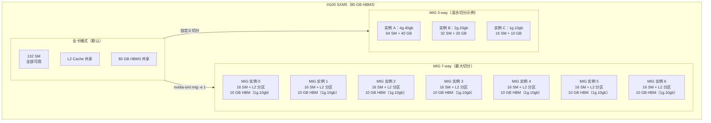
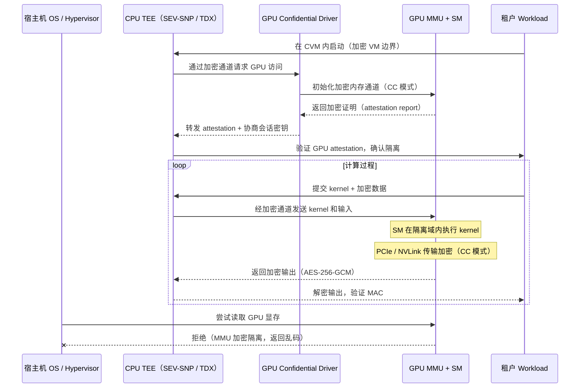

# a10 · MIG + Confidential Compute + vGPU — 多租户部署

> **一句话总结:** MIG 提供硬件级 GPU 切分（H100 最多 7 实例，每实例独占 SM + L2 + HBM 分区），Confidential Compute（SEV-SNP / TDX）加密 GPU 执行路径保障数据机密性，vGPU 通过驱动层虚拟化支持多 VM 共享，三者组合是生产多租户 GPU 集群的安全与隔离基础。

## 1. 是什么 / 为什么有它

随着 GPU 集群进入企业数据中心和公有云环境，多租户场景下的资源隔离、数据机密性保护和虚拟化需求变得不可回避。三种机制分别针对不同层次的隔离需求：MIG（Multi-Instance GPU）从硬件层面将单张 GPU 切分为若干相互隔离的实例，每个实例拥有独立的 SM 组、L2 分区、HBM 分区和内存带宽，实现真正的硬件隔离；Confidential Compute 则针对数据安全合规场景，通过 CPU 侧的 AMD SEV-SNP 或 Intel TDX 可信执行环境，将 GPU 执行路径纳入加密隔离边界，防止恶意宿主机操作系统或 hypervisor 访问租户数据；vGPU（虚拟 GPU）是基于 NVIDIA grid 驱动的虚拟化方案，允许多个虚拟机通过时分复用（Time-Slice）或 MIG-based 方式共享一张物理 GPU，面向传统 VM 化数据中心。

三者并非互斥：MIG 可以与 vGPU 结合使用（MIG-based vGPU，每个 VM 独占一个 MIG 实例，隔离性更强，性能预测性更好），也可以与 Confidential Compute 结合（在 MIG 实例内运行加密 workload，同时实现硬件隔离与数据机密性两层保护）；容器化场景（NVIDIA Container Toolkit + Kubernetes Device Plugin）可以基于 MIG 实例分配 GPU 资源，通过 `nvidia.com/mig-1g.10gb` 等 K8s resource 名称向 Pod 分配特定大小的实例，也可以不依赖 MIG 而直接通过 time-slicing 共享全卡（后者隔离性弱，适合非关键推理任务）。理解这三层机制的适用场景、编程接口、性能开销和常见错误，是部署和运维 GPU 集群的 senior AI Infra 工程师必备能力。从工程角度看，三种机制的选型建议：MIG 适合多租户推理场景（需要硬件级隔离 + 可预测带宽），Confidential Compute 适合合规要求的金融 / 医疗数据场景（须满足数据驻留 / 加密要求），vGPU 适合传统 VM 化 VDI 或遗留 VM 迁移场景（需要保留 VM 的运维习惯和快照 / 迁移能力），NVIDIA Container Toolkit 则是无论哪种隔离模式都需要的容器化基础层。

主体 CUDA 教程主要关注单 GPU 算法层面，对多租户部署机制几乎没有涉及。在实际生产环境中，AI 平台团队经常遇到的问题包括：MIG 配置后 NCCL 多 GPU 训练报错（MIG 实例间 P2P 被禁用）、Confidential Compute 开启后 kernel 性能退化超出预期（加密路径开销 5-15%）、vGPU license 配置失误导致 GPU 降级为 6 小时限时模式、容器未正确配置 device plugin 导致 GPU 不可见等。本章逐一梳理这些常见问题的成因与解决方案。

## 2. 硬件 / 系统视角（微架构 / 拓扑 / 协议）

### MIG 硬件切分原理



实际生产中，MIG 的最大价值在于将一张高端 GPU（如 H100 SXM5）的推理算力切分给多个推理服务实例，每个实例各自运行一个不同的模型（7B 模型约需 14 GB FP16，适合 2g.20gb 实例），从而把 GPU 利用率从通常的 20-30%（单模型推理）提升到 80-90%（多模型并行服务）。公有云的 GPU MIG 实例（如 H100.1g）比整卡便宜约 7×，适合轻量级推理任务。

MIG 的硬件隔离是通过 GPU 内部的 GPC（Graphics Processing Cluster）级别硬件分区实现的，不是软件调度模拟。每个 MIG 实例拥有独立的：SM 组（以 GPC 为单位划分，H100 每 GPC 含约 16 SM）、专属 L2 cache 分区（硬件隔离，实例间 L2 互不可见）、独立 HBM 地址范围（硬件内存保护，实例间无法访问对方 HBM）、独立内存带宽配额（以 memory slice 为单位，1g 实例获得 1/7 总带宽）。MIG 实例间的隔离是对等的，实例 A 无法通过任何 CUDA API 读取实例 B 的 HBM，即使拥有 root 权限的进程也无法绕过硬件 MMU 保护（与软件级时间片共享相比，MIG 的隔离强度接近物理独立卡）。

H100 SXM5 支持的标准 MIG profile（`nvidia-smi mig --list-gpu-instance-profiles` 输出）：

| Profile | SM 数量 | HBM 容量 | 可同时创建数量 |
|---------|--------|---------|------------|
| 7g.80gb | 全部 132 SM | 80 GB | 1（全卡） |
| 4g.40gb | 64 SM | 40 GB | 1 |
| 3g.40gb | 48 SM | 40 GB | 2 |
| 2g.20gb | 32 SM | 20 GB | 3 |
| 1g.10gb | 16 SM | 10 GB | 7（最多） |
| 1g.10gb+me | 16 SM | 10 GB | 1（含 Media Engine） |

### Confidential Compute 加密路径



Confidential Compute 的核心机制：在 CC 模式开启时，GPU 与 CPU 之间的 PCIe/NVLink 数据传输通过 AES-256-GCM 加密（密钥由 CC 握手协商，宿主机 OS 不可见）；GPU 内部执行（SM 计算、HBM 访问）在隔离边界内，宿主机无法通过调试接口或 DMA 读取明文数据；GPU 固件提供可验证的 attestation report（类似 TPM quote），让 CVM 内的租户代码可以远程验证 GPU 的身份和隔离状态，防止中间人攻击。性能开销来自加密路径上的额外运算：数据传输加密（PCIe 带宽受影响约 5-10%）、attestation 验证（一次性开销，约 50-100 ms 初始化）、CC 模式的驱动 overhead（每个 kernel launch 额外约 1-5 µs）。整体 workload 开销约 5-15%，具体取决于 PCIe 传输密度和 kernel launch 频率（计算密集型任务损耗低，IO 密集型损耗高）。

## 3. CUDA / 框架编程接口

### MIG 管理接口

MIG 的生命周期管理通过 `nvidia-smi mig` 子命令完成，共分为两层 CLI 操作：GPU Instance（GI）层管理硬件 SM/L2/HBM 分区，Compute Instance（CI）层在 GI 内部进一步划分 SM 调度域（通常每个 GI 创建一个对应的 CI，使用 GI 内的全部 SM）。MIG 模式需要在 NVIDIA 持久化守护进程（nvidia-persistenced）重启后才能生效，因此开启或关闭 MIG 模式时，该节点上的所有 GPU workload 必须先停止。在 Kubernetes 环境中，改变 MIG 模式前需要 cordon 节点并驱逐所有 GPU Pod，避免业务中断。MIG 配置持久化保存在 GPU 固件中（NVRAM），节点重启后配置保留，但需要重新创建 GI/CI 实例（实例不会跨重启持久化，只有 MIG 模式本身持久化）。以 H100 创建 7 个 1g.10gb 实例为例，完整流程如下：

```bash
# 步骤 1：开启 MIG 模式（需要 root，会中断当前 GPU workload）
sudo nvidia-smi mig -e 1   # 或 --gpu-instance-profile 使用数字 ID

# 步骤 2：重启持久化守护进程使 MIG 模式生效
sudo systemctl restart nvidia-persistenced

# 步骤 3：查询支持的 profile ID（各卡型不同）
nvidia-smi mig --list-gpu-instance-profiles
# 输出：1g.10gb = profile ID 19，H100 上

# 步骤 4：创建 7 个 1g.10gb GPU 实例（GI）
sudo nvidia-smi mig -cgi 19,19,19,19,19,19,19 -C
# -cgi: create gpu instance; -C: also create compute instance

# 步骤 5：验证切分结果
nvidia-smi -L
# 输出：GPU 0: NVIDIA H100 SXM5
#         MIG 1g.10gb  Device 0: ...（7 行）

# 步骤 6：在容器中使用特定 MIG 实例
CUDA_VISIBLE_DEVICES=MIG-GPU-xxxxxxxx-0-1  python workload.py
# 格式：MIG-GPU-<device-uuid>-<gi-id>-<ci-id>

# 清理：删除所有 MIG 实例并关闭 MIG 模式
sudo nvidia-smi mig -dci && sudo nvidia-smi mig -dgi
sudo nvidia-smi mig -e 0
```

混合 profile 切分（更灵活的实例大小组合）同样支持，但总资源不能超过物理卡的硬件 slice 数量（H100 有 7 个 memory slice 和 7 个 compute slice，可灵活组合，但总 slice 数固定）：

```bash
# 创建 1 个 4g.40gb + 1 个 2g.20gb + 1 个 1g.10gb 的混合配置
# 共使用 4+2+1=7 个 compute slice（刚好用满）
sudo nvidia-smi mig -cgi 9,14,19 -C
# Profile ID：4g.40gb=9, 2g.20gb=14, 1g.10gb=19（H100 SXM5）

# 监控各 MIG 实例的资源利用率（DCGM 方式）
dcgmi dmon -e 203,204,252   # MIG 实例 GPU、内存利用率、SM 时钟
```

### Confidential Compute 接口

Confidential Compute 的 CUDA 编程接口对应用代码几乎透明——普通的 `cudaMalloc`、`cudaMemcpy`、kernel launch 在 CC 模式下会自动通过加密通道进行，无需修改 kernel 代码本身。应用层需要主动管理的有三点：第一，启动前通过 `NVIDIA_REQUIRE_CC=on` 环境变量声明要求，防止在非 CC GPU 上静默降级运行（机密 workload 跑在非加密 GPU 上会造成数据泄露而无任何警告）；第二，在 CVM（Confidential VM）内完成 GPU attestation 验证，确认 GPU 固件未被篡改（使用 NVIDIA Attestation SDK 或 nvtrust 库）；第三，CC 模式下 CUDA Unified Memory（cudaMallocManaged）受到额外限制（CC 模式的 MMU 隔离与 UM 的页面迁移机制存在冲突），应避免在 CC workload 中使用 Unified Memory，改用显式 `cudaMalloc` + `cudaMemcpy`。vGPU 的 API 主要在驱动层（宿主机侧 NVIDIA grid 驱动），guest VM 内看到的是虚拟 GPU，API 与普通 GPU 完全一致，工程师无需修改应用代码。grid 驱动额外提供 `nvidia-smi vgpu` 子命令用于宿主机侧管理（查看 vGPU session、带宽分配等）。

```bash
# 查询 GPU 是否支持 CC 模式
nvidia-smi conf-compute -f     # -f: query features
# 输出：CC Dev Tools Mode   : Disabled
#        CC Mode            : Off（可改为 On / DevTools）

# 开启 CC 模式（需要 root + 支持 CC 的 GPU，如 H100 SXM5）
sudo nvidia-smi conf-compute -e 1   # 启用 CC
sudo nvidia-smi conf-compute -e 0   # 关闭 CC

# 验证主机端：确认 AMD SEV-SNP 或 Intel TDX 已启用
dmesg | grep -i "sev\|tdx\|tdvf\|cvm"
# AMD 系统：应看到 "SEV-SNP supported" 和 "SEV enabled"
# Intel 系统：应看到 "TDX enabled"

# 在 CVM（Confidential VM）内验证 GPU attestation
# 使用 NVIDIA Hopper Attestation SDK
python3 -c "
import nv_attestation_sdk as nas
client = nas.Client()
# 获取 GPU attestation report（包含固件度量值）
report = client.get_cc_attestation_report()
# 验证 report 签名链（根 CA 为 NVIDIA）
nas.verifier.verify_gpu_attestation(report)
print('GPU attestation verified:', report.gpu_uuid)
"

# 环境变量：要求仅在 CC 模式 GPU 上运行
NVIDIA_REQUIRE_CC=on python workload.py
# 若 GPU 不在 CC 模式，程序报错退出（而非静默降级）
```

### vGPU 与 NVIDIA Container Toolkit

```bash
# vGPU：在宿主机侧安装 NVIDIA grid 驱动（不同于标准数据中心驱动）
# vGPU profile 创建（通过 mdevctl 或 vGPU manager）
sudo nvidia-smi vgpu -cmode  # 查看 vGPU 模式（SR-IOV / legacy）

# NVIDIA Container Toolkit：容器中访问 GPU
docker run --rm --gpus all nvidia/cuda:12.4.0-base-ubuntu22.04 nvidia-smi
# --gpus all：暴露全部 GPU（或指定 MIG 实例）

# 暴露特定 MIG 实例给容器
docker run --rm \
    --gpus 'device=MIG-GPU-xxxxxxxx-0-1' \
    nvidia/cuda:12.4.0-base-ubuntu22.04 \
    nvidia-smi

# Kubernetes NVIDIA Device Plugin + MIG 资源分配
# MIG 实例以 resource name 方式暴露给 K8s
kubectl describe node gpu-node | grep -i "nvidia.com"
# 输出：nvidia.com/mig-1g.10gb: 7（7 个 1g.10gb 实例可用）

# Pod spec 中请求 MIG 实例
# resources:
#   limits:
#     nvidia.com/mig-1g.10gb: "1"   # 请求 1 个 1g.10gb MIG 实例

# 验证 Pod 内 GPU 可见性
kubectl exec -it my-pod -- nvidia-smi
```

## 4. 关键性能指标

### MIG 隔离开销

MIG 的硬件隔离并非零开销。主要开销来源有以下几个方面：每个 MIG 实例拥有专属的 memory slice，即使某实例 workload 不使用全部带宽，多余带宽也不能被其他实例借用（相当于 HBM 带宽硬性分区，不允许动态借用）；L2 cache 分区后总可用容量略有减少（分区管理元数据占用，约 1-2 GB）；SM 调度粒度从全卡级别降至实例级别，小 batch 场景 SM 利用率会有 5-10% 降低，原因是 1g 实例只有 16 个 SM，对于 batch_size=1 的推理，GPU occupancy 更低。MIG 模式切换本身（开启 / 关闭 MIG 模式）会清除 GPU 状态，导致当时运行的所有 workload 中断，因此生产中 MIG 模式应在节点初始化阶段配置，而不是动态切换。硬件内存保护（MMU 隔离）本身不引入额外运行时 overhead（隔离由硬件地址转换实现，无 CPU 参与），所以 MIG 的性能代价主要来自资源分区固化（不能借用），而非访问控制检查。

实测性能数字（H100 SXM5，NVIDIA 官方测试 + 社区报告）：

| 场景 | 全卡（7g.80gb） | 7 × 1g.10gb MIG（总计） | 隔离开销 |
|-----|------------|------------------|--------|
| GEMM BF16（大 batch） | 100%（基准） | 约 90%（7 实例合计） | 约 10% |
| Transformer 推理（单模型） | 100% | 约 88%（单实例） | 约 12% |
| 内存带宽（STREAM） | 100% | 约 95%（单实例按比例） | 约 5% |
| HBM 总容量 | 80 GB 可用 | 7 × 10 GB = 70 GB（-12.5%） | 约 12.5% |

MIG 的隔离开销约 10%，这是硬件分区的固有代价。对于多租户云服务场景，隔离带来的安全保障和可预测性（每个租户不受邻居影响）通常被认为值得这 10% 的代价。

Confidential Compute 性能开销的分布（H100 CC 模式，基于 NVIDIA Confidential Computing Whitepaper 数据）：

| 操作类型 | 开销 | 主要来源 |
|--------|------|--------|
| 计算密集型 GEMM（大 batch） | 约 2-3% | CC 模式驱动 overhead |
| 内存传输（H2D/D2H via PCIe） | 约 8-12% | PCIe 传输加密（AES-256-GCM） |
| 小 kernel 高频 launch | 约 10-15% | 每次 launch 额外验证开销 |
| 初始化（attestation 验证） | 一次性 50-200 ms | 证书链验证 + 会话密钥协商 |
| 整体 LLM 推理 workload | 约 5-10% | 混合上述开销 |

vGPU 的额外开销取决于 vGPU 类型和调度策略：Time-Slice vGPU 的上下文切换开销约 2-5%（切换周期通常 1-10 ms），MIG-based vGPU（每 VM 独占一个 MIG 实例）的 overhead 与 MIG 相同约 10%，性能隔离性更好（不受邻居干扰）。vGPU 的 guest driver 版本需要与宿主机 grid 驱动版本精确匹配（major version 必须一致），版本不匹配时 guest VM 内 GPU 初始化失败，报 `device not found` 或 `incompatible driver` 错误，这是 vGPU 部署中最高频的初始化问题之一。vGPU license 验证的网络依赖也需要特别注意：在隔离网络或离线数据中心部署时，应配置 DLS（Delegated License Server）本地化部署，避免 VM 到外网 license server 的联通性问题触发降级。

### 设计权衡：MIG / Time-Slice / vGPU 的选型

三种多租户机制的核心权衡在于隔离强度、性能利用率和运维复杂度之间的取舍。MIG 提供最强的硬件隔离（SM + L2 + HBM 三层分区）和最可预测的性能（每实例带宽固定，不受邻居影响），代价是 10% 的整体效率损失和不能跨实例 NCCL；Time-Slice vGPU 隔离性最弱（SM 不隔离，只有地址空间隔离），性能受邻居影响最大（存在"吵闹邻居"问题），但最大化了 GPU 算力利用率（多 VM 时分共享全部 SM）；MIG-based vGPU 在两者之间取了折衷（VM 内部有 MIG 隔离，跨 VM 有 hypervisor 隔离，适合需要 VM 运维模型且又需要隔离保证的场景）。在推理服务场景中，当模型推理 SLA 对延迟抖动敏感（P99 延迟要求）时，MIG 是更好的选择；当 SLA 宽松（吞吐量导向）时，Time-Slice 可以提高 GPU 利用率。Confidential Compute 是独立于上述三种的附加安全层，可叠加到任何一种隔离方式上，但需要额外评估 5-15% 的性能开销和 attestation 的运维复杂度（证书轮换、远程验证基础设施搭建）。

### MIG 实例间 NCCL 限制

这是生产中最常见的 MIG 踩坑点：MIG 实例之间 P2P（peer-to-peer）访问被完全禁用（硬件 MMU 隔离），因此基于 P2P 的 NCCL 通信（NVLink P2P、GPUDirect P2P）无法在不同 MIG 实例之间工作。具体表现：

```bash
# 在 MIG 实例 A 内尝试 NCCL allreduce，使用同一物理卡的实例 B
# NCCL 报错：
# NCCL WARN Timeout(300000) waiting for group fence
# NCCL WARN Cuda failure 1 'invalid device ordinal'
# 或静默 fallback 到 socket 传输（速度极慢）

# 验证 MIG 实例间 P2P 状态
nvidia-smi topo -p2p r   # 显示 P2P 可达性矩阵
# MIG 实例间应显示 NS（No Support）

# 正确做法：MIG 实例内的单卡训练 / 推理（不跨实例 NCCL）
# 若需要多实例协作，应使用 socket 传输并接受带宽降级
NCCL_P2P_DISABLE=1 python multi_gpu_train.py  # 强制不使用 P2P
```

## 5. 代码示例

### MIG 完整部署脚本（H100 7-way 切分 + Kubernetes）

```bash
#!/bin/bash
# MIG 7-way 切分 + Kubernetes Device Plugin 配置

# === 物理节点配置 ===
# 开启 MIG 模式（需要 root 权限）
sudo nvidia-smi mig -e 1

# 查询 1g.10gb 的 profile ID（H100 SXM5 通常为 19）
PROFILE_ID=$(nvidia-smi mig --list-gpu-instance-profiles | \
    grep "1g.10gb" | awk '{print $NF}' | head -1)
echo "1g.10gb profile ID: ${PROFILE_ID}"

# 创建 7 个实例（自动同时创建对应的 compute instance）
sudo nvidia-smi mig -cgi ${PROFILE_ID},${PROFILE_ID},${PROFILE_ID},${PROFILE_ID},${PROFILE_ID},${PROFILE_ID},${PROFILE_ID} -C

# 验证结果（应输出 7 个 MIG 实例）
nvidia-smi -L | grep MIG

# === Kubernetes Device Plugin 配置 ===
# 修改 nvidia-device-plugin ConfigMap 以支持 MIG strategy
cat <<EOF | kubectl apply -f -
apiVersion: v1
kind: ConfigMap
metadata:
  name: nvidia-device-plugin-config
  namespace: kube-system
data:
  config.yaml: |
    version: v1
    flags:
      migStrategy: single   # single: 每个 MIG 实例独立 resource
    sharing:
      timeSlicing:
        resources: []       # MIG 模式下不使用 time slicing
EOF

# 重启 device plugin DaemonSet 使配置生效
kubectl rollout restart daemonset/nvidia-device-plugin-daemonset -n kube-system

# 验证 K8s 中 MIG 资源可见性
kubectl describe nodes | grep "nvidia.com/mig"
```

### Confidential GPU 初始化与 attestation 验证

```python
import os
import subprocess

def verify_confidential_gpu(gpu_id: int = 0) -> bool:
    """
    验证 GPU 是否处于 Confidential Compute 模式，
    并完成 attestation 证明（确认 GPU 固件未被篡改）。
    生产部署前必须调用此函数。
    """
    # 步骤 1：检查 CC 模式状态
    result = subprocess.run(
        ['nvidia-smi', 'conf-compute', '-f'],
        capture_output=True, text=True
    )
    if 'CC Mode            : On' not in result.stdout:
        raise RuntimeError(
            f"GPU {gpu_id} 未处于 Confidential Compute 模式。\n"
            f"请先运行：sudo nvidia-smi conf-compute -e 1"
        )

    # 步骤 2：确认环境变量要求（防止静默降级）
    if os.environ.get('NVIDIA_REQUIRE_CC') != 'on':
        raise RuntimeError(
            "请设置 NVIDIA_REQUIRE_CC=on 以要求 CC 模式，"
            "防止静默降级到非加密路径。"
        )

    # 步骤 3：获取 GPU attestation report（需要 NVIDIA CC SDK）
    try:
        import nv_attestation_sdk as nas
        client = nas.Client(gpu_id=gpu_id)
        report = client.get_cc_attestation_report()
        # 验证签名链（根 CA：NVIDIA Root CA）
        verification_result = nas.verifier.verify_gpu_attestation(report)
        print(f"[CC] GPU {gpu_id} attestation 验证成功")
        print(f"[CC] GPU UUID: {report.gpu_uuid}")
        print(f"[CC] 固件版本: {report.driver_version}")
        return True
    except ImportError:
        # SDK 未安装时退回基础检查
        print("[CC] 警告：nv_attestation_sdk 未安装，跳过 attestation 深度验证")
        return True

# 在 CVM 内启动 workload 时调用
if verify_confidential_gpu():
    import torch
    # 后续 CUDA 操作自动走加密路径（CC 模式已验证）
    x = torch.randn(1024, 1024, device='cuda')
```

### Kubernetes MIG 资源请求示例

```yaml
# Pod spec：请求 1 个 MIG 1g.10gb 实例（适合小规模推理）
apiVersion: v1
kind: Pod
metadata:
  name: llm-inference-mig
spec:
  containers:
  - name: inference
    image: nvcr.io/nvidia/pytorch:24.04-py3
    command: ["python", "serve.py"]
    env:
    - name: NVIDIA_REQUIRE_CC     # 可选：要求 CC 模式
      value: "on"
    resources:
      limits:
        nvidia.com/mig-1g.10gb: "1"     # 请求 1 个 1g.10gb MIG 实例
        memory: "16Gi"
        cpu: "4"
    volumeMounts:
    - name: model-storage
      mountPath: /models
  volumes:
  - name: model-storage
    persistentVolumeClaim:
      claimName: model-pvc
  tolerations:
  - key: "nvidia.com/gpu"
    operator: "Exists"
    effect: "NoSchedule"
```

## 6. 实测手段

### MIG 资源监控

MIG 切分后的资源监控需要使用 MIG-aware 工具，标准 `nvidia-smi` 在 MIG 模式下默认显示实例列表而非全卡总览，需要通过 DCGM（Data Center GPU Manager）进行持续监控和指标采集。在没有 DCGM 的环境中，可以通过逐一指定 MIG 实例 UUID 来查询各实例的资源状态，但这在自动化脚本中较为繁琐。DCGM 的优势在于支持批量采集所有 MIG 实例的指标，并通过 dcgm-exporter 以 Prometheus 格式暴露，直接接入现有的监控告警体系（Grafana / Alertmanager）；此外 DCGM 还具备 MIG 级别的 GPU 健康检测（Health Monitor），可以在 MIG 实例出现 ECC 错误或温度异常时触发告警。在 Kubernetes 环境中，DCGM Exporter 以 DaemonSet 形式部署，自动识别 MIG 配置并以 `namespace/device/instance` 层级暴露指标，无需为每张卡单独配置。Confidential Compute 模式下，DCGM 的访问权限受到额外限制（CC 模式限制宿主机对 GPU 状态的细粒度读取），部分指标可能不可用，需要在 CC 部署设计时预先考虑监控能力降级。

```bash
# 查询所有 MIG 实例及其资源利用率
nvidia-smi --query-gpu=index,name,utilization.gpu,memory.used,memory.total \
    --format=csv --mig-mode=1
# 或直接指定 MIG 实例 UUID
nvidia-smi -i MIG-GPU-xxxxxxxx-0-1 \
    --query-gpu=utilization.gpu,memory.used --format=csv,noheader,nounits

# DCGM 监控所有 MIG 实例（Prometheus 格式）
dcgmi dmon -e 203,204,252,1001 -d 1000   # 每 1 秒采集一次
# 203: GPU 利用率, 204: 显存利用率, 252: SM 时钟, 1001: 显存带宽利用率

# DCGM Exporter 自动将 MIG 指标推送到 Prometheus
# 部署后通过 Grafana 查看 MIG 实例级别的 GPU 健康状态

# 查看 MIG 实例的 GPU profile 配置
nvidia-smi mig --list-gpu-instance-profiles
nvidia-smi mig --list-compute-instance-profiles
nvidia-smi mig --query   # 当前所有实例的详细信息
```

### CC 模式与 vGPU 验证

```bash
# 查看 Confidential Compute 状态和支持的特性
nvidia-smi conf-compute -f
# 预期输出（CC 开启时）：
# CC Dev Tools Mode  : Disabled（生产模式）
# CC Mode            : On
# Protected Memory   : Enabled

# 验证 vGPU 配置（需 NVIDIA Grid 驱动）
nvidia-smi vgpu -s     # 查看所有 vGPU session
nvidia-smi vgpu -q     # 详细查询 vGPU 信息（profile、VM、带宽）

# Container Toolkit 验证
nvidia-ctk cdi generate --output=/etc/cdi/nvidia.yaml  # 生成 CDI 配置
nvidia-ctk system info                                   # 系统信息
docker run --rm --gpus all ubuntu:22.04 bash -c "ls /dev/nvidia*"

# Kubernetes 中查看 MIG 资源分配情况
kubectl describe nodes | grep -A20 "Capacity:\|Allocatable:"
# 预期看到：nvidia.com/mig-1g.10gb: 7

# 查看哪些 Pod 使用了 MIG 实例
kubectl get pods -A -o custom-columns=\
"NAME:.metadata.name,NODE:.spec.nodeName,GPU:.spec.containers[*].resources.limits.nvidia\.com/mig-1g\.10gb"
```

## 7. 常见反模式

**1. MIG 配置后 NCCL 跨实例通信（P2P 被禁用导致超时或静默 fallback）。** MIG 实例之间硬件 P2P 被禁用，NCCL 在实例间无法使用 NVLink 或 GPUDirect P2P 路径。如果训练脚本中 `CUDA_VISIBLE_DEVICES` 包含了多个 MIG 实例，NCCL 会尝试 P2P 建联，超时后 fallback 到 socket（速度约为 NVLink 的 1/100），或直接报 `NCCL error: unhandled cuda error`。正确做法是一个训练 job 只分配到一个 MIG 实例（单实例推理 / 单实例微调），若需要多实例通信（如分布式训练）应使用跨物理卡的方案而非跨 MIG 实例。检测方法：`nvidia-smi topo -p2p r` 查看 P2P 状态，MIG 实例间应显示 NS。

**2. Confidential kernel 误用 CPU 共享内存（打破加密隔离边界）。** 在 CC 模式下，如果 CUDA kernel 通过 `cudaHostAlloc(cudaHostAllocMapped)` 映射 CPU 共享内存（非加密区域），CPU 侧内容对宿主机 OS 可见，破坏了 CC 模式的隔离保证。正确做法是 CC 模式下所有敏感数据必须分配在 GPU 设备内存（`cudaMalloc`）中，并通过加密 PCIe 通道传输；需要 CPU 访问的场景应通过 CC SDK 的安全传输接口，避免绕过加密边界。实际踩坑场景：`torch.autocast` 在部分版本中通过 host memory 暂存中间结果，在 CC 模式下可能绕过加密路径，应在 CC 部署验收时显式验证数据流路径。

**3. vGPU license 漏配（driver fallback 限时模式）。** NVIDIA vGPU 需要商业 license（通过 NVIDIA License Server 或 DLS 提供），如果 VM 内 guest driver 无法连接到 license server，会退入"降级模式"：GPU 功能受限（部分 compute 特性禁用）且有 6 小时超时限制，超时后 GPU 不可用直到重新授权。常见误配场景：防火墙阻断了 VM 到 license server 的 7070/443 端口，或 license server 地址配置在 `/etc/nvidia/gridd.conf` 中但拼写错误。检测方法：`systemctl status nvidia-gridd` 查看 license 服务状态；`nvidia-smi -q` 输出中检查 `vGPU Software Licensed` 字段。

**4. MIG 切了 7 实例但 workload 需要超过单实例内存（隐性 OOM）。** 1g.10gb 实例只有 10 GB HBM，若加载 Llama-3-70B（FP16 约 140 GB）到单个 MIG 实例，会立即 OOM（显存不足）。但错误信息有时不够清晰（显示为 CUDA error 而非 MIG 内存限制），工程师可能误判为 OOM 是 CUDA 配置问题。正确做法是在切分前评估 workload 的显存需求，选择合适的 MIG profile（7g.80gb 用于大模型，1g.10gb 用于小模型 / 嵌入推理）。检测方法：`nvidia-smi mig -q` 显示每个实例可用内存，与 workload 需求对比后再决定切分策略。

**5. Container 漏 `--gpus` 标志（看到 GPU 设备节点但无法执行 CUDA）。** 在未配置 NVIDIA Container Toolkit 的 Docker 或误用 `--device /dev/nvidia0` 的场景中，容器内虽然可以看到 GPU 设备节点，但缺少 `/dev/nvidiactl`、`/dev/nvidia-uvm` 等控制接口和 driver shim，所有 CUDA API 调用均返回 `CUDA initialization: CUDA unknown error`。正确做法是在 Docker 安装 NVIDIA Container Runtime 后，通过 `--gpus all` 或 `--gpus device=0` 参数（而非 `--device`）挂载 GPU，Container Toolkit 会自动注入所有必要设备节点和驱动库。检测方法：容器内 `ls /dev/nvidia*` 应同时看到 `/dev/nvidia0` 和 `/dev/nvidiactl`、`/dev/nvidia-uvm`。

**6. Kubernetes Device Plugin 配置错误（Pod 挂起或多 Pod 共享 GPU）。** MIG 策略配置错误（如 `migStrategy: none` 时 K8s 将整卡作为单 resource，7 个 Pod 请求 `nvidia.com/gpu: 1` 会同时分配到同一张卡的同一块显存，没有 MIG 隔离），或 `migStrategy: mixed` 下 resource 名称不匹配导致 Pod 处于 Pending 状态（`Insufficient nvidia.com/mig-1g.10gb`，实际资源存在但 name 对不上）。应当在变更 device plugin 配置后通过 `kubectl describe nodes` 核对 MIG resource 名称，并用测试 Pod 验证分配行为后再上线生产流量。

**7. MIG 实例内 KV cache 跨实例服务（LLM serving 分配错误）。** 在 vLLM 或类似推理框架中，若 CUDA_VISIBLE_DEVICES 包含多个 MIG 实例（如两个 1g.10gb），框架会尝试跨实例分配 KV cache 和 tensor parallel，触发 MIG 实例间 P2P 错误，或因实际可用带宽远低于预期（socket fallback）导致推理延迟急剧增大。正确做法是确保每个推理进程的 `CUDA_VISIBLE_DEVICES` 只包含单个 MIG 实例（通过 K8s Device Plugin 正确分配），framework 层面（vLLM）不跨 MIG 实例做 tensor parallel；需要更大算力时，应选择更大的 MIG profile（如 2g.20gb 或 4g.40gb）而非多 MIG 实例合并。

## 8. 延伸阅读

- **NVIDIA MIG User Guide**：完整的 MIG 管理 CLI 参考，包含 H100 / A100 上所有 profile 说明、GI/CI 生命周期管理、MIG 与 vGPU 组合部署，以及 Kubernetes MIG 配置指南。[docs.nvidia.com/datacenter/tesla/mig-user-guide/](https://docs.nvidia.com/datacenter/tesla/mig-user-guide/)
- **NVIDIA Confidential Computing Whitepaper**（2023）：GPU CC 架构详细描述，包含 PCIe 加密机制（AES-256-GCM）、attestation report 格式、SEV-SNP / TDX 集成，以及性能开销基准测试数据。[developer.nvidia.com/confidential-computing](https://developer.nvidia.com/confidential-computing)
- **NVIDIA vGPU 软件文档**：vGPU profile 类型（Time-Slice / MIG-backed）、NVIDIA grid 驱动安装、license server 配置（NVIDIA License System），适合 VMware / KVM 环境的详细部署指南。[docs.nvidia.com/grid/latest/](https://docs.nvidia.com/grid/latest/)
- **NVIDIA Container Toolkit**：Docker / containerd / CRI-O 的 GPU 容器集成安装和配置文档，CDI 规范（Container Device Interface），以及与 Kubernetes Device Plugin 的集成关系。[github.com/NVIDIA/nvidia-container-toolkit](https://github.com/NVIDIA/nvidia-container-toolkit)
- **Kubernetes NVIDIA Device Plugin**：MIG 策略（none / single / mixed）详细说明，MIG resource 命名规范，与 DCGM、NVIDIA GPU Feature Discovery 的集成配置，以及 Operator 方式一键部署。[github.com/NVIDIA/k8s-device-plugin](https://github.com/NVIDIA/k8s-device-plugin)
- **NVIDIA DCGM（Data Center GPU Manager）**：MIG 实例级别的 GPU 健康监控、Prometheus 指标采集（dcgm-exporter），以及 CC 模式下的证明日志审计功能。[github.com/NVIDIA/DCGM](https://github.com/NVIDIA/DCGM)
- **NVIDIA Attestation SDK**：Confidential Compute 场景下的 GPU attestation report 获取和验证，支持 OIDC 集成（与 Vault / Azure Attestation 对接），Python 和 C++ binding。[github.com/NVIDIA/nvtrust](https://github.com/NVIDIA/nvtrust)
- **nccl-tests**：NCCL 通信性能基准工具，可用于验证 MIG 实例间通信的 fallback 行为（在 MIG 环境中运行 all_reduce_perf，确认是否触发 P2P disabled 警告），帮助诊断 MIG 配置是否影响多 GPU 训练。[github.com/NVIDIA/nccl-tests](https://github.com/NVIDIA/nccl-tests)
